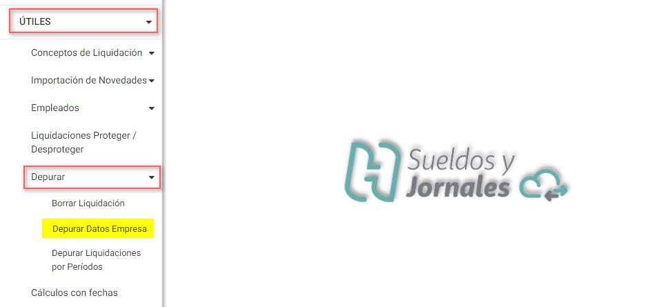
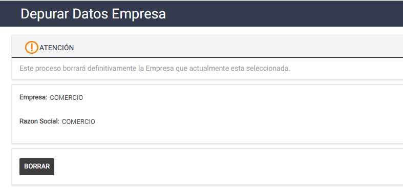

# 20240930190222

 1 
 
Estudios Contables  

 
 
 
 2 Estudios Contables  
Sueldos y Jornales  
Octubre  2022 Borrar empresa.  
 
 
 
Desde esta opción se podrá eliminar toda la información definida para una empresa. La 
empresa que se eliminará será la que se tiene elegida desde datos de trabajo. En caso 
de necesitar eliminar varias, debe hacerse de a una empresa por vez, seleccionándolas 
previamente.  
 
Importante:  para poder borrar la empresa, no deben existir liquidaciones creadas. En 
caso de existir se deberán eliminar previamente desde Útiles→ Depurar→ Borrar 
Liquidación.  
 
 
 ► [Borrar ]: desde este botón se eliminará definitivamente la empresa, debiendo 
aceptar para proceder. Al hacerlo, comienza el proceso de borrado indicando al finalizar 
la terminación exitosa.  

