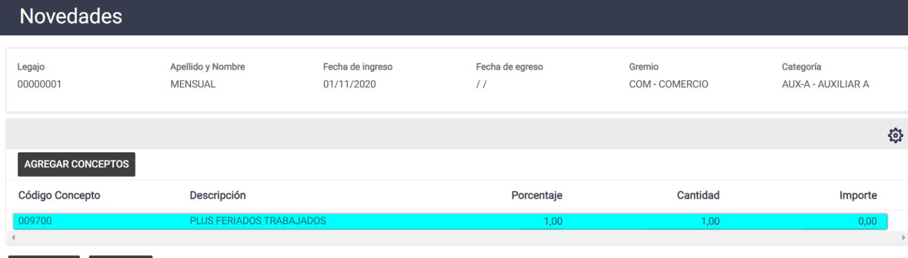

# 20240930190240

 1 
 
  
Estudios Contables  

 
 
 
 2 Estudios Contables  
Sueldos y Jornales  
Marzo 2024  Cálculo de feriados:  
 
A continuación, te recordamos las generalidades a  tener en cuenta para el cálculo de 
feriados, ya sean trabajados o no trabajados.  
 
¡Esperamos que te sea de utilidad!  
 
CONCEPTOS DE LIQUIDACIÓN PREVISTOS : 
 
Para el cálculo de feriados sugerimos utilizar los conceptos 009900 FERIADOS  cuando 
son no trabajados y el 009700 PLUS FERIADOS TRABAJADOS  cuando los mismos son 
trabajados.  
A continuación, detallamos el funcionamiento de cada uno.  
 
0097 00 PLUS FERIADOS TRABAJADOS:  
 
Puede importarlo desde Útiles > Conceptos de liquidación > Importar / Exportar 
Conceptos Liquidación, solapa  Importar  tilda  Sindicales,  busca la carpeta  USO 
GENERAL  [Seleccionar conceptos]  tilda el 009700 desde columna "SEL" y en 
columna NUEVO CODIGO le asigna uno disponible  > IMPORTAR.  
 
 
 

 
 
 
 3 Estudios Contables  
Sueldos y Jornales  
Marzo 2024   
 
 
➢ Funcionamiento del concepto:  
 
Se ingresa desde Liquidacion > Novedades  indicando la cantidad de dias feriados 
trabajados.  
Tomara el valor dia por cantidad de dias informados.  
Para pagar el día con plus (Sueldo Básico / 25), colocar 1 en PORCENTAJE de 
NOVEDADES.  
Tambien se puede ingresar un importe directo en IMPORTE de NOVEDADES.  
 
➢ Ejemplo:  
  
Caso 1:  En el mismo consideramos que el mes tiene 30 dias, por lo tanto se calcula el 
concepto de Sueldo por 30 dias mas el concepto de Plus feriado trabajado.  
 
 
 

 
 
 
 4 Estudios Contables  
Sueldos y Jornales  
Marzo 2024   
 
Toma el valor día: (500 .000 / 30 = 16.666,67) * 1 día feriado trabajado: 16.666,67.  
 
Caso 2:  Pagar el feriado con el plus: agrego el concepto 0097 por novedades con 1 en 
PORCENTAJE y 1 en CANTIDAD.  
 
 
 
 
 
 
Cálculo: Toma el valor día con plus: (500.000 / 25 = 20.000) * 1 día feriado trabajado: 
20.000  
 
 
 

 
 
 
 5 Estudios Contables  
Sueldos y Jornales  
Marzo 2024  009900 FERIADOS:  
 
Puede importarlo desde Útiles > Conceptos de liquidación > Importar / Exportar 
Conceptos Liquidación, solapa  Importar  tilda  Conceptos Generales , [Seleccionar 
conceptos]  tilda el 009 900 desde columna "SEL" y en columna NUEVO CODIGO le 
asigna uno disponible  > IMPORTAR.  
 
 
 
 
 
➢ Funcionamiento del concepto:  
 
Se ingresa desde Liquidacion > Novedades  indicando la cantidad de dias feriados.  
Calculara con el plus incluido, es decir (Sueldo basico/25)  
Tambien se puede ingresar un importe directo en IMPORTE de NOVEDADES.  
Dado que es un feriado no trabajado, sera necesario junto con el mismo agregar por 
Novedades el concepto de Sueldo indicando la cantidad de dias trabajados.  
 
 
➢ Ejemplo:  
  
Caso 1:  En el mismo consideramos que el mes tiene 30 dias, por lo tanto se calcula el 
concepto de Sueldo por 29 dias y 1 dia feriado.  
 

 
 
 
 6 Estudios Contables  
Sueldos y Jornales  
Marzo 2024   
 
 
 
Cálculo: Toma el valor día con plus: (Sueldo básico 500.000 / 25 = 20.000) * 1 día 
feriado trabajado: 20.000  
 
 
 

