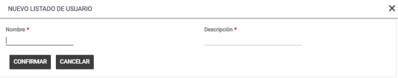
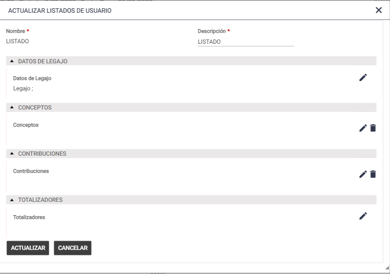
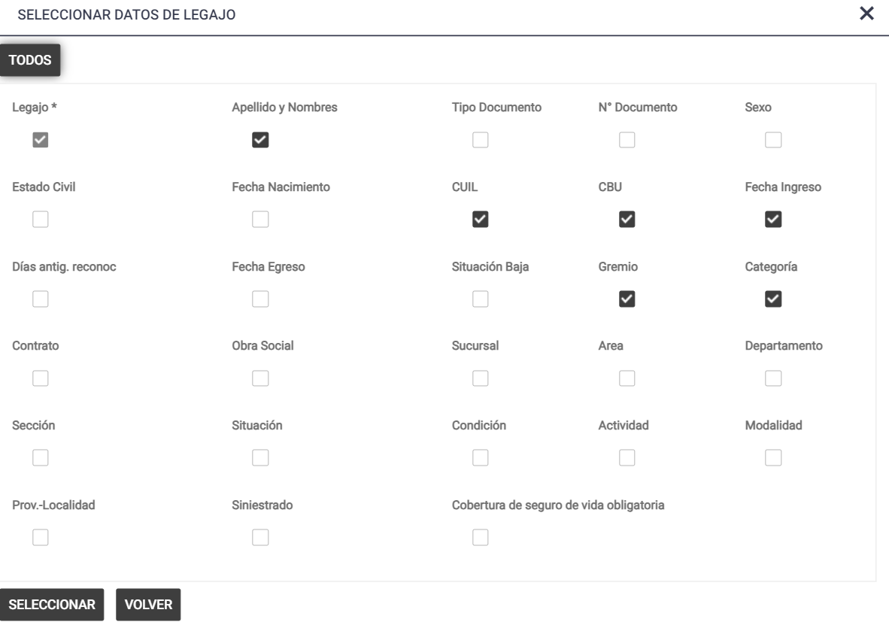
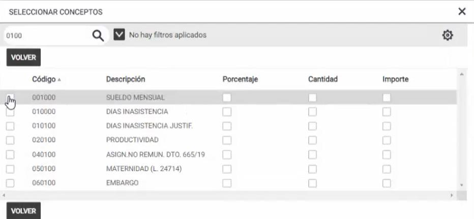
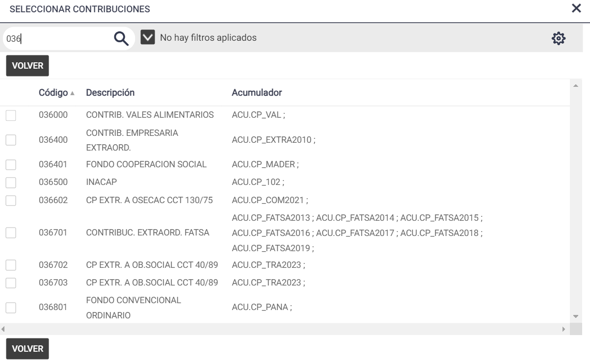
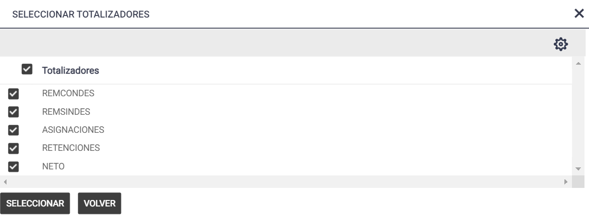
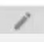
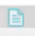
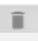

# 20240930190307

 1 
 
  
Estudios Contables  

 
 
 
 2 Estudios Contables  
Sueldos y Jornales  Web  
Septiembre  2023 Listados del Usuario : 
 
En el siguiente instructivo le vamos a mostrar el paso a paso de 
como generar un Listado del Usuario  desde Sueldos y Jornales 
WEB:  
 
Desde esta opción se pueden crear y generar nuevos listados adecuados a las 
necesidades de diseño e información específicas de cada usuario. Los mismos 
salen en formato Excel y quedaran disponibles para todas las Empresa y 
Liquidaciones.  
 
Para crear un Nuevo Listado del Usuario los pasos son los siguientes:  
 
►Ingresar a Emisiones  > Listados del Usuario . 
  
►Presionando el botón [Nuevo]: se dará de alta el Nuevo Listado colocando 
Nombre y Descripción. Para terminar  su generación , pulsar el botón [Confirmar] o 
[Cancelar].  
 
 Nombre : nombre mediante el cual se hace referencia al listado. Es único y no 
admite duplicados.  
 
Descripción : colocar la descripción deseada por el usuario para añadir más 
información sobre el listado.  
 
►Luego el sistema solici tará que se completen los Datos con los cuales el usuario 
quiere Actualizar el Listado; es decir el contenido que necesita que se muestre 
detallado en el mismo.  
 

 
 
 
 3 Estudios Contables  
Sueldos y Jornales  Web  
Septiembre  2023  
►El contenido posible a mostrar en el Listado se divide en 4 Áreas: Datos del  
Legajo, Concep tos, Contribuciones y Totalizadores:  
 
• DATOS DE LEGAJO : 
Desde esta opción se podrán seleccionar los datos del Legajo que se quieren 
visualizar en el Listado. Por defecto aparecerá seleccionado Legajo.  Para guardar 
las opciones elegidas debe presionar el b otón Seleccionar y Aceptar.  

 
 
 
 4 Estudios Contables  
Sueldos y Jornales  Web  
Septiembre  2023  
 
• CONCEPTOS : 
Desde esta opción se podrán seleccionar los Conceptos que se quieren visualizar 
en el Listado. Al seleccionar un concepto por defecto se selecciona el campo 
Importe, pudiendo seleccionar también los campos Porcenta je y Cantidad.  Para 
guardar las opciones elegidas debe presionar el botón Seleccionar y Aceptar.  
 
 
 
 

 
 
 
 5 Estudios Contables  
Sueldos y Jornales  Web  
Septiembre  2023 • CONTRIBUCIONES : 
Desde esta opción se podrán seleccionar los conceptos que calculen 
contribuciones patronales no consideradas en las Contribuciones Generales que 
se quieren visualizar en el Listado. Al seleccionar una contribución se mostrarán 
todos los acumuladores que se generan en dicha contribución.  Para guardar las 
opciones elegidas debe presionar el botón Seleccionar y Aceptar.  
 
 
• TOTALIZADORES : 
Desde esta opción se podrán seleccionar los siguientes totalizadores:  
REMCONDES: toma los conceptos con Totalizador de Importe REMCONDES y 
REMCONART . (Conceptos remunerativos)  
REMSINDES: toma los conceptos con Totalizador de Importe REMSIN DES. 
(Conceptos no remunerativos)  
ASIGNACIONES: toma los conceptos con Totalizador de Importe 
ASIGNACIONES y ASIART .  
RETENCIONES: toma los conceptos con Totalizador de Importe  RETENCIONES  y 
RETART  
NETO  
Para guardar las opciones elegidas debe presionar el  botón Seleccionar y Aceptar.  
 

 
 
 
 6 Estudios Contables  
Sueldos y Jornales  Web  
Septiembre  2023  
 
►Por último, para generar un Listado con toda la información 
seleccionada se debe presionar [Actualizar] o [Cancelar] si no se desea 
generar el Listado. Una vez creado el mismo; existen 3 opciones posibles 
para trabajar con el mismo, que son las siguientes:  
 
♦ [Modificar]: desde esta opción se podrá modificar el contenido del 
Listado.  Se accede a ella tocando el botón . 
 
♦ [Exportar]: desde esta opción se podrá generar el Excel.  Se accede a ella 
tocando el botón  . 
 
♦ [Eliminar]: desde esta opción se podrá eliminar el Listado.  Se accede a 
ella tocando el botón . 

