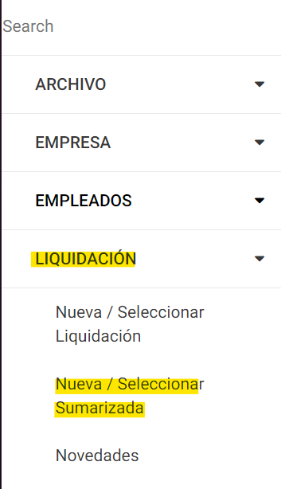
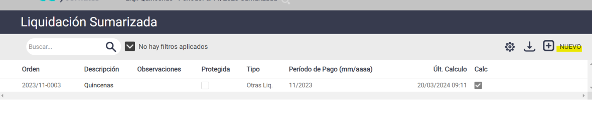
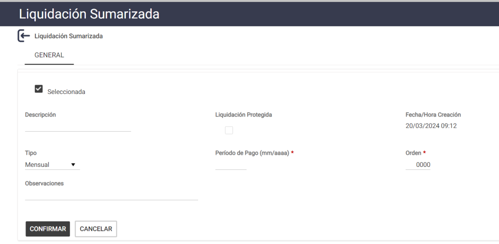
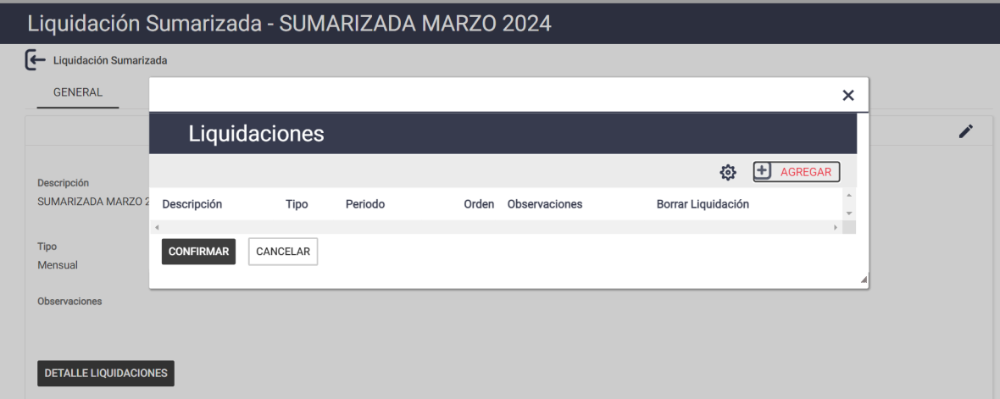
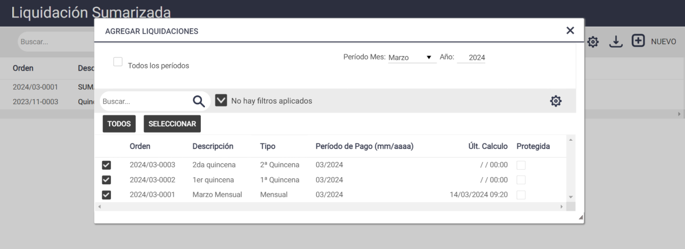
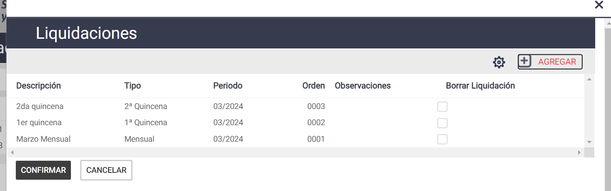
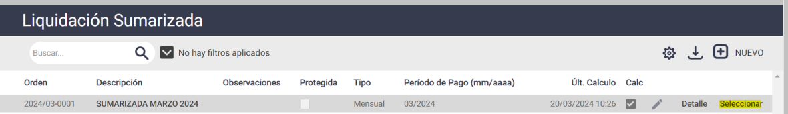
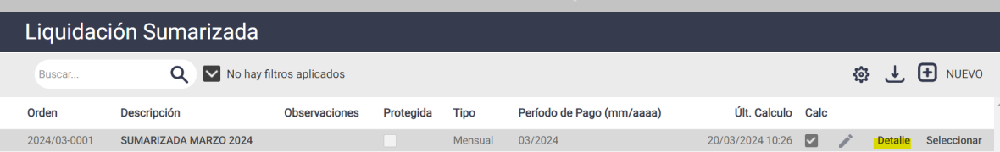
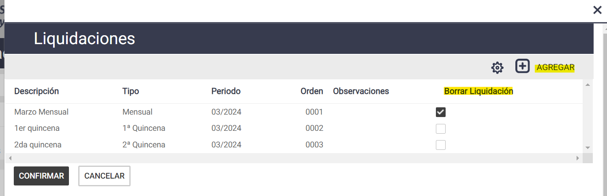
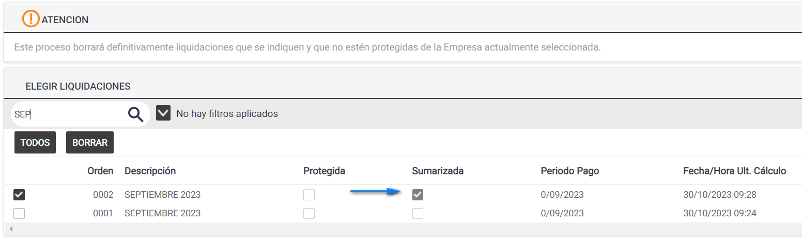

# 20240930190311

 1 
 
  
Estudios Contables  

 
 
 
 2 Estudios Contables  
Sueldos y Jornales  
Septiembre  2024  Crear liquidaciones sumarizadas  
 
A continuación, te detallamos los pasos a seguir para poder unir dos o mas liquidaciones 
por medio de una Sumarizada, ya sea para la exportación del periodo, o bien, para la 
emisión de papeles de trabajo  
 
¡Esperamos que te sea de utilidad!  
 
Generalidades:  
 
La liquidación nueva, estará compuesta por la sumatoria de los datos de las 
liquidaciones originales.  
Esta liquidación, de ningún modo reemplaza a las liquidaciones originales.  
 
1. Crear Sumarizada : 
 
Para armar una nueva sumarizada, deberás dirigirse a Liquidación > Nueva / Seleccionar 
Sumarizada  y presionar el botón NUEVO   
 
 
 
 

 
 
 
 3 Estudios Contables  
Sueldos y Jornales  
Septiembre  2024  Al presionar este botón, aparecerá una ventana en la cual primero deberás completar 
los datos referidos a la Caratula de la Sumarizada.  
 
 
 
Luego, en Descripción , colocá el nombre con el que luego identificarás a la sumarizada 
que estas creando. Por ejemplo: Sumarizada MARZO 2024.  
 
El  campo  Observaciones   es  opcional,  lo  podrás  completar  en  el  caso  que  desees 
agregar algún comentario adicional.  
 
En Período Pago , deberás indicar el período de pago al que corresponde la sumarizada 
en cuestión. Por ejemplo: 03/2024.   
 
Este último dato deberás completarlo siempre, dado que de no hacerlo, la sumarizada  
no se encontrará correctamente creada, y podrías llegar a observar inconsistencias al 
visualizar papeles de trabajo desde esta liquidación concatenada.  
 
Orden : debe colocar le numero de orden de la liquidación en cuanto a las liquidaciones 
que tenga en el periodo.  
 
Fecha / Hora Creación : este campo indicará la fecha y hora de creación de la liquidación 
sumarizada. Es un dato informativo.  
 
Luego presiona el botón CONFIRMAR.  
  
2. Agregar las liquidaciones : 
 
Luego de haber completado los datos de la sumarizada y confirmar,  se muestra el botón 
de DETALLE LIQUIDACIONES , presiona r allí y luego AGREGAR  cada liquidación que 
quiere que participe de la sumarizada.  

 
 
 
 4 Estudios Contables  
Sueldos y Jornales  
Septiembre  2024   
 
 
Por defecto se accede a la lista de todas las liquidaciones cuyo período de pago coincide 
con el de la sumarizada . 
 
Presionando el botón [ TODOS LOS PERÍODOS ]: accederás a la lista de todas las 
liquidaciones existentes en la empresa, de todos los períodos.  
 
Presionando el botón [ TODOS ]: Al ingresar en este botón, accederás a la lista de todas 
las liquidaciones que poseas, cuyo período de pago  coincida con el de la sumarizada.  
 
 
 
 
En cualquiera de las dos opciones, deberás tildar el casillero de selección de la 
liquidación que quieras elegir. Presionando el botón [Todas]  podrás seleccionar la 
totalidad de liquidaciones a la vez.  
 
Luego, hace clic en el botón [Seleccionar].  Al salir se mostrará en la grilla todas las 
liquidaciones que integrarán esta nueva liquidación  y presionar CONFIRMAR  y el 
sistema le consultara [¿Esta seguro? ] > Aceptar.   

 
 
 
 5 Estudios Contables  
Sueldos y Jornales  
Septiembre  2024   
 
Al cerrar esta ventana, te encontrarás en condiciones de poder generar el archivo de 
exportación, o bien, de emitir papeles de trabajo desde esta sumarizada.  
 
NOTA:  Una liquidación sumarizada no podrá formar parte de otra sumarizada, pero, una 
liquidación original, podrá formar parte de más de una sumarizada .  
 
3. Seleccionar la Concatenación : 
 
Para seleccionar una liquidación sumarizada  que ya se encuentre creada, deberás 
dirigirte a Liquidación > Nueva / Seleccionar Sumarizada  > y presionar el botón 
[Seleccionar ].  
 
 
4. Modificar las liquidaciones que forman parte de la sumarizada :  
 
Dirigirse a Liquidación  > Nueva / Seleccionar Sumarizada  y presionar el botón  [Detalle ], 
luego tildando en Borrar liquidación  se podrá eliminar esa liquidación incluida o en el 
botón [Agregar ] para ingresar otra liquidación no incluida.  
Siempre botón CONFIRMAR  para guardar los cambios.  
 
 
 
 

 
 
 
 6 Estudios Contables  
Sueldos y Jornales  
Septiembre  2024   
 
 
5. Eliminar la sumarizada  para poder modificar las liquidaciones originales :  
 
Dirigirse a Útiles  > Depurar > Borrar liquidación  al ingresar aparecerá una grilla con 
todas las liquidaciones creadas en la empresa elegida. Haciendo clic en el casillero de 
selección ☑ podr á ir marcando todas las que desee eliminar.  
 
Deberás asegurarte que la liquidación que borrarás se encuentre tildada en la columna 
Sumarizada  
 
 
 
Una vez tildada, presiona el botón [Seleccionar]. Luego presiona el botón [Borrar].  
 
 
 
 
 
 

