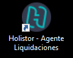
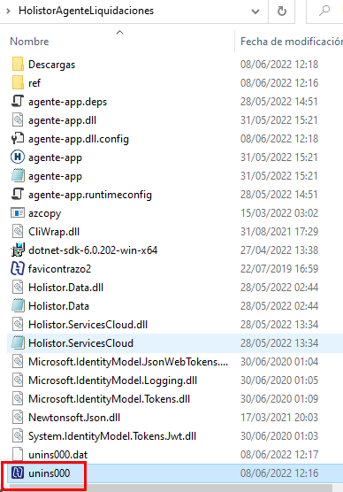
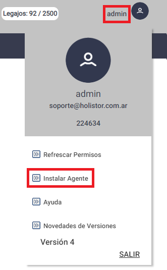
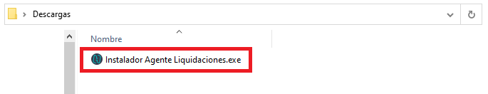
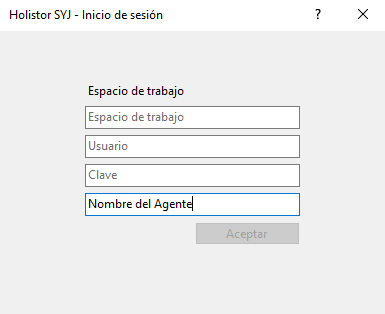
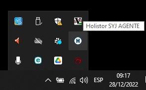
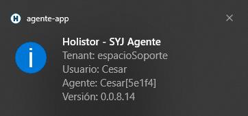

# 20240930190319

 1 
 
  
Estudios Contables  

 
 
 
 2 Estudios Contables  
Sueldos y Jornales  
Octubre  2022 Desinstalar Agente . 
 
1. Posicionarse sobre el ícono del agente que uno tiene ya instalado 
(que tiene que estar en el escritorio), presionar clic k derecho y 
presionar Propiedades . Luego presionar Abrir ubicación : 
 
 
 
2. Luego buscar el ejecutable unins000  y ejecutarlo:  
 
 
 

 
 
 
 3 Estudios Contables  
Sueldos y Jornales  
Octubre  2022 3. Luego borrar la s carpetas que quedan en  
HolistorAgenteLiquidaciones  
 
4. Por último,  descargar e i nstalar el Agente : 
 
 
 
 
 

 
 
 
 4 Estudios Contables  
Sueldos y Jornales  
Octubre  2022 Debemos ir presionando siguiente hasta finalizar, el mismo ya 
propone una ruta por defecto la cual recomendamos mantener.  
 
 
5. Una vez que finaliza la instalación se abrirá la siguiente pantalla:  
 
 
 
Los primeros 3 datos son los mismos que colocamos para ingres ar al 
sistema. Y se validan que sean correctos avisando en caso de que 
alguno de ellos sea incorrecto.  
En cambio,  el campo “Nombre del Agente”, si bien es obligatorio no 
es un dato específico, por lo que podemos colocar por ejemplo 
nuestro nombre.  
 
Esta pes taña se abrirá una sola vez al finalizar la instalación del 
ejecutable, luego ya se guarda esa información y se ejecuta de 
manera automática.  
 
Una vez que presionamos Aceptar podemos ver, abajo a la derecha 
donde están los íconos ocultos, que se generara u n “Try icon” con la 
letra H.  

 
 
 
 5 Estudios Contables  
Sueldos y Jornales  
Octubre  2022  
 
 
 
Si hacemos un clic sobre el mismo nos muestra la información que 
colocamos en la pantalla.  
 
 
 
Si por ejemplo detectamos que pusimos mal el usuario tenemos 
que posicionarnos sobre la “H”, hacer clic derecho con el mouse y 
presionar la opción Iniciar sesión  donde nos pedirá nuevamente los 
datos.  
 

