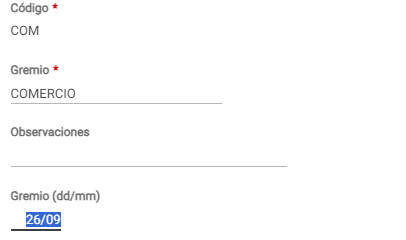
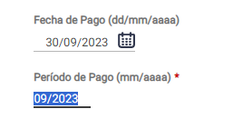
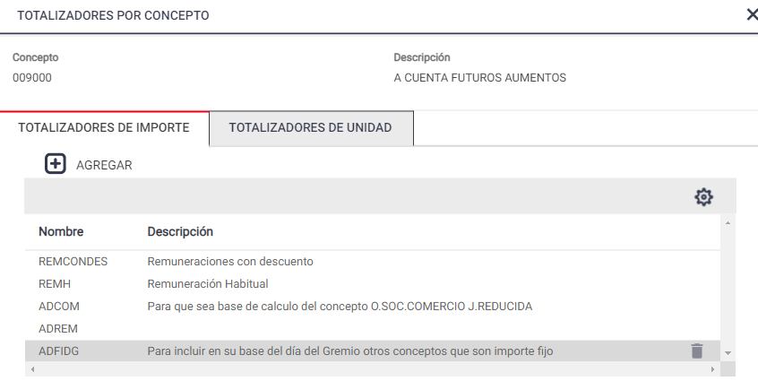
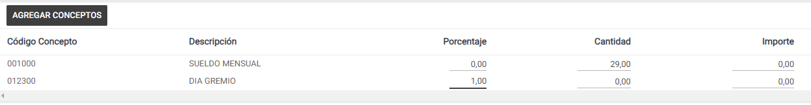

# 20240930190322

 1 
 
  
Estudios Contables  

 
 
 
 2 Estudios Contables  
Sueldos y Jornales  
Septiembre 2023  Día del Gremio  Comercio  
 
¿Qué  conceptos  puedo  utilizar?  
 
Para  calcular  el día del gremio  podrás  utilizar  el concepto  de liquidación  
genérico:  
- 012300  DIA GREMIO . 
Al mismo podrás cargarlo en Conceptos Fijos sin informar dato alguno y 
se calculará  de forma  automática  en el  período  que corresponda.  
Para ello, deberías verificar que, dentro de  ARCHIVO > Laborales > 
Gremio , en el campo  Gremio  (dd/mm) , se encuentre  ingresada la fecha  
correspondiente:  
 
 
 
 
En caso  de no contar con el concepto,  podrás  recuperarlo  ingresando  desde  
ÚTILES > Conceptos de Liquidación > Importar/Exportar Conceptos de 
Liquidación > solapa IMPORTAR  > tildar Conceptos Generales  > 
[SELECCIONAR CONCEPTOS] buscar código 012300 DIA GREMIO , 
Seleccionar e [IMPORTAR] .  
 
 

 
 
 
 3 Estudios Contables  
Sueldos y Jornales  
Septiembre 2023  Carátula  de la Liquidación:  
Deberás tener en cuenta que el Período de Pago informado en 
LIQUIDACION > ABM/ Selección Liquidación deberá coincidir con la 
fecha correspondiente al día del gremio que  deseas  calcular.  
Por ejemplo : Gremio  Comercio;  Liquidación  mensual  - Fecha  día del 
gremio:  26/09  - Período  de pago  que deberías  informar:  09/2023  
 
 
 
 
 
¿Cuál  es el cálculo  del Valor  del Día de Gremio  que 
realiza  el sistema?  
Para el cálculo del concepto 012300 DIA GREMIO , en el caso de 
empleados del  gremio de Comercio , el sistema tomará como base de 
cálculo el sueldo básico  del mes que se liquida  más el valor  de la 
antigüedad  (siempre  y cuando  se liquide utilizando concepto 001300 
ANTIGUEDAD COMERCIO o código anterior al 012300),  lo dividirá por  25 
y, al valor resultante,  lo multiplicará por  un día. 
 
También, podrás indicar el monto final a liquidar en la columna Importe 
de Novedades.  
 
Para incluir en su base de cálculo otros conceptos que se proporcionan 
por día trabajado incorporar en ARCHIVO > Conceptos de Liquidación > 
Totalizadores solapa TOTALIZADORES DE IMPORTE de dichos conceptos el 
totalizador ADIDG .  
 

 
 
 
 4 Estudios Contables  
Sueldos y Jornales  
Septiembre 2023  Para incluir en su base de  cálculo otros conceptos que son importe fijo 
incorporar en ARCHIVO > Conceptos de Liquidación > Totalizadores solapa 
TOTALIZADORES DE IMPORTE de dichos conceptos el totalizador ADFIDG.  
 
A modo de ejemplo incorporamos la variable ADFIDG en el concepto 
0090 00 A CUENTA FUTUROS AUMENTOS  para que sea base del concepto 
012300 DIA GREMIO.  
 
 
 
 
 
 
 
 
Empleados que no trabajan el Día de Gremio:  
 
Ingresar desde Liquidación > Novedades  el concepto que utiliza para 
liquidar el sueldo de ese empleado informando 29 en columna 
CANTIDAD y el concepto 012300 DIA GREMIO informando 1 en 
columna PORCENTAJE:  
 
 
 

 
 
 
 5 Estudios Contables  
Sueldos y Jornales  
Septiembre 2023  DIA GREMIO sobre acuerdos de Comercio:  
 
En el caso que desee calcular DIA GREMIO sob re el concepto no 
remunerativo de comercio, sugerimos liquidar con los siguientes 
conceptos según corresponda:  
 
• Para empleados con OSECAC: 026700 DÍAS LICENCIA NO 
REMUN.    
• Para empleados sin OSECAC: 021300 DÍAS LICENCIA NO REM. 
S/OS COM  
 
Ambos conceptos s e ingresan desde Liquidación > Novedades  
informando la CANTIDAD, en este caso 1 en columna CANTIDAD.  
 
 
En caso  de no contar con dichos conceptos,  podrás  recuperarlo  
ingresando desde  ÚTILES > Conceptos de Liquidación > 
Importar/Exportar Conceptos de Liquidación > solapa IMPORTAR > 
tildar Conceptos Sindicales sindicato 4 - COMERCIO o 5 - COMERCIO 
SIN OSECAC según corresponda.  
 
¿Qué  pasa  si ya liquidé  el día  del gremio,  y tengo  que 
recalcular  la liquidación?  
Si fuera necesario recalcular  una liquidación ya actualizada, en la que 
participe  este concepto, el sistema te consultará si se trata de un 
recálculo o de una  liquidación complementaria del período; para 
determinar si el concepto 012300  DÍA GREMIO , participará  o no 
nuevamente  del cálculo.  
 
 
 
 
 

