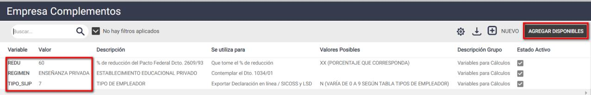
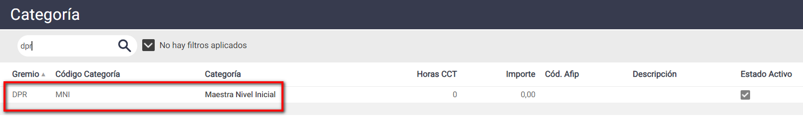
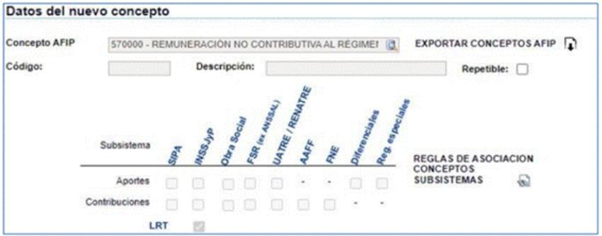
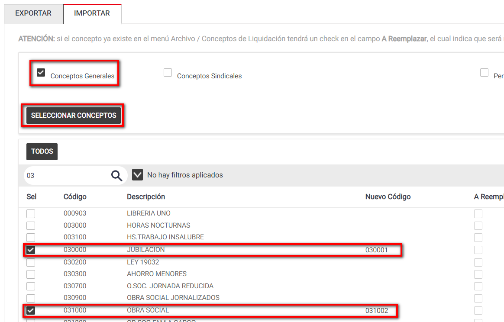
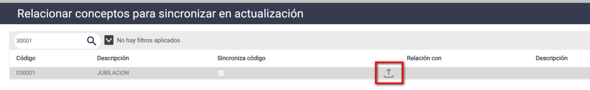
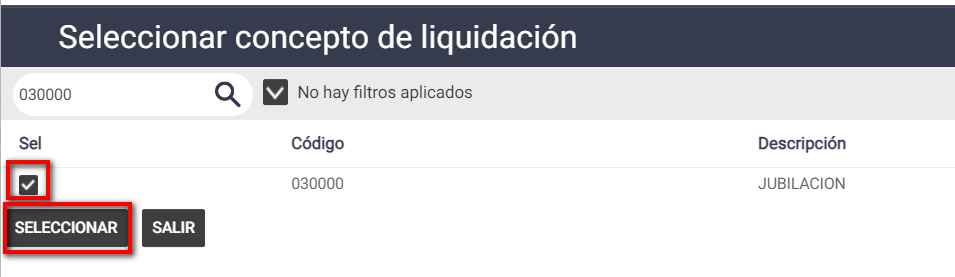
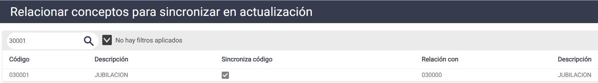
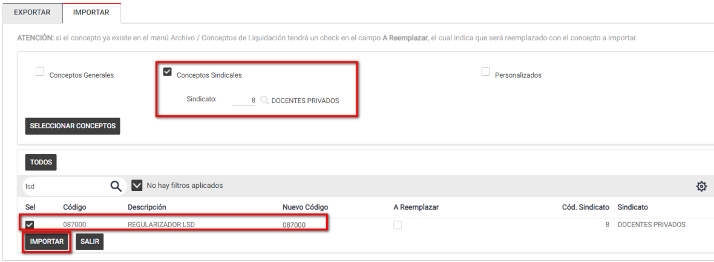

# 20240930190326

 1 
 
  
Estudios Contables  

 
 
 
 2 Estudios Contables  
Sueldos y Jornales  
Noviembre  2023 Liquidación Docentes Actividad 016  
 
A continuación, te detallamos las generalidades a tener en cuenta para 
poder  realizar la liquidación de personal docente con Actividad 016 - No 
obligados con el SIJP (colegios, reciprocidad previsional y otros), en el 
módulo Sueldos y Jornales.  
 
¡Esperamos que te sea de utilidad!  
 
En Empresa > Complementos , presiona en [Agregar Disponibles ] y 
agrega  las siguientes variables:  
• Para indicar el Tipo de Empleador para el aplicativo de AFIP, 
seleccio nar TIPO_SIJP en Valor agregar  7 
• Para contemplar el Dto. 1034/01, seleccionar  REGIMEN en Valor 
agregar  ENSEÑANZA PRIVADA  
• Si corresponde porcentaje de reducción de contribuciones 
patronales, seleccionar  REDU en Valor agregar  … (porcentaje que 
corresponda)  
 
A modo de ejemplo : 
 
 
 
En Empleados > Legajo > Laborales  completar en cada empleado los 
campos Gremio y Categoría, con los datos que correspondan.  
 
El sistema ya tiene definidos algunos gremios y categorías. No obstante, 
pueden crearse nuevos o modificarse los existentes. Para crear un 
gremio ingresar a Archivo > Laborales > Gremio  y colocar un código 
inexistente y su descripción. Luego, a ese gremio se le deberán crear las 
categorías desde Archivo > Laborales > Categoría . En el campo 
“Gremio” seleccionar el código cread o. Luego, en el campo categoría dar 
de alta un código inexistente y completar el resto de los datos. Ejemplo:  

 
 
 
 3 Estudios Contables  
Sueldos y Jornales  
Noviembre  2023  
 
 
Horas CCT : informar el número de horas que se estableció para la 
categoría.  
 
Importe : informar el valor salarial de la categoría (mensual, por hora o 
jornal, según corresponda). Si se completa, los conceptos de Sueldo 
mensual, Horas normales, Horas trabajadas y Días trabajados lo tendrán 
en cuenta, no siendo necesario completar este valor e n cada empleado.  
 
CONCEPTOS DE LIQUIDACIÓN DISPONIBLES : 
 
Podrá utilizarse cualquier concepto de los que se encuentran definidos 
en Archivo > Conceptos de Liquidación , de acuerdo a lo que se desee 
calcular. Además, el sistema cuenta con conceptos adicionales, 
específicos para trabajadores docentes, que cada usuario podrá 
incorporar si considera que corresponde su liquidación.  
 
Para consultar los conceptos disponibles y su proceso de incorporación 
ver Ayuda > Temas de Ayuda de Sueldos y Jornales > Capítulo 10 – 
Fórmulas Adicionales > Importación de Fórmulas Sindicales y Varias . 
 
EXPORTACIÓN LIBRO DE SUELDO DIGITAL : 
 
Según la Guía 45 - LIBRO DE SUELDO DIGITAL  
 
CARGA MANUAL CONCEPTOS REMUNERACIÓN NO CONTRIBUTIVA : 
 
Los conceptos que deberán tener descuentos en el recibo, pero no llevar 
aportes ni contribuciones SIJP para el F931 se codifican como 570.000 
Mensual - Remuneración No Contributiva al Régimen Nacional de 
Seguridad Social   en AFIP en forma manual:  

 
 
 
 4 Estudios Contables  
Sueldos y Jornales  
Noviembre  2023  
 
 
En Código  se indica el código del concepto en Holistor (por ejemplo, 
001003 ) y en Descripción el nombre del mismo (por ejemplo, SUELDO 
MENSUAL).  
 
Por defecto aportan a ART y puede tildarse en forma opcional aporte y 
contribución a Obra Social, según corresponda.  
 
Desde Útiles > Conceptos de Liquidación > Realizar c odificación AFIP - 
Libro de Sueldo Digital  se deberá indicar 570000  como codificación en el 
sistema.  
 
El concepto 001003 - SUELDO MENSUAL  puede ser incorporado 
(importando el 0010 00 SUELDO MENSUAL), siguiendo el procedimiento 
que se indica a continuación para los conceptos de Jubilación y Obra 
social.  
 
IMPORTANTE : Los conceptos que utilice para liquidar esta modalidad 
tendrá que utilizarlos de manera exclusiva para la misma, dado que en 
AFIP deben figurar con un código especifico, por esta razón es que 
indicamos como importarlos en otros códigos.  
 
IMPORTACIÓN Y CODIFICACIÓN CONCEPTOS ESPECÍFICOS PARA 
LIQUIDAR : 
 
Aquellos conceptos que deberán codificarse con 570.000 , y los códigos 
0300 00 JUBILACIÓN y 0310 00 OBRA SOCIAL  deberán importarse en otro 

 
 
 
 5 Estudios Contables  
Sueldos y Jornales  
Noviembre  2023 código para trabajar exclusivamente en estas liquidaciones.  
 
Estos conceptos se podrán importar, ingresando al menú Útiles > 
Conceptos de liquidación > Importar/exportar conceptos de liquidación , 
solapa Importar  tilda Conceptos Generales . En la columna Nuevo Código 
se deberá asignar un nuevo código a los conceptos.  
 
A modo de ejemplo, ver la siguiente imagen:  
 
 
 
 
Luego de importar los conceptos deberá ingresar al menú  Útiles > 
Conceptos de Liquidación > Relacionar conceptos para Actualización  > 
Código 030 001 (por ejemplo). Presiona en Seleccionar  código para 
relacionar . Allí relacionar el concepto 030 001 con el 030 000 para que 
cuando se actualicen  los códigos originales también se actualicen los 
códigos relacionados.  
 
Los mismos pasos deberá realizar con los demás conceptos.  
 
A modo de ejemplo puede ver las siguientes imágenes:  

 
 
 
 6 Estudios Contables  
Sueldos y Jornales  
Noviembre  2023  
 
 
 
CODIFICACIÓN PARA LIBRO DE SUELDOS DIGITAL : 
 
Luego de importar los conceptos deberá relacionarlos con el código de 
AFIP   810015 -Sistema Previsional No Nacional  para el concepto 
JUBILACION  y para el concepto de OBRA SOCIAL el condigo de 
AFIP  810016 Obra social Provincial.  La copia de los conceptos 
remunerativos a utilizar para aquellos  conceptos que deben tener 
descuentos en el recibo, pero no llevar aportes ni contribuciones para el 
F931 se codificarán como remunerativos (Por ejemplo, para la copia 
0010 00 SUELDO MENSUAL utilizar 110000 SUELDO)  
 
Para ello deberá ingresar desde el menú  Útiles > Conceptos de Liquidación 
> Codificación AFIP - Libro de Sueldo Digital,  columna  Código AFIP .  
 
A la hora de subir los conceptos en la página de AFIP, deberá subir 
primeramente en forma manual la copia de los conceptos remunerativos, 
desde la sección CONCEPTOS, trabajando en esta parte de la pantalla:  
 
Una vez subidos estos conceptos en forma manual, proceder con la 
importación de los demás conceptos desde CARGA MASIVA POR 
IMPORTACIÓN a partir del txt que exporta Holistor.  
 

 
 
 
 7 Estudios Contables  
Sueldos y Jornales  
Noviembre  2023 AJUSTAR LAS BASES EN FUNCIÓN DE LA ACTIVIDAD 16:  
 
Para ajustar las bases y que sólo se considere el aporte de las bases 4, 8 y 9 
debe incorporar el siguiente concepto en los Conceptos Fijos de sus 
empleados con Actividad 16:  
  
CONCEPTO:  
 
• Código sugerido: 0870 00 - Regulizador LSD  (Sugerimos 
importar este concepto en un código posterior al 0800 00) 
  
FUNCIONAMIENTO:  
 
• 0870 00 - Regulizador LSD :  Cargar  desde  Empleados > 
Conceptos Fijos  sin informar nada.  Regulariza exportación para 
Actividad SICOSS 016 Y ENSEÑANZA PRIVADA  
 
IMPORTACION:  Puede importar el concepto desde Útiles > Conceptos de 
liquidación > Importar/exportar conceptos de liquidación , solapa 
Importar  tilda Conceptos Sindicales > Sindicato >  8 - Docentes Privados > 
[Seleccionar conceptos]   
 
 
 
 
 
 
 
 

 
 
 
 8 Estudios Contables  
Sueldos y Jornales  
Noviembre  2023 ACTIVIDAD 92 - Res 71/99 SSS y otros : 
 
Para aquellos empleados que tuvieran CUILES mixtos, curriculares y 
extracurriculares, deberán crearse dos legajos: uno siguiendo las pautas ya 
indicadas en este instructivo por su parte curricular, y otro separado por su 
parte extracurricular, en la que utilizarán los conceptos remunerativos y de 
retención generales. Ambo s legajos deberán exportarse en la misma 
liquidación. Al poseer el mismo CUIL, se unirán a la hora de subir a LSD.  
Ante  cualquier  inconveniente  no dude  en comunicarse  con nosotros.  
 

