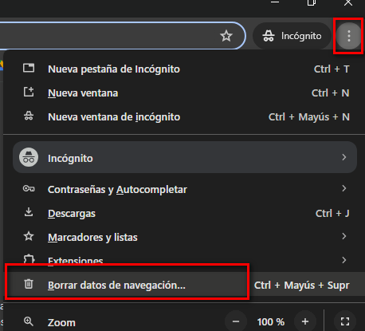
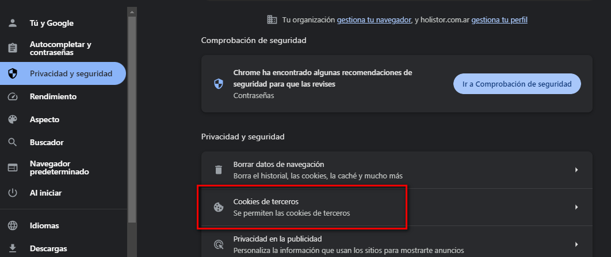
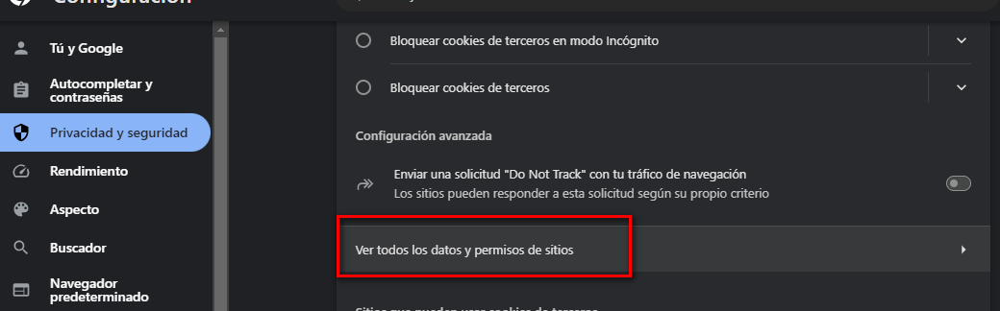
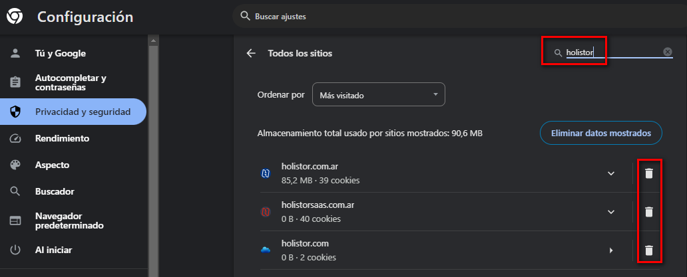
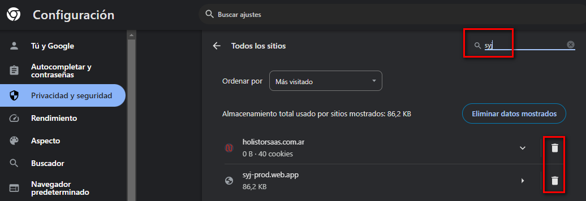

# 20240930190330

 1 
 
  
Estudios Contables  

 
 
 
 2 Estudios Contables  
Sueldos y Jornales  
Mayo  2024 ELIMINAR HISTORIAL DEL NAVEGADOR DE INTERNET 
Y COOKIES DE HOLISTOR . 
 
Para eliminar el historial de su navegador de Internet, seguir los pasos 
detallados a continuación:  
 
Si están trabajando con el Navegador de Internet Google Chrome:  
 
- Abrir el navegador Google Chrome.  
 
- En el sector de arriba a la derecha, ingresar en el icono para 
"Personalizar y Controlar Google Chrome"  
 
- Seleccionar " Borrar Datos de Navegación…".  
 
 
 
- En la solapa "Configuración Avanzada", seleccionar en Intervalo de 
tiempo: TODOS o DESDE SIEMPRE y dejar tildadas las  primeas 4 o pciones:  

 
 
 
 3 Estudios Contables  
Sueldos y Jornales  
Mayo  2024  
 
- Clic sobre el botón "Borrar los Datos".  
 
Eliminar cookies de Holistor.  
 
- En la sección  Privacidad y Seguridad, ingresar en “Cookies de terceros ” 
 
 
 
- Click en “ Ver todos los datos y permisos de sitios ” 
 

 
 
 
 4 Estudios Contables  
Sueldos y Jornales  
Mayo  2024  
 
- Escribir en la barra de búsqueda que se encuentra en la barra superior 
derecha “holistor” y borrar cada una de las cookies guardadas , si es que 
no se eliminaron en el paso anterior . Luego, realizar el mismo 
procedimiento buscando “syj”. A modo de ejemplo:  
 
 
 
 
 
- Cerrar el navegador y volver a inicializarlo.  
 
- Verificar que el error esté reparado.  
 

