# 20240930190334

 1 
 
  
Estudios Contables  

 
 
 
 2 Estudios Contables  
Sueldos y Jornales  
Septiembre 2024  Liquidación Empleados Jornalizados  
 
Concep tos previstos:  
 
Para las horas , uno de los siguientes conceptos:  
 
• 001500 HORAS NORMALES ó   
• 001700 HORAS TRABAJADAS  
  
Para la retención de obra social:   
 
• 031700 OB. SOCIAL JORNALIZADOS HORAS  
 
¿Cómo funcionan estos conceptos? ¿Qué concepto de horas me 
conviene utilizar?  
 
• 001500 HORAS NORMALES: deberás cargarlo por Conceptos Fijos indicando en 
la columna CANTIDAD la cantidad de horas de una jornada habitual (de un día 
de trabajo). El valor de la hora la podes  indicar en la columna IMPORTE de 
Conceptos Fijos o desde Archivo  > Laborales  > Categoría , en el campo Importe. 
En cada quincena o en la liquidación mensual deberás cargar por Novedades el 
concepto 001500 HORAS NORMALES e indicarle en la columna CANTIDAD la 
cantidad de horas efectivamente trabajadas por el empleado en el período en 
cuestión.   
• 001700 HORAS TRABAJADAS:  deberás cargarlo por Conceptos Fijos indicando 
en la columna PORCENTAJE la cantidad de horas de una jornada habitual (de un 
día de trabajo). El valor de la hora la podes  indicar en la columna IMPORTE de 
Conceptos Fijos o desde Archivo  > Laborales  > Categoría , en el campo Importe. 
La cantidad de horas efectivamente trabajadas por el empleado podrás 
informarlas en la columna CANTIDAD de Conceptos Fijos o en la columna 
CANTIDAD de Novedades, dando prioridad el sistema a lo indicado en 
Novedades.   
 
El concepto 001700 HORAS TRABAJADAS  te será de mayor utilidad en el caso de 
empleados que trabajen todas las quincenas o todos los meses la misma cantidad de 
horas, ya que en este caso podrás cargar directamente la cantidad de horas trabajadas 
en la columna CANTIDAD de Conceptos Fijos, sin necesidad de tener que cargar en 
todas las liquidaciones el concepto por Novedades, salvo casos excepcionales. Si por el 
contrario, la cantidad de horas trabajadas varía en todas las liquidaciones, te 
sugerimos utilizar e l concepto 001500 HORAS NORMALES.   
 

 
 
 
 3 Estudios Contables  
Sueldos y Jornales  
Septiembre 2024  NOTA:  Es importante que en Conceptos Fijos indiques al sistema cuantas horas 
representan una jornada de trabajo , en la columna CANTIDAD en el caso del código 
001500 y en la columna PORCENTAJE en el caso del código 001700, ya que cuando 
debas liquidar conceptos expresados en días, como por ejemplo vacaciones , días de 
licencia , etc., el sistema necesitará saber cuántas  horas representan un día.   
 
Atención:  Tené presente que solo podrás utilizar uno de estos dos conceptos , ya que 
en ningún caso deberás tener más de un concepto de básico en un mismo empleado, 
ya que eso generará cálculos erróneos y la visualización de datos incorrectos en 
distintas emisiones del módulo.  
 
• 031700 OB. SOCIAL JORNALIZADOS HORAS:  deberás cargarlo por Conceptos 
Fijos sin indicar nada. El concepto calculará en la primera quincena el 3% sobre 
el total remunerativo, y en la segunda quincena realizará un control de mínimo 
de horas normales de convenio para realizar el aporte, según la cantidad 
indicada desde Archivo  > Laborale s > Categoría , en el campo Horas CCT.  
El control lo realiza en la segunda quincena, de la siguiente forma: suma lo 
remunerativo de la primera quincena y lo remunerativo de la se gunda quincena 
y lo compara con las horas normales del convenio multiplicadas por el valor de 
la hora básica y, de los dos importes, toma el mayor. A esa base le deduce la 
base sobre la que ya aportó en la primera quincena y sobre el diferencial aplica 
el 3 %. 
 
Importante:  para que el sistema pueda realizar el control descripto anteriormente, es 
necesario que luego de liquidar la primera quincena se dirija al menú Liquidación > 
Actualizar Totalizadores  para que los datos se guarden dentro del sistema.  
 
Si liquidas los empleados en forma mensual,  pero utilizando, para liquidar el básico, 
algún código de horas (001500 HORAS NORMALES ó 001700 HORAS TRABAJADAS) , el 
concepto 031700 OB. SOCIAL JORNALIZADOS HORAS  también va a realizar el control 
del mínimo de horas de aporte, comparando, en este caso, el total remunerativo 
liquidado con las horas normales del convenio multiplicadas por el valor de la hora 
básica tomando de los dos importes el mayor. Luego de deter minar la base aplica 
sobre ella el 3%.  
 
También, si por algún motivo lo prefirieras, en lugar del concepto 031700 podrías 
utilizar el concepto 031000 OBRA SOCIAL , informando en Conceptos Fijos la base de 
cálculo que quisieras considerar.  
  
 
 
 
 

 
 
 
 4 Estudios Contables  
Sueldos y Jornales  
Septiembre 2024  Ejemplos de Cálculo  
 
A continuación, te mostraremos dos ejemplos de liquidación para empleados 
jornalizados:   
1. Empleados quincenales (Primera y Segunda Quincena)  
2. Empleados con una única liquidación mensual.   
 
El empleado que utilizaremos, para ambos ejemplos, está definido de la siguiente 
manera: En el menú Empleados  > Legajo , solapa Laborales tiene asociado el gremio 
CONE y la categoría C -AY. 
 
 
 
NOTA:  A los fines del ejemplo se seleccionó el gremio Construcción , pero recordá que 
las indicaciones de este instructivo son aplicables a cualquier gremio en el que sea 
necesario liquidar por hora.  
 
En el menú Archivo  > Laborales  > Categoría , en el campo Horas CCT informamos como 
horas normales de convenio 176 y en el campo Importe 320, que representa el valor 
de la hora.  
 

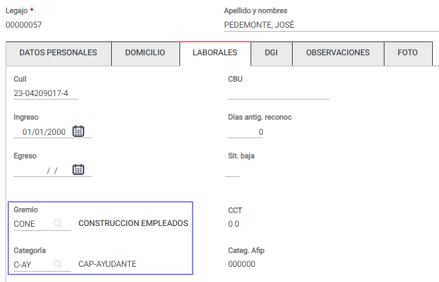

 
 
 
 5 Estudios Contables  
Sueldos y Jornales  
Septiembre 2024   
 
En el menú Empleados > Conceptos Fijos  el empleado tiene cargado los siguientes 
conceptos de liquidación:  
 
 
 
 
1. Empleados quincenales  
 
Primera Quincena : 
En primer lugar, creamos la carátula de liquidación, desde el menú Liquidación→ 
Nueva / Seleccionar Liquidación → [Nuevo] , completando los campos Tipo y Período 
de Pago del siguiente modo:  
 
 
 
Luego, desde Liquidación > Novedades , cargamos el código 001500 HORAS 
NORMALES  y en la columna CANTIDAD le indicamos la cantidad de horas trabajadas en 
la primera quincena.  
 
A continuación, ejecutamos los procesos de Verificar y Calcular . 
 
Al visualizar la liquidación, observamos que el concepto 031700 OB. SOCIAL 
JORNALIZADOS HORAS  calcula el 3% sobre el total remunerativo.  

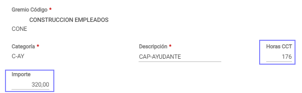

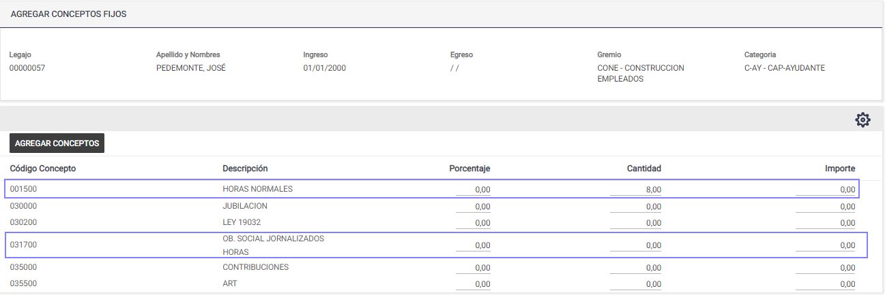

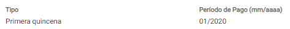

 
 
 
 6 Estudios Contables  
Sueldos y Jornales  
Septiembre 2024   
 
 
Por último, corremos el proceso de Actualizar Totalizadores , desde el menú 
Liquidación > Actualizar Totalizadores , para que los datos de la primera quincena se 
guarden en la tabla HABERES.  
 
Segunda Quincena : 
Seguimos el mismo procedimiento indicado con anterioridad. Creamos la carátula de 
liquidación, completando los campos Tipo y Período de Pago del siguiente modo:  
 
 
 
 
Luego, desde Liquidación  > Novedades , cargamos el código 001500 HORAS 
NORMALES  y en la columna CANTIDAD le indicamos la cantidad de horas trabajadas en 
la segunda quincena.  
 
A continuación, ejecutamos los procesos de Verificar y Calcular . 
 
Al visualizar la liquidación, corroboramos que el concepto 031700 OB. SOCIAL 
JORNALIZADOS HORAS  calcula un valor superior al 3 % sobre lo remunerativo.  
 
 
 
El cálculo que realiza el código 031700 OB. SOCIAL JORNALIZADOS HORAS  es el 
siguiente:  
 

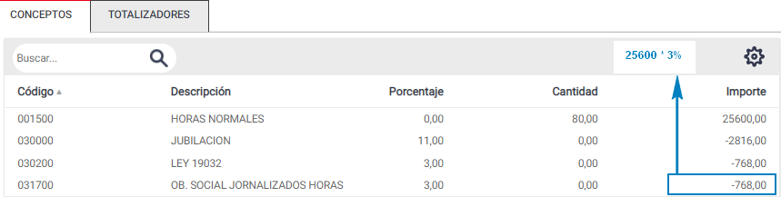

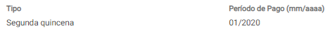

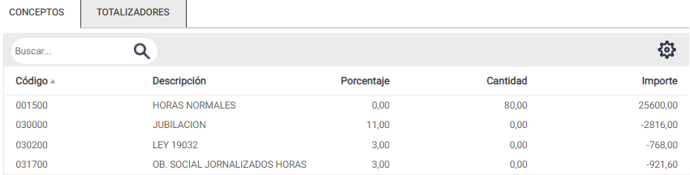

 
 
 
 7 Estudios Contables  
Sueldos y Jornales  
Septiembre 2024   
 
Por último, corremos el proceso de Actualizar Totalizadores , desde el menú 
Liquidación  > Actualizar Totalizadores , para que los datos de la primera quincena se 
guarden en la tabla HABERES, seleccionando la opción [Sumar los Nuevos Datos].  
 
2.Empleados con una única Liquidación Mensual.    
 
En primer lugar, creamos la carátula de liquidación, desde el menú Liquidación  > 
Nueva / Seleccionar Liquidación → [Nuevo] , completando los campos Tipo y Período 
de Pago del siguiente modo:  
 
 
 
Luego, desde Liquidación > Novedades , cargamos el código 001500 HORAS 
NORMALES  y en la columna CANTIDAD le indicamos la cantidad de horas trabajadas en 
el mes.  
A continuación, ejecutamos los procesos de Verificar y Calcular . 
 
Al visualizar la liquidación observamos que el concepto 031700 OB. SOCIAL 
JORNALIZADOS HORAS  calcula un valor superior al 3 % sobre lo remunerativo.  
 
 
 
El cálculo que realiza el código 031700 OB. SOCIAL JORNALIZADOS HORAS  es el 
siguiente:  
 

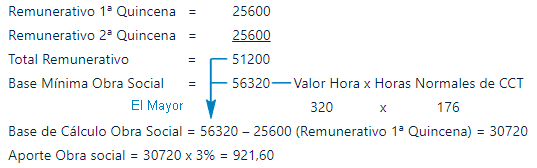

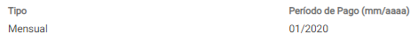

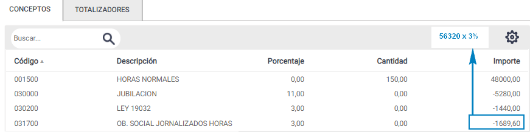

 
 
 
 8 Estudios Contables  
Sueldos y Jornales  
Septiembre 2024   
 
Por último, corremos el proceso de Actualizar Totalizadores , desde el menú 
Liquidación > Actualizar Totalizadores , para que los datos de la primera quincena se 
guarden en la tabla HABERES.  
 
Empleados de Construcción  
 
Si liquidas empleados del gremio Construcción (UOCRA) , te sugerimos consultar el 
menú Ayuda > Temas de Ayuda de Sueldos y Jornales > Capitulo 9 – Procesos Útiles > 
Liquidación Construcción . Allí se indican los pasos a seguir para la liquidación de 
remuneraciones de este gremio. Podrás calcular la contribución al fondo de 
desempleo, emitir las notas de crédito por cuadruplicado, emitir resumen para bancos 
y exportar al aplicativo de la UOCRA , entre otras opciones.  
 
 
 
 

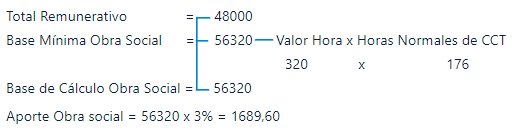

