# 20240930190344

 1 
 
  
Estudios Contables  

 
 
 
 2 Estudios Contables  
Sueldos y Jornales  
Noviembre 2022 Libro de Sueldo Digital  
 
Configuración e importación de Conceptos de liquidación  
 
En el módulo Sueldos y Jornales ingresando desde Útiles > Conceptos de 
Liquidación > Realizar Codificación AFIP – Libro de Sueldos Digital , se deberá 
asociar a cada concepto de liquidación un Código AFIP para la exportación a la 
aplicación web Libro de Sueldos Digital.  
Este proceso se realiza por única vez, y sólo será necesario volver a ingresar a esta 
opción para asociar a nuevos códigos los códigos de AFIP.  
Si la empresa tiene  codificación propia de conceptos, esto se deberá realizar 
desde  Empresa > Codificación Propia > C onceptos de Liquidación Propios . En 
este lugar de trabajo, también se podrá copiar la asociación con los códigos AFIP 
que tienen los conceptos en la Codificación General, desde el botón [Codificación 
AFIP General].  
  
 
 
 

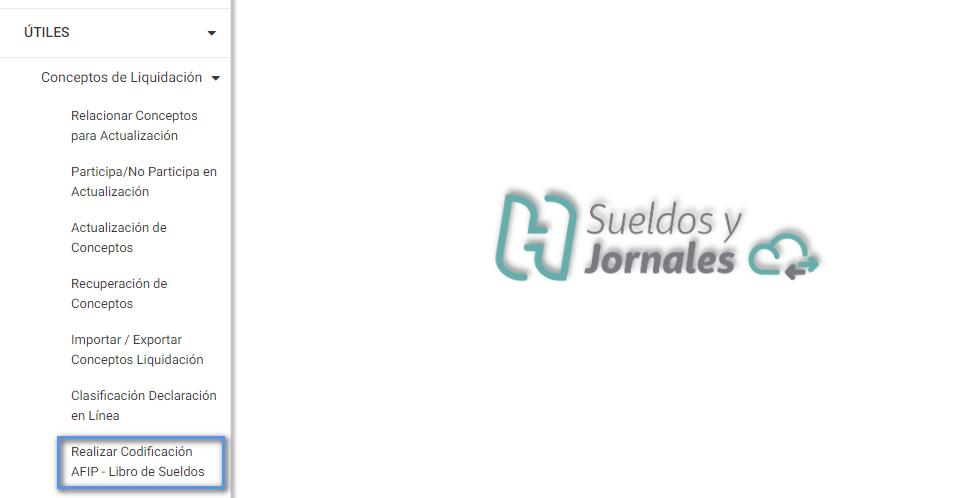

 
 
 
 3 Estudios Contables  
Sueldos y Jornales  
Noviembre 2022 Cuando se efectúe la exportación de  cada liquidación, desde Exportar  > Libro de 
Sueldos Digital , se generarán dos archivos .txt XXXX_Conceptos_AAAAMM.txt y 
XXXX_Liquidacion_AAAAMM.txt (donde XXXX es el Nº de orden de la liquidación 
y AAAAMM es el año y mes del periodo liquidado).  
 
 
 
 
 
Para importar los conceptos se deberá ingresar en la página de AFIP, en el servicio 
Libro de Sueldos Digital, solapa CONCEPTOS : 

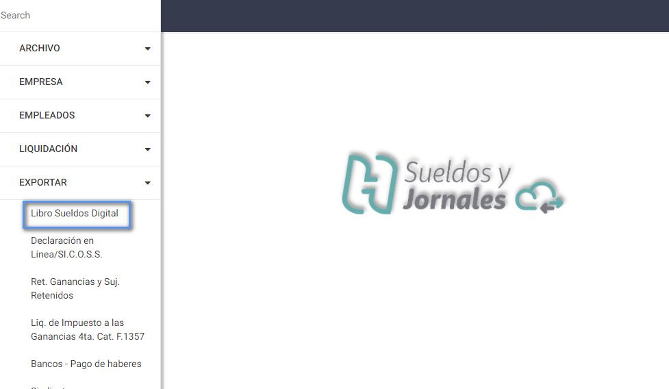

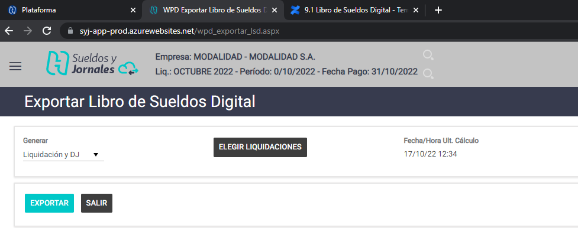

 
 
 
 4 Estudios Contables  
Sueldos y Jornales  
Noviembre 2022  
 
 Y elegir la opción [CARGA MASIVA POR IMPORTACIÓN]:  
 
  
Presionar el botón [Seleccionar archivo],  buscar el archivo 
XXXX_Conceptos_AAAAMM.txt generado desde el módulo Sueldos y Jornales, y 
por último presionar [CARGAR]:   

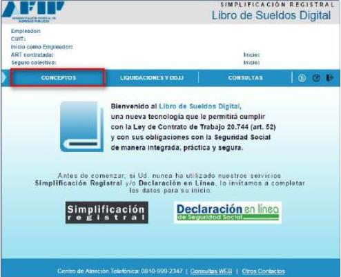

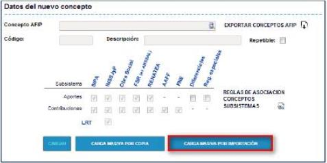

 
 
 
 5 Estudios Contables  
Sueldos y Jornales  
Noviembre 2022  
 
 
 
Creación e importación de Liquidación  
 
En el servicio "Libro de sueldos digital", solapa LIQUIDACIONES Y DDJJ , se 
deberá realizar el alta del nuevo período desde el botón [Nuevo Período],  
completando los siguientes ítems:   
 
 
 Luego se deberá presionar el botón [Agregar],  y ahí se abrirá un cua dro para el 
período en cuestión, donde se van a ir agrupando una o más liquidaciones de 
sueldo.  
Después se deberá presionar el botón [Agregar Liquidación] , y completar el 
número y el tipo de liquidación:  

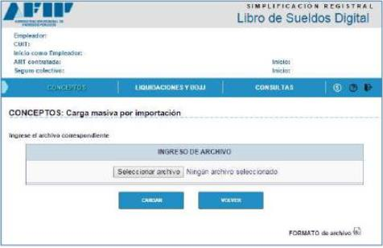

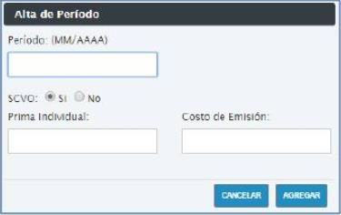

 
 
 
 6 Estudios Contables  
Sueldos y Jornales  
Noviembre 2022  
No es necesario empezar en cada período con el nro. de liquidación 1. Lo único 
que se debe tener en cuenta es que, al agregar más de una liquidación en un 
período, la numeración debe ser ascendente.  
En el archivo XXXX_Liquidación_AAAAMM.txt, Holistor  exportará en los campos 
“Período”, “Nro liquidación”  y “Tipo de liquidación” los datos ingresados en la 
Carátula de Liquidación en los campos Tipo, Período Pago y Orden:  
 
 
Para efectuar la importación de la liquidación deberá presionar el botón 
[IMPORTAR DESDE ARCHIVO]:  
 
 

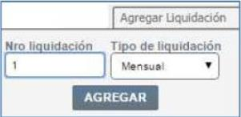

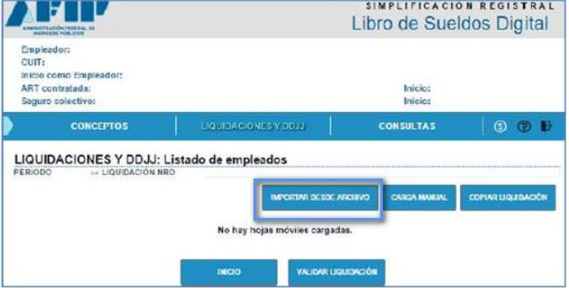

 
 
 
 7 Estudios Contables  
Sueldos y Jornales  
Noviembre 2022 Seleccionar el archivo XXXX_Liqui dación_AAAAMM.txt generado por Holistor , y 
luego presionar el botón [Subir].   
 
 
Importante : el período y el nro. de orden deben coincidir con lo ingresado en el 
servicio de AFIP en Período, Nro. liquidación y Tipo de liquidación, caso contrario 
saldrá un mensaje de error similar al siguiente:    
 

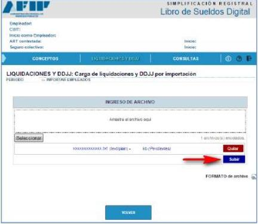

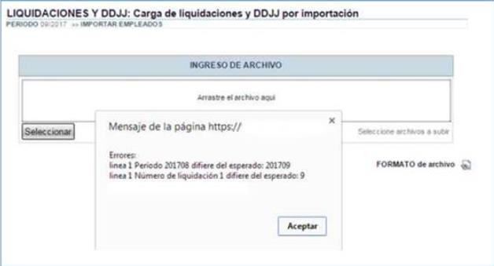

 
 
 
 8 Estudios Contables  
Sueldos y Jornales  
Noviembre 2022 Atención : Sólo podrá agregarse una nueva liquidación en un mismo período 
cuando se encuentren firmadas y presentadas todas las liquidaciones anteriores 
que pudieran existir para el mismo período.   
Una ve z importado el archivo, corresponde validar la información, presionando el 
botón [VALIDAR LIQUIDACIÓN],  al realizar dicho proceso el sistema indicará si 
los datos cargados son correctos o presentan inconsistencias.  
  
Si una liquidación posee inconsistencia s, se mostrarán los primeros 20 errores 
detectados para que puedan ser corregidos y repetir el proceso de validación.  
Esos errores podrán visualizarse por pantalla al finalizar el proceso de validación 
o descargar esa información en formato txt haciendo cl ic en el icono de descarga.  
 
 
Al finalizar el proceso de validación, se podrá acceder a la consulta de los 
siguientes documentos de control:  
• Libro de sueldos borrador.  
• Resumen de la liquidación.  
• Declaración jurada en base a las liquidaciones ingresadas.   
 
 
 
 
 
 
 
 
 
 
 
 

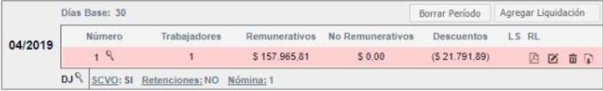

