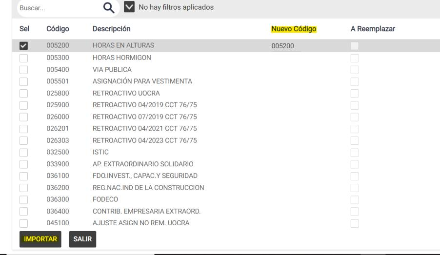

# 20240930190403

 1 
 
  
Estudios Contables  

 
 
 
 2 Estudios Contables  
Sueldos y Jornales  
Septiembre  2024  IMPORTAC IÓN DE CONCEPTOS SINDICALES  
 
A continuación de detallamos los pasos a seguir para realizar la importación de 
conceptos sindicales.  
 
¡Esperamos que te sea de utilidad!  
 
Generalidades:  
 
El sistema contiene desarrollados conceptos de liquidación adicionales, algunos de uso 
general, y otros específicos para determinados Gremios de mayor utilización.  
 
Para que puedas dar de alta y utilizar dichos conceptos, previamente deberás importarlos. 
Para ello ingresa al Menú  Útiles > Conceptos de liquidación > Importar / Exportar conceptos 
de liquidación.  
 
 
 
 
Luego se abrirá la siguiente pantalla , donde debe seleccionar IMPORTAR y tildar la 
opción CONCEPTOS SINDICALES   
 

 
 
 
 3 Estudios Contables  
Sueldos y Jornales  
Septiembre  2024   
 
Tildado Conceptos Sindicales , aparecerá para buscar el sindicato de acuerdo a los 
conceptos que necesite importar. Deberá hacer clic en el icono de la lupita y luego 
seleccionar el sindicato.  
 
 
Seleccionado el sindicato, presiona el Seleccionar Conceptos  y el sistema mostrara en 
grilla los conceptos disponibles para el sindicato seleccionado. Deberá tildar los 
conceptos que se deseen importar en la Columna “Sel” .  
  
La columna “Nuevo código”  mostrara por defecto, el código sugerido por el sistema, 
pero a este podrás modificarlo si ya se encontrara actualmente en uso.  
 
Luego presiona IMPORTAR  para realizar la importación definitiva de los conceptos.  
 

 
 
 
 4 Estudios Contables  
Sueldos y Jornales  
Septiembre  2024  En el menú Ayuda > Temas de ayuda de sueldos y jornales > Capitulo 1 Archivo > 1.5 
Conceptos de liquidación > 1.5.2 Descripción de los conceptos sindicales  encontrara 
una lista de los gremios que poseen conceptos particulares para importar, el rango en 
el cual se debe encontrar cada uno, así  como una breve descripción de su utilización y 
funcionamiento.  
 
 
  

