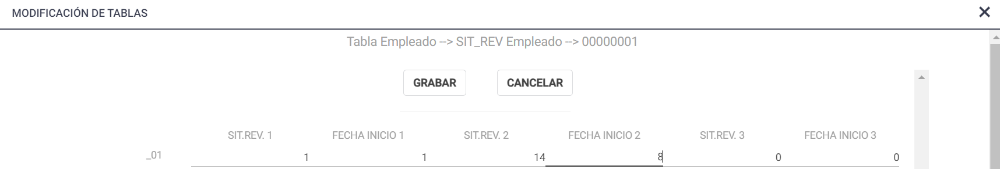

# 20240930190415

 1 
 
  
Estudios Contables  

 
 
 
 2 Estudios Contables  
Sueldos y Jornales  
Julio 2023  
 Licencia sin goce de haberes.  
 
En el siguiente instructivo encontrará los pasos a seguir para liquidar 
empleados con licencia sin goce de haberes en el módulo Sueldos y Jornales.  
 
Sugerimos liquidar con el código 085500 RESERVA DE PUESTO .  
Para importar dicho concepto debe ingresar desde Útiles  > Conceptos de 
Liquidación > Importar/Exportar Conceptos Liquidación > [Importar ] > Conceptos 
Sindicales > Sindicato > 1 A USO GENERAL.  
 
Situación 1:  El empleado tenga licencia por el mes completo:  
Ingresar desde Liquidación > Novedade s > Agregar por Concepto  > el código  
0855 00 RESERVA DE PUESTO informando en CANTIDAD los días del mes (ejemplo 
30)  
Para ocultar el Sueldo ingresar desde Liquidación > Novedade s > Código de 
Condiciones > Condición > Agrega la letra S (mayúscula y sin signo)  
 
Situación 2:  El empleado tenga licencia y días trabajados en el mismo periodo: 
Ingresar desde Liquidación > Novedades > Agregar por Concepto > el código 
085500 RESERVA DE PUESTO informando la CANTIDAD de días de licencia y 
agregar además el código que utiliza para liq uidar sueldo (ejemplo 0010 00 
SUELDO MENSUAL) informando la CANTIDAD de días trabajados.  
 
En cada caso deberá informar en Empleados > Legajo > Modificar (Icono de lápiz) 
> Solapa DGI la Situación que tiene el empleado el último día del periodo 
liquidado: 01 Activo o 14 Reserva de puesto según corresponda.  
 
Además, se deberá indicar los días que corresponden para las Situaciones de 
revista del período desde Empleados > Tabla de Empleados busca el legajo en 
cuestión, y busca la tabla SIT_REV , la abre desde DATOS. Allí indica, en el renglón 
del mes correspondiente, el código de situación y la fecha en que inició. Puede 
cargar hasta 3 situaciones.  
 
Por ejemplo, en el mes de enero, tenemos un legajo donde trabajo 7 días, y a 
partir del día 8 está bajo licencia s in goce de haberes. Quedaría de la siguiente 
manera:  

 
 
 
 3 Estudios Contables  
Sueldos y Jornales  
Julio 2023  
 Situación de Revista 1: 01 ACTIVO – Fecha de inicio 1: día 1.  
Situación de Revista 2: 14 RESERVA  DE PUESTO – Fecha de inicio 2: día 8.  
 
Para Libro de Sueldos Digital  se sugiere asociar el concepto 085500 RESERVA DE 
PUESTO con el código de Afip 550000 – Importes no remunerativos especiales.  
 
Ante cualquier inconveniente no dude en comunicarse con nosotros.  
 
 
 
 
 
 
 
 
 
 
 
 
 
 
 
 
 
 

