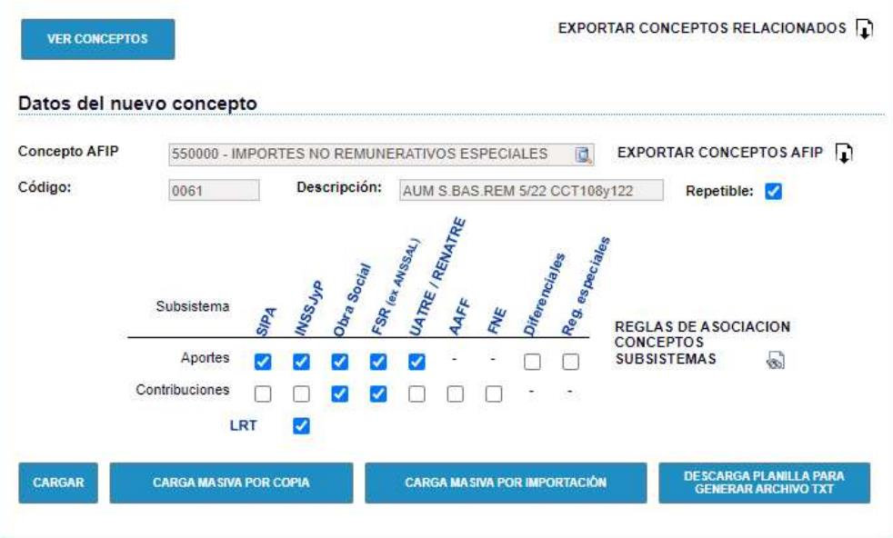

# 20240930190422

 1 
 
  
Estudios Contables  

 
 
 
 2 Estudios Contables  
Sueldos y Jornales  
Mayo  2023 LIQUIDACION SANIDAD CCT 108/75 y 122/75  
 
En todos los casos, debe utilizar el concepto de Sueldo ( 0010 00 SUELDO 
MENSUAL  o 0004 00 SUELDO MENSUAL JOR. REDUCIDA  según 
corresponda), indicando el sueldo básico de Abril de 2019  en IMPORTE 
por Conceptos Fijos o en la Categoría del empleado.  
 
Para calcular la antigüedad sobre el sueldo básico abril 2019, agregar el 
concepto 0200 00 ANTIGÜEDAD , indicando el porcentaje c orrespondiente 
en PORCENTAJE de Conceptos Fijos.  
 
A éstos se suman conceptos de aumento de acuerdo al convenio y opción, 
teniendo en cuenta  las particularidades de Sanidad respecto de las 
contribuciones. Los puede importar desde Útiles  > Conceptos de 
liquidación > Importar /Exportar  conceptos de liquidación > solapa 
Importar > Tilda en Conceptos Sindicales  > 23 – SANIDAD, 24 – SANIDAD 
CCT 108/75 y 25 – SANIDAD CC 122/75  
 
Opción A:  sobre el nuevo aumento el empleado deberá realizar sólo 
aportes de Obra Social , y el empleador sólo la contribución 
correspondiente a Obra Social . 
 
CCT 108/75:  
 
0177 02 INCR.NO REM. SANID 8/20 -108/75  
0179 00 INCR.NO REM. SANID 7/19 -108/75  
0205 03 INCR.NO REM. SANID 7/21 -108/75  
0206 05 INCR.NO REM. SANID 5/22 -108/75  
0215 04 INCR.NO REM. SANID 4/23 -108/75  
0274 01 ANTIG. S/ DESCTO. CCT 108/75  (Para calcular la antigüedad  
correspondiente a los aumentos)  
0275 01 ADIC. S/ DESCTO. CCT 108/75  (Para indicar un importe o un  
porcentaje sobre los  aumentos con las mismas condiciones de  
aportes/contribuciones que los demás conceptos de aumento)  
 
CCT 122/75 : 
 

 
 
 
 3 Estudios Contables  
Sueldos y Jornales  
Mayo  2023 0169 01 INCR.NO REM. SANID 4/23 -122/75  
0175 01 INCR.NO REM. SANID 5/22 -122/75  
0176 01 INCR.NO REM. SANID 8/20 -122/75  
0178 00 INCR.NO REM. SANID 7/19 -122/75  
0192 03 INCR.NO REM. SANID 7/21 -122/75  
0193 01 ANTIG. S/ DESCTO. CCT 122/75  (Para calcular la antigüedad  
correspondiente a los aumentos)  
0194 01 ADIC. S/ DESCTO. CCT 122/75  (Para indica r un importe o un  
porcentaje sobre los aumentos con las mismas condiciones de  
aportes/contribuciones que los demás conceptos de aumento) . 
 
Para cargar los conceptos de opción A en Libro de Sueldo digital:  
 
Estos conceptos son tratados como no remunerativos, y se codifican 
desde Holistor c on el código AFIP:  550000  -  IMPORTES NO 
REMUNERATIVOS ESPECIALES  (porque tienen indicado REMSINDES  en 
Totalización Importe).  
 
Opción B:  sobre el nuevo aumento el empleado deberá realizarlos aportes 
de: Jubilación, Ley 19032 y Obra Social  y el empleador sólo la 
contribución correspondiente a Obra Social.  
 
CCT 108/75:  
 
0039 00 AUM S.BASIC.REM 7/19 CCT108/75  
0056 01 AUM S.BASIC.REM 8/20 CCT10 8/75  
0058 01 AUM S.BASIC.REM 7/21 CCT108/75  
0061 00 AUM S.BAS.REM 5/22 CCT108y122  
0063 00 AUM S.BAS.REM 4/23 CCT108y122  
 
CCT 122/75 : 
 
0049 00 AUM S.BASIC.REM 7/19 CCT122/75  
0057 01 AUM S.BASIC.REM 8/20 CCT122/75  
0059 01 AUM S.BASIC.REM 7/21 CCT122/75  
0061 00 AUM S.BAS.REM 5/22 CCT108y122  
0063 00 AUM S.BAS.REM 4/23 CCT108y122  

 
 
 
 4 Estudios Contables  
Sueldos y Jornales  
Mayo  2023  
En ambos convenios puede complementar con:  
0074 00 ANTIGUEDAD SANIDAD S/ADICIONAL  
(Este concepto es para calcular la antigüedad correspondiente a los  
aumentos)  
0075 00 ADICIONALES SANIDAD S/INCREM.  
 (Este último es para indicar un importe o un porcentaje sobre los  
aumentos con las mismas condiciones de aportes/contribuciones que  
los demás conceptos de aumento)  
 
Para cargar los conceptos de opción B en Libro de Sueldo digital:  
 
Los conceptos de Sanidad que tienen en su TOTALIZACION IMPORTE  la  
variable SANC  (Puede visualizarlo desde Archivo > Conceptos de  
liquidación > busca el mismo, solapa DATOS ), se deben cargar  
manualmente en la página de AFIP, con el códig o de AFIP: 550000 –  
IMPORTES NO REMUNERATIVOS ESPECIALES  y con las siguientes 
particularidades:  
- Debe tildar toda la parte de Aportes, dejando destildados sólo los 
diferenciales y regímenes especiales.  
-Debe tildar en Contribuciones sólo Obra Social y ANSSAL (las demás 
opciones debe dejarlas destildadas)  
-Debe tildar LRT  
Además, desde Holistor deberá asignarles el mismo código de AFIP.  
 

 
 
 
 5 Estudios Contables  
Sueldos y Jornales  
Mayo  2023  
Una vez haya cargado en forma manual estos conceptos, genera la 
exportación, debe subir mediante Carga masiva por importación los 
demás conceptos que participan de la liquidacion. Cuando suba los 
conceptos puede surgir un error de “Combinación de subsistemas ..”. 
Desestímelo en estos conceptos , verificando que en la sección 
CONCEPTOS en AFIP se hayan dado de  alta los demás conceptos que 
utiliza.  
 
 
 
 
 
 
 
 
 
 
 
 
 

