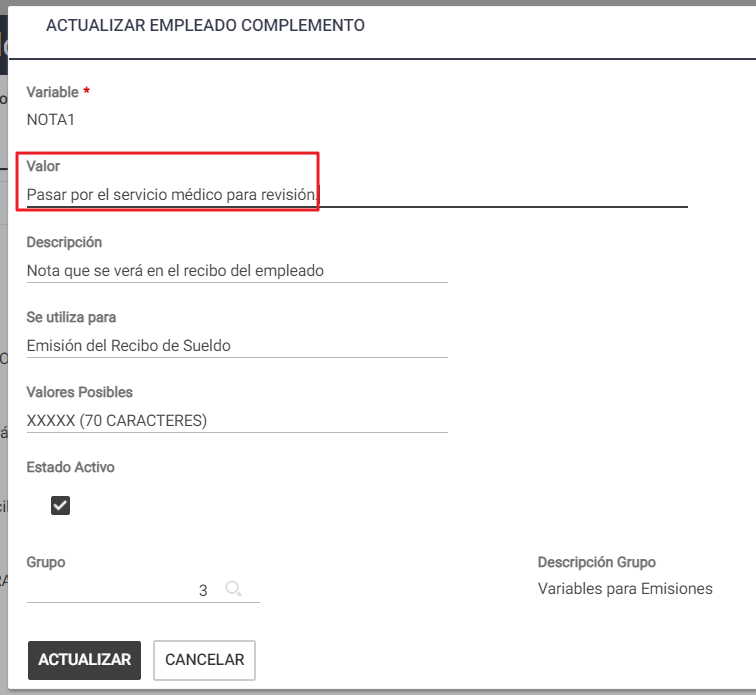

# 20240930190426

 1 
 
  
Estudios Contables  

 
 
 
 2 Estudios Contables  
Sueldos y Jornales  
Septi embre 2 024 Notas en el Recibo de Sueldo  
 
A continuación, te detallamos los pasos a seguir para poder incorporar notas 
complementarias/observaciones en el recibo de sueldo, en el módulo Sueldos y Jornales  
Web.   
¡Esperamos que te sea de utilidad!   
 
 
Es posible incorporar Notas que sean comunes a todos los empleados de la empresa, o 
bien, alguna nota que sea específica para algún empleado en particular (o varios).  
 
1. Notas comunes a todos los e mpleados de la empresa:  
 
Si la nota se debe incluir en todos los empleados de la empresa, se la deberá 
agregar en Empresa→ Complementos : 
 
NOTA1 y en Valor  completar con la nota correspondiente, por ejemplo: Pasar por 
el servicio médico para revisión.  
  
 
 
Si quisieras incorporar una segunda nota, que sea común para todos los 
empleados de la empresa, en un nuevo renglón deberás agregar el complemento:  
 
NOTA2  y en Valor  completar con la nota correspondiente.  
 
 

 
 
 
 3 Estudios Contables  
Sueldos y Jornales  
Septi embre 2 024 2. Notas específicas  para uno o más  emplead os: 
 
Si la nota es para un empleado en particular, se la deberá agregar en Empleados  
> Legajo , botón Complementos.  
 
NOTA1 y en Valor  completar con la nota correspondiente, por ejemplo: Pasar por 
el servicio médico para revisión.  
 
 
  
Sugerencia : Si necesitaras incorporar notas específicas a más de un empleado a la 
vez, podrás realizarlo de forma más ágil utilizando la herramienta de 
Modificaciones masivas, desde Empleados > Modificaciones masivas > 
Complementos.  
 
3. ¿Qué sucede si coloco notas tan to en la empre sa como en el empleado ? 
 
Si existieran notas en la empresa y en el empleado, las del empleado tienen 
prioridad de impresión (línea por línea) sobre las de la empresa. Si se desea que se 
impriman las de la empresa y también las del empleado se les deberá asignar 
diferente número de  nota. Ejemplo:  NOTA 1 en el empleado y  NOTA 2 en la 
empresa . 
 
4. Longitud de la nota:  
 
La longitud de cada nota estará condicionada al ancho del recibo con que se esté 
trabajando. Aproximadamente serán 70 caracteres. Si la nota a ingresar fuera más 

 
 
 
 4 Estudios Contables  
Sueldos y Jornales  
Septi embre 2 024 extensa continuar en el renglón siguiente agregando la variable NOTA con el 
número correlativo . 
 
5. Modelos de re cibo que admite notas : 
 
Todos los  modelos que al seleccionar el tipo de Recibo diga C/No tas: 
 
 
 
6. Cantidad de  notas posibles : 
 
En el modelo de recibo HOLISTOR V3.0 1xhoja (A4) se podrá incluir hasta 4 notas, 
los restantes modelos de recibo incluyen hasta 2 notas . 
 
 
 
  
  
 

