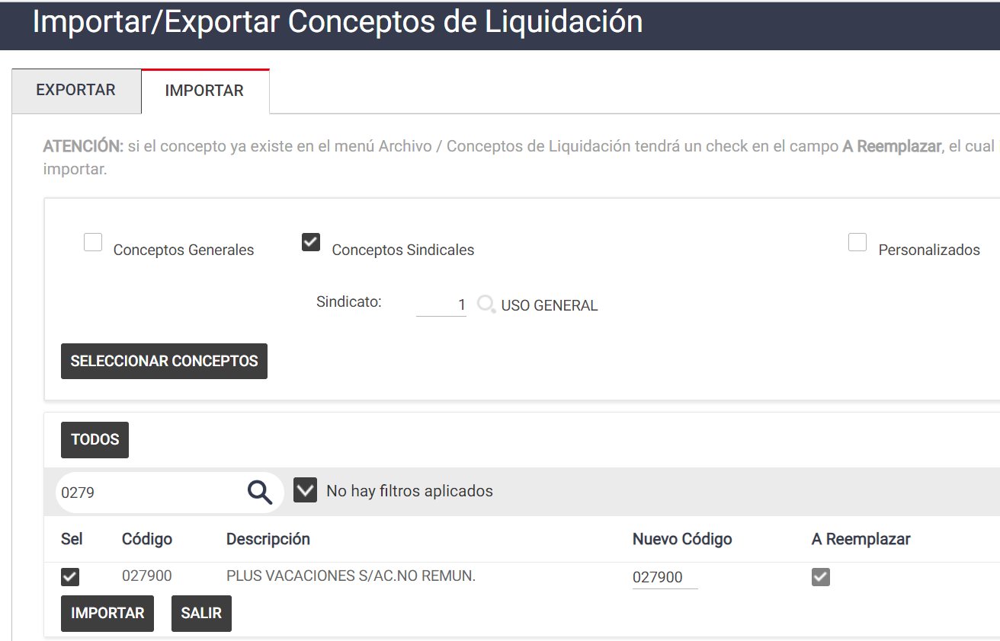

# 20240930190429

 1 
 
  
Estudios Contables  

 
 
 
 2 Estudios Contables  
Sueldos y Jornales  
Noviembre 2023  PLUS VACACIONES SOBRE ACUERDOS NO REMUNERATIV OS: 
 
A continuación, te detallamos los pasos  a tener en cuenta para poder realizar 
la liquidación de Vacaciones sobre acuerdos no remunerativos, en el módulo 
Sueldos y Jornales  Web . 
¡Esperamos que te sea de utilidad!  
 
El concepto a utilizar es el 0279 00 PLUS VACACIONES S/AC.NO REMUN.  
 
Se podrán importar desde Útiles  > Conceptos de Liquidación > 
Importar /Exportar conceptos de liquidación > Solapa importar > tildando 
Conceptos Sindicales > 1 – USO GENERAL  
 
 
 
Funcionamiento del concepto:  
 
Se debe cargar en  Novedades  sin informar nada. Si se desea indicar una 
cantidad de días diferente a las indicada en Vacaciones, indicarlo en la columna 
CANTIDAD.  
La base de cálculo son los Acuerdos del período que se calculan en la misma 
liquidación.  

 
 
 
 3 Estudios Contables  
Sueldos y Jornales  
Noviembre 2023  Si no está de acuerdo con el cálculo que está realizando el sistema, en la 
columna IMPORTE  se puede informar el monto final a pagar.  
El mismo calculara el Plus de las vacaciones sobre acuerdos.  
 
Codificación AFIP:  
 
Sugerimos vincularlo al código de AFIP 560003 - Vacaciones - PPC y CCT 
Especiales o 550000 – Importes no remunerativos especiales .  
 
 
 
 
 
 
 
 
 
 
 
 
 
 

