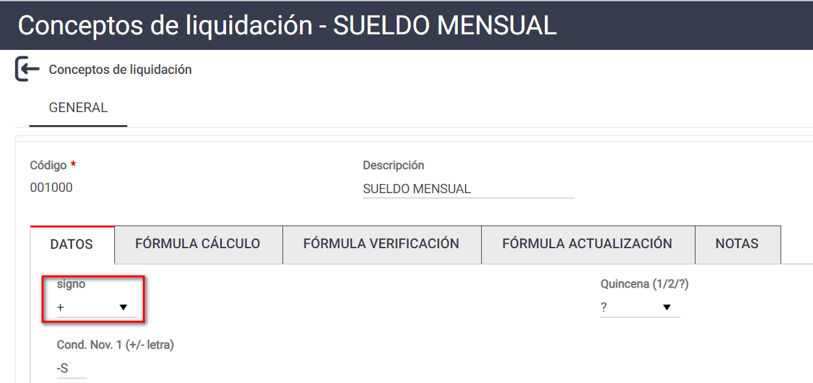
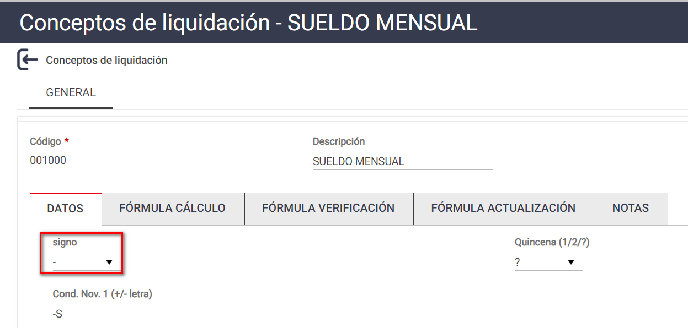
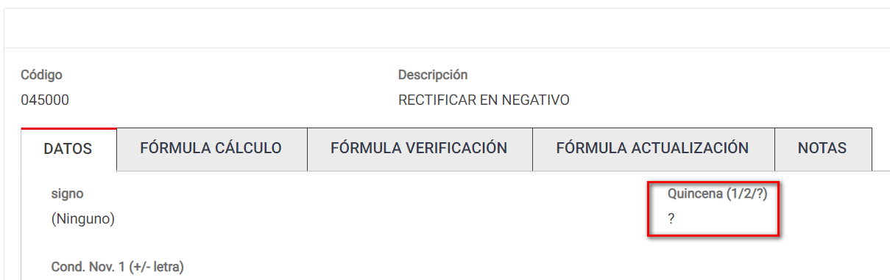
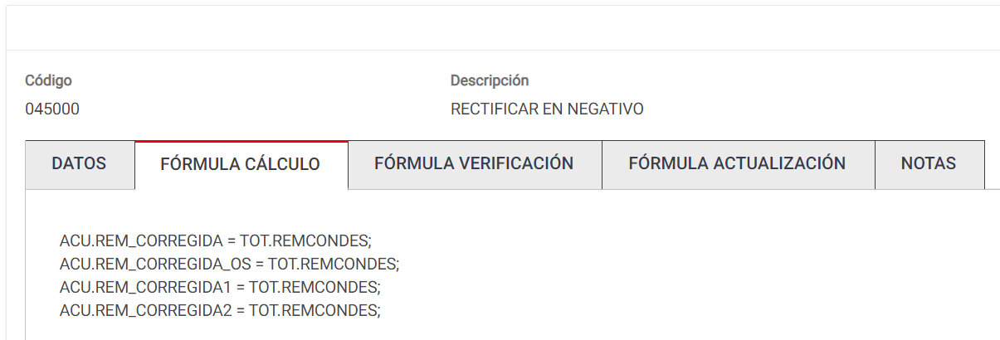

# 20240930190433

 1 
 
  
Estudios Contables  

 
 
 
 2 Estudios Contables  
Sueldos y Jornales  
Junio 2023  
 Rectificativas para Libro Sueldo digital.  
 
Cuando fuera necesario incorporar nuevas liquidaciones de sueldo que 
impliquen novedades y/o ajustes en el F931, según la Guía de AFIP debe 
incorporarse las mismas al período que corresponde, y completar todos 
los pasos propios del proceso de liquidación de sueldo: ‘Cargar’, ‘Validar’ y 
‘Aceptar’ la liquidación, como una nueva liquidación , teniendo en cuenta 
las siguientes pautas:  
 
1. La liquidación original tiene que qued ar tal como fue presentada 
oportunamente en AFIP. Si la modificó, tiene que volver a calcularla 
para regresarla a su estado original.  
2. En una liquidación separada debe realizar un recibo 
complementario, con las diferencias que tiene que rectificar. Estas 
diferencias pueden ser en más o en menos.  
 
 
RECTIFICACIÓN EN POSITIVO:  
 
En la liquidación rectificativa deberá ingresar las diferencias  que le falto 
informar.  
 
En caso de que sea un empleado completo que no se haya incluido, desde 
Liquidación > Novedades  incluye exclusivamente el legajo omitido.  
 
En caso de que sobre legajos incluidos en la liquidación original deba 
ajustar sus valores,  deberá solo agregar el/lo s conceptos que le falto 
informar, por la diferencia.  
Puede utilizar los conceptos omitidos o bien incluir directamente un 
concepto global por el ajuste en más que necesite.  
 
En caso de tratarse de conceptos remunerativos, puede u tilizar los 
conceptos mod elo que tenemos en el sistema, los mismo son  el 6000 00 
REMUNERATIVO – IMPORTE FIJO , de ser no remunerativo el 6010 00 NO 
REMUNERATIVO - IMPORTE FIJO . Los selecciona desde Útiles  > Conceptos 
de liquidación  > Importar/Exportar  conceptos de liquidación  > Solapa 
IMPORTAR > Tilda en CONCEPTOS SINDICALES > En Sindicato con la lupa 

 
 
 
 3 Estudios Contables  
Sueldos y Jornales  
Junio 2023  
 busca 36 CONCEPTOS MODELO  e importa a un código disponible entre el 
0002 00 y el 0299 99, que es donde están los conceptos remunerativos y no 
remunerativos,  (indica este código en la columna Nuevo Código)  e 
Importa . 
Luego puede cambiar la descripción para ajustarse a lo que necesita ver 
en el recibo.  
 
Estos conceptos puede ingresarlos por Conceptos Fijos o Novedades 
indicando en la columna IMPORTE el valor que desea ver en el recibo . 
 
RECTIFICACIÓN EN NEGATIVO:  
 
Dado un caso, por ejemplo, en el que en AFIP se haya aceptado por error 
una liquidación como la siguiente que se expone:  
 
0010 00 SUELDO MENSUAL   +$10000  
0300 00 JUBILACION    -$   1100  
0302 00 LEY 19032                    -$     300 
0310 00 OBRA SOCIAL                   -$     300  
 
En la caratula separada rectificativa deberá realizarse la anulación de los 
días calculados de más: con el código de sueldo restando por el importe 
que se necesita anular y luego las retenciones con si gno positivo por el 
valor correspondiente a dicha anulación.  
 
0010 00 SUELDO MENSUAL      -$ 5000  
0300 00 JUBILACION            +$  550  
0302 00 LEY 19032              +$  150  
0310 00 OBRA SOCIAL           +$  150  
 
Para que el código 0010 00 SUELDO MENSUA L, se calcule con signo 
negativo deberá modificarse el signo desde Archivo > Conceptos de 
liquidación selecciona el lápiz para EDITAR el concepto en la solapa Datos , 
interviniendo el campo Suma/Resta  indicando  -. Idéntico tratamiento, con 
signo inverso, deberá re alizar con concepto de retención.  

 
 
 
 4 Estudios Contables  
Sueldos y Jornales  
Junio 2023  
  
 
 
 
 
 
A modo de ejemplo indicamos como hacerlo con el concepto 0010 00 
SUELDO MENSUAL, pero mismo procedimiento realiza con los conceptos 
que necesita anular.  
 
Puede ocultar con códigos de condiciones los conceptos que no  necesita 
en el recibo. Para ello puede consultar el instructivo específico de Códigos 
de Condiciones /Ocultar conceptos publicado.  
 

 
 
 
 5 Estudios Contables  
Sueldos y Jornales  
Junio 2023  
 Además para poder generar la exportación deberá crear un concepto: 
045000 RECTIFICAR EN NEGATIVO . 
Siga los pasos para poder crearlo:  
Desde Archivo > Conceptos se liquidación >  Selecciona +NUEVO  
Completa en Código  004500 en Descripción  RECTIFICAR EN NEGATIV O, en 
la solapa DATOS  lo único que carga es en QUINCENA (1/2 /?) selecciona ? 
quedando así:  
 
 
 
En la solapa FORMULA DE CALCULO completa con la siguiente formula:  
 
ACU.REM_CORREGIDA = TOT.REMCONDES;  
ACU.REM_CORREGIDA_OS = TOT.REMCONDES;  
ACU.REM_CORREGIDA1 =  TOT.REMCONDES;  
ACU.REM_CORREGIDA2 = TOT.REMCONDES;  
 
Quedando de esta manera:  
 
 
 
 
 

 
 
 
 6 Estudios Contables  
Sueldos y Jornales  
Junio 2023  
  
Agrega el concepto creado a novedades. El mismo no saldrá impreso en el 
recibo, es solo para poder generar la exportación en negativo.  
 
Una vez realizada la liquidación rectificativa y habiéndose asegurado que 
la liquidación inicial está por sus valores original, exportar la rectificativa, 
verificando que desde Exportar > AFIP - Libro de Sueldos Digital , 
presionando en [Elegir Liquidacione s] tenga tildadas las liquidaciones que 
ya ha validado y la actual rectificativa . 
 
Importante:  Una vez presentada la rectificativa, validado y aceptada la 
misma. Vuelva a recuperar o a modificar los conceptos para que le queden 
en su forma original.  
 
 
 

