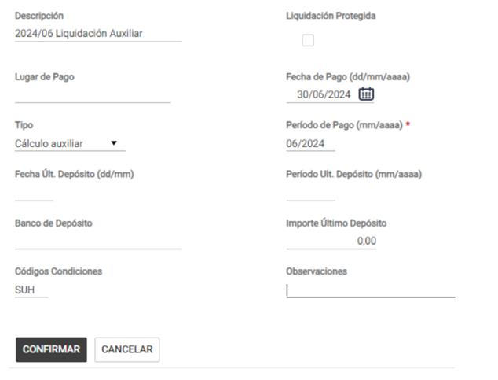
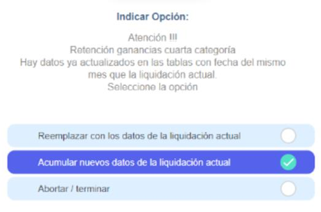

# 20240930190441

 
 
 
 
 
 
 
 
 
 
 
 
 
 
 
 
 
 
 
 
 
 
 
 
 
 
 
 
 
 
 
 
 
 
 
 
 
 
 
 
 
 
 
 
 
 
 
 
 
 
 
 
 
 
 
 
 
Estudios  Contables  
1 

Estudios  Contables  
Estudios  Contables  
Agosto  2024  2  
  
Se comienza a liquidar con Holistor a partir de un  mes 
que no coincide con el primer mes del año  2024  
 
A continuación, te detallamos las generalidades a tener en cuenta para poder comenzar 
a liquidar Retenciones de Ganancias por la ley 27.743 con Holistor a partir de Julio 2024 
en los casos en que no haya información acumulada.  
 
¡Esperamos que te sea de utilidad!  
 
1. Aclaraciones previas (clic aquí)  
2. Pasos a seguir  
➢ Empleados con Régimen cedular  
▪ OPCIÓN Nº1 - Cargar en forma manual las tablas y realizar la 
liquidación auxiliar (clic aquí)  
▪ OPCIÓN Nº2 - Cargar las tablas en forma manual y no realizar la 
liquidacion auxiliar  (clic aquí)  
➢ Empleados con Régimen general  
▪ OPCIÓN Nº1 - Cargar en forma manual las tablas y realizar la 
liquidación auxiliar  (clic aquí)  
▪ OPCIÓN Nº2 - Cargar las tablas en forma manual y no realizar la 
liquidacion auxiliar  (clic aquí)  
 
1. ACLARACIONES PREVIAS : 
 
En Empleados > Conceptos Fijos  se deberá cargar el concepto 0395 00 GANANCIAS 4ta. 
CATEGORIA , además si al empleado en el primer semestre le correspondía REGIMEN 
CEDULAR  en Empleados > Conceptos Fijos  se deberá agregar el concepto 0418 00 
GANANCIAS CEDULAR  y si al empleado le correspondía REGIMEN GENERAL  en Empleados 
> Legajos , botón Complementos  se debe agregar la variable GCIACEDULAR valor  NO 
 
Además,  en Empresa > Complementos  agregar la variable RG4030A valor  SI 
 
2. PASOS A SEGUIR : 
 
➢ Empleados con Régimen Cedular  
 
OPCIÓN Nº1  - Cargar en forma manual las tablas y realizar la liquidación auxiliar  
 
1. Se deberá completar los datos acumulados hasta el mes de Junio 2024  en la tabla  
RET_GANANCIA . 
 
Los renglones a completar son los siguientes:  

Estudios  Contables  
Estudios  Contables  
Agosto  2024  3  
  
En el renglón MES , en la columna ACU_REMUN  se colocará 6. 
 
 
 
MES_REMUN ACU_REMUN ACU_NO_REMUN
MES Mes de última liquidaciónMes de la fecha de pago de 
la misma
Rem.Exenta TotalRemuneración exenta 
liquidada por la empresa 
(incluir la parte de las horas 
extras art. 20 inc z)
Ingresos PropiosRemuneración bruta 
liquidada por la empresa Conceptos no remunerativos 
liquidados por la empresa
No Base SACConceptos remunerativos 
que no son base de cálculo 
de AguinaldoConceptos no remunerativos 
que no son base de cálculo 
de Aguinaldo
Increm.12a.pte.SACRemuneracion bruta 
acumulada / 12Conceptos no remunerativos 
liquidados por la empresa 
acumulados / 12
Ap.Jub.-L.19032 reciboAportes jubilatorios y Ley 
19032 retenidos por la 
empresa
Ap.O.social reciboAportes a obras sociales 
retenidos por la empresa
Cuota sind reciboAportes a sindicatos 
retenidos por la empresa
Caja compl. ReciboAportes a cajas 
complementarias retenidos 
por la empresa
CónyugeColocar 1 de corresponder la 
deducción
HijosColocar la cantidad de 
corresponder la deducción
Otras cargasColocar la cantidad de 
corresponder la deducción
Retenc.Efectuadas Retenciones acumuladas
Hs extras Art.90 P.7 Neto acumulado
Hs extr. 100% exentasParte exenta bruta 
acumulada (Art. 20 inc. Z)
Prima reciboPrimas de seguro retenidas 
en recibos de sueldo 
acumuladas
Cob.Méd.ReciboCuotas o abonos médico 
asistenciales a cargo del 
trabajador, retenidos en 
recibos de sueldo 
acumuladas
Ap.O.Soc y SindicatoAportes de Obra Social y 
Sindicato retenidos por la 
empresa
Jub antes de SACAportes jubilatorios y Ley 
19032 retenidos por la 
empresa
Ob. Soc antes de SACAportes a obras sociales 
retenidos por la empresa
Cuota sind antes de SACAportes a sindicatos 
retenidos por la empresa
Caja comp antes de SACAportes a cajas 
complementarias retenidos 
por la empresa

Estudios  Contables  
Estudios  Contables  
Agosto  2024  4  
  
 
2. Generar una nueva liquidación auxiliar : 
 
Tener en cuenta que:  
 
a) Fecha Pago debe ser la misma de la última liquidación 06/2024, según el grupo de 
empleados que participan. Es decir, si se trabaja con la variable GAN_PAGO valor  
SI en Empresa > Complementos , si un grupo de empleados tiene en la última 
liquidación Fecha de Pago 05/07/2024 y otro grupo de distintos empleados, 
30/06/2024, será necesario generar 2 liquidaciones auxiliares, cada una con la 
Fecha Pago que le corresponda a ese grupo de empleados.  
 
b) Periodo Pago debe se r 06/2024 : para todos los casos  – Tipo de liquidacion: Calculo 
auxiliar  
 
c) Utilizar Códigos Condiciones para anular todos los conceptos Remunerativos, No 
Remunerativos y Retenciones que puedan participar de la liquidación. Se puede 
usar también la columna Cond de Novedades para anular conceptos.  
 
 
 
3. En Liquidación > Novedades  se incorporan los empleados y se agrega el concepto 
039200 REGULARIZADORA P/GCIAS , que previamente se importó desde menú Útiles 
> Conceptos de liquidación > Importar/Exportar Conceptos de liquidación : 
seleccionar la opción Importar > Conceptos Sindicales , allí en sindicato elegir la 
carpeta A USO GENERAL , presionar en el botón SELECCIONAR CONCEPTOS  y buscar 
el concepto 039200 REGULARIZADORA P/GCIAS , seleccionar y por último presionar 
en IMPORTAR . 
 
4. Calcular la liquidación, seleccionando la opción Acumular  nuevos datos de la 
liquidación actual  

Estudios  Contables  
Estudios  Contables  
Agosto  2024  5  
  
 
 
 
Importante : Ingresar en Liquidación > Visualizar  y verificar que no salga liquidado ningún 
concepto. También se podrá verificar desde  Emisiones > Resumen > Resumen de Sueldos.  
 
Esta liquidación agregará en Empleados > Tablas de empleados , la tabla RET_GAN202406  
que tendrá información de la Tabla auxiliar para los cálculos de 06/2024 y siguientes.  
 
IMPORTANTE : Esta liquidacion NO se debe ACTUALIZAR TOTALIZADORES, solo se debe 
calcular.  
 
Para cargar deducciones informadas por el empleado debe utilizar la tabla 
CEDU_PLUS2024 . 
 
5. Recalcular las liquidaciones próxim as, hasta llegar al mes actual, ocultando el 
concepto 0395 00 GANANCIAS 4ta. CATEGORIA , utilizando código de condiciones, 
para que este no salga calculado.  Corroborar que la liquidación no se modifique.  
 
6. Actualizar totalizadores para guardar los datos en tablas.  
 
7. Calcular la liquidacion actual, de esa manera si corresponde se liquidará el concepto 
0395 00 GANANCIAS 4ta. CATEGORIA . 
 
 
OPCIÓN Nº2  - Cargar las tablas en forma manual y no realizar la liquidacion auxiliar  
 
1. Se deberá completar los datos acumulados hasta el mes de Junio 2024  en la tabla  
RET12_202406 . 
 
Los renglones a completar son los siguientes:  
 

Estudios  Contables  
Estudios  Contables  
Agosto  2024  6  
  
 
Además, debe completar el renglón REG PROMOCION  con las retenciones que tendría 
que haber retenido con la aplicación de la nueva ley.  
 
MES_REMUN ACU_REMUN ACU_NO_REMUN
MES Mes de última liquidaciónMes de la fecha de pago de 
la misma
Rem.Exenta TotalRemuneración exenta 
liquidada por la empresa 
(incluir la parte de las horas 
extras art. 20 inc z)
Ingresos PropiosRemuneración bruta 
liquidada por la empresa Conceptos no remunerativos 
liquidados por la empresa
No Base SACConceptos remunerativos 
que no son base de cálculo 
de AguinaldoConceptos no remunerativos 
que no son base de cálculo 
de Aguinaldo
Increm.12a.pte.SACRemuneracion bruta 
acumulada / 12Conceptos no remunerativos 
liquidados por la empresa 
acumulados / 12
Ap.Jub.-L.19032 reciboAportes jubilatorios y Ley 
19032 retenidos por la 
empresa
Ap.O.social reciboAportes a obras sociales 
retenidos por la empresa
Cuota sind reciboAportes a sindicatos 
retenidos por la empresa
Caja compl. ReciboAportes a cajas 
complementarias retenidos 
por la empresa
CónyugeColocar 1 de corresponder la 
deducción
HijosColocar la cantidad de 
corresponder la deducción
Otras cargasColocar la cantidad de 
corresponder la deducción
Retenc.Efectuadas Retenciones acumuladas
Hs extras Art.90 P.7 Neto acumulado
Hs extr. 100% exentasParte exenta bruta 
acumulada (Art. 20 inc. Z)
Prima reciboPrimas de seguro retenidas 
en recibos de sueldo 
acumuladas
Cob.Méd.ReciboCuotas o abonos médico 
asistenciales a cargo del 
trabajador, retenidos en 
recibos de sueldo 
acumuladas
Ap.O.Soc y SindicatoAportes de Obra Social y 
Sindicato retenidos por la 
empresa
Jub antes de SACAportes jubilatorios y Ley 
19032 retenidos por la 
empresa
Ob. Soc antes de SACAportes a obras sociales 
retenidos por la empresa
Cuota sind antes de SACAportes a sindicatos 
retenidos por la empresa
Caja comp antes de SACAportes a cajas 
complementarias retenidos 
por la empresa

Estudios  Contables  
Estudios  Contables  
Agosto  2024  7  
 2. Se deberá completar los datos acumulados hasta el mes anterior al cual se desea 
comenzar a liquidar en la tabla RET_GANANCIA . 
 
Los renglones a completar son los siguientes:  
 
 
 
Para cargar deducciones informadas por el empleado debe utilizar la tabla 
CEDU_PLUS2024 . 
 
3. Calcular la liquidacion actual, de esa manera si corresponde se liquidará el concepto 

Estudios  Contables  
Estudios  Contables  
Agosto  2024  8  
 0395 00 GANANCIAS 4ta. CATEGORIA . 
 
➢ Empleados con Régimen General  
 
OPCIÓN Nº1  - Cargar en forma manual las tablas y realizar la liquidación auxiliar  
 
1. Se deberá completar los datos acumulados hasta el mes de Junio 2024  en la tabla 
RET_GANANCIA . 
 
Los renglones a completar son los siguientes:  
 
En el renglón MES , en la columna ACU_REMUN  se colocará 6. 
 

Estudios  Contables  
Estudios  Contables  
Agosto  2024  9  
  
 
2. Generar una nueva liquidación auxiliar : 
 
Tener en cuenta que:  
 
a) Fecha Pago debe ser la misma de la última liquidación 06/2024, según el grupo de 
empleados que participan. Es decir, si se trabaja con la variable GAN_PAGO = SI  
en Empresa > Complementos , si un grupo de empleados tiene en la última 
liquidación Fecha de Pago 05/07/2024 y otro grupo de distintos empleados, 
30/06/2024, será necesario generar 2 liquidaciones auxiliares, cada una con la 
Fecha Pago que le corresponda a ese grupo de empleados.  
 

Estudios  Contables  
Estudios  Contables  
Agosto  2024  10  
 b) Periodo Pago debe ser 06/2024  para todos los casos . Tipo de liquidacion: Cálculo 
auxiliar  
 
c) Utilizar Códigos Condiciones para anular todos los conceptos Remunerativos, No 
Remunerativos y Retenciones que puedan participar de la liquidación. Se puede 
usar también la columna Cond de Novedades para anular conceptos.  
 
 
 
3. En Liquidación > Novedades  se incorporan los empleados y se agrega el concepto 
039200 REGULARIZADORA P/GCIAS , que previamente se importó desde menú Útiles 
> Conceptos de liquidación > Importar/Exportar Conceptos de liquidación : 
seleccionar la opción Importar > Conceptos Sindicales , allí en sindicato elegir la 
carpeta A USO GENERAL , presionar en el botón SELECCIONAR CONCEPTOS  y buscar 
el concepto 039200 REGULARIZADORA P/GCIAS , seleccionar y por último presionar 
en IMPORTAR . 
 
4. Calcular la liquidación, seleccionando la opción Acumular  nuevos datos de la 
liquidación actual  
 
 
 

Estudios  Contables  
Estudios  Contables  
Agosto  2024  11  
  
 
Importante : Ingresar en Liquidación > Visualizar  y verificar que no salga liquidado ningún 
concepto. También se podrá verificar desde  Emisiones > Resumen > Resumen de Sueldos.  
 
Esta liquidación agregará en Empleados > Tablas de empleados , la tabla RET_GAN202406  
que tendrá información de la Tabla auxiliar para los cálculos de 06/2024 y siguientes.  
 
IMPORTANTE : Esta liquidacion NO se debe ACTUALIZAR TOTALIZADORES, solo se debe 
calcular.  
 
Para cargar deducciones informadas por el empleado debe utilizar la tabla 
GAN _PLUS2024 . 
 
5. Recalcular las liquidaciones próxim as, hasta llegar al mes actual, ocultando el 
concepto 0395 00 GANANCIAS 4ta. CATEGORIA , utilizando código de condiciones, 
para que este no salga calculado. Corroborar que la liquidación no se modifique.  
 
6. Actualizar totalizadores para guardar los datos en tablas.  
 
7. Calcular la liquidacion actual, de esa manera si corresponde se liquidará el concepto 
0395 00 GANANCIAS 4ta. CATEGORIA . 
 
OPCIÓN Nº2 - Cargar las tablas en forma manual y no realizar la liquidacion auxiliar  
 
1. Se deberá completar los datos acumulados hasta el mes de Junio 2024  en la tabla  
RET12_202406.  
 
Los renglones a completar son los siguientes:  
 
 
 
 
 
 

Estudios  Contables  
Estudios  Contables  
Agosto  2024  12  
  
 
Además, debe completar el renglón REG PROMOCION  con las retenciones que 
tendría que haber retenido con la aplicación de la nueva ley.  
 
2. Se deberá completar los datos acumulados hasta el mes anterior al cual se desea 
comenzar a liquidar en la  tabla RET_GANANCIA . 
 
Los renglones a completar son los siguientes:  
 
 
 
 

Estudios  Contables  
Estudios  Contables  
Agosto  2024  13  
  
 
Para cargar deducciones informadas por el empleado debe utilizar la tabla 
GAN _PLUS2024 . 
 
3. Calcular la liquidacion actual, de esa manera si corresponde se liquidará el concepto 
0395 00 GANANCIAS 4ta. CATEGORIA . 
 

