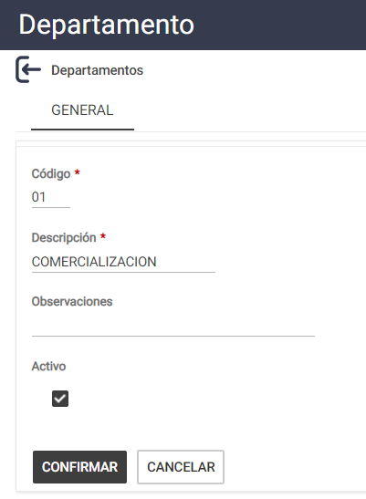
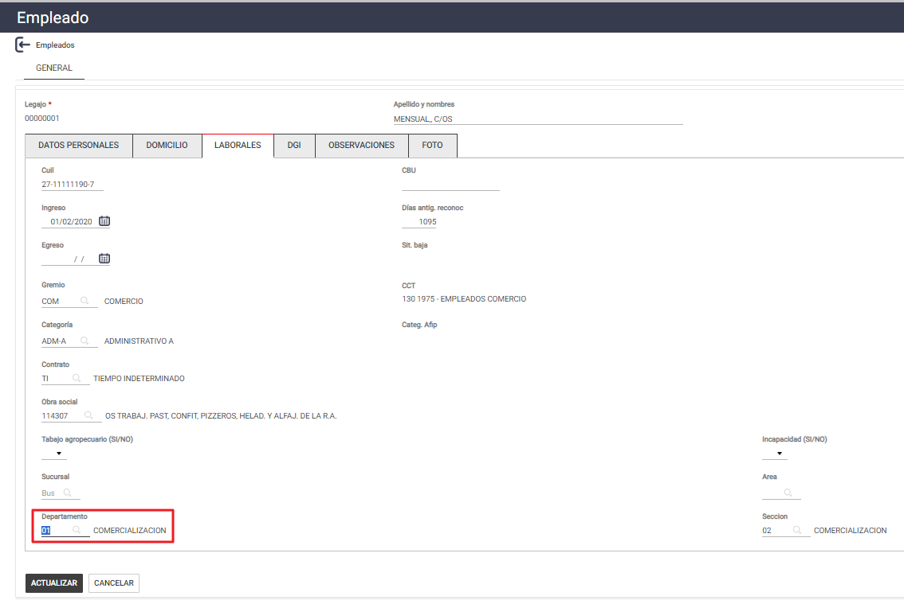
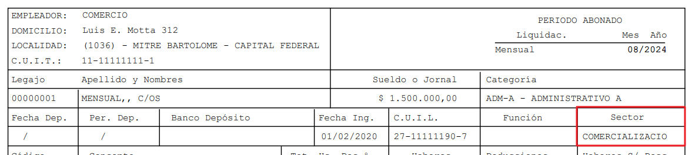
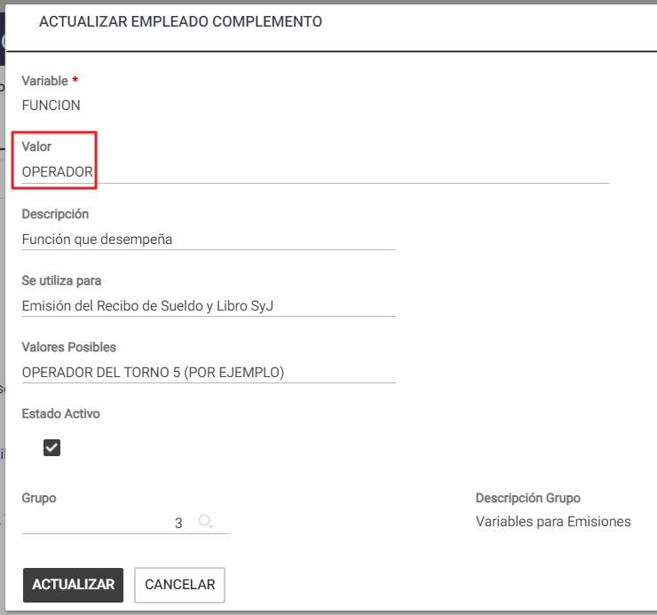
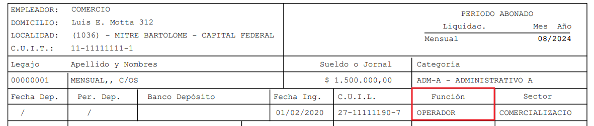

# 20240930190446

 1 
 
  
Estudios Contables  

 
 
 
 2 Estudios Contables  
Sueldos y Jornales  
Septiembre  2024  Campos “Sector” y “Función” en el Recibo de Sueldo.  
 
A continuación, te detallamos los pasos a seguir para poder completar los campos 
“Sector” y “Función” del recibo de sueldo.  
¡Esperamos que te sea de utilidad!  
 
1. SECTOR:  
 
Lo primero que deberás hacer es ingresar al menú Empresa > Codificar Divisiones 
> Departamento  y crear los distintos departamentos o sectores que posea la 
empresa  seleccionando:  
 
♦ [Nuevo] : desde esta opción se dará de alta una nueva división, para terminar,  
pulsar el botón [Confirmar] o [Cancelar].  
 
► Código : puede ingresarse en forma numérica, alfabética o alfanumérica. No 
admite duplicados.  
► Descripción : ingresar la que permita identificar la división que se está 
ingresando.  
► Observaciones : colocar aquellas que considere necesarias.  
 
 
 
Luego, deberás asignar en cada legajo, el Departamento al cual corresponde el 
empleado. Para esto, deberás ingresar en el menú Empleados > Legajos > 
solapa Laborales  seleccionando  el lápiz  para editar el mismo , haciendo 
búsqueda  con la lupa.  
 

 
 
 
 3 Estudios Contables  
Sueldos y Jornales  
Septiembre  2024   
 
Una vez seleccionado en cada legajo el departamento que corresponda, deberás 
realizar el proceso habitual de Verificación y Cálculo.   
Luego, al emitir el recibo de sueldo, podrás observar que el campo “Sector”  se 
encuentra completo con el departamento seleccionado.  
 
 
 
2. FUNCI ÓN: 
 
Para que imprima en el recibo HOLISTOR V3.0 y HOLISTOR V2.0 la función que 
desempeña, ingresar en  Empleados  > Legajo , botón  Complementos  y agregar:   
FUNCION y en Valor completar co n OPERADOR DEL TORNO 5  
A modo de ejempl o: 

 
 
 
 4 Estudios Contables  
Sueldos y Jornales  
Septiembre  2024   
Luego, al emitir el recibo de sueldo, podrás observar que el campo “Funci ón” se 
encuentra completo con el departamento seleccionado.  
 
 
 
 
 

