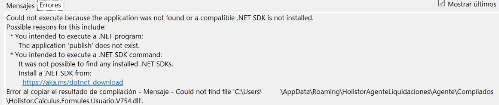

# 20240930190457

 1 
 
  
Estudios Contables  

 
 
 
 2 Estudios Contables  
Sueldos y Jornales  
Noviembre  2023 Solución  .Net SDK is not installed en Agente . 
 
A continuación, se detallan los pasos  para solucionar el error en .Net SDK 
is not installed  al intentar liquidar con el agente . 
 
 
 
• Primero y principal, debemos cerrar el agente del pc con el error. 
Desde iconos ocultos > click derecho sobre el agente > Cerrar 
aplicación .   
 
 
• En el inicio, escribir “ Variables de entorno ” y seleccionar Editar las 
variables de entorno del sistema . 
 

 
 
 
 3 Estudios Contables  
Sueldos y Jornales  
Noviembre  2023  
 
• Click en “ variables de entorno ”. 
 
 

 
 
 
 4 Estudios Contables  
Sueldos y Jornales  
Noviembre  2023  
• En esta nueva ventana, en el recuadro inferior, el que se llama 
Variables del sistema  buscamos la que se llama “ Path ” la 
selecciona mos  y luego click en “ Editar ”. 
 
 
 
• Selecciona mos C:\Program Files \dotnet \ y con el botón Subir la 
dejamos por encima de C:\Program Files (x86) \dotnet \ y ponemos 
Aceptar . Debería quedar de la siguiente manera:   
 

 
 
 
 5 Estudios Contables  
Sueldos y Jornales  
Noviembre  2023  
 
• Aceptar y aplicar los cambios de todas las pantallas que quedaron 
abiertas e iniciar  el agente haciendo doble click sobre el acceso 
directo en el escritorio.  
 
Ante cualquier inconveniente no dude en contactarnos . 

