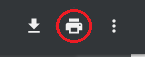
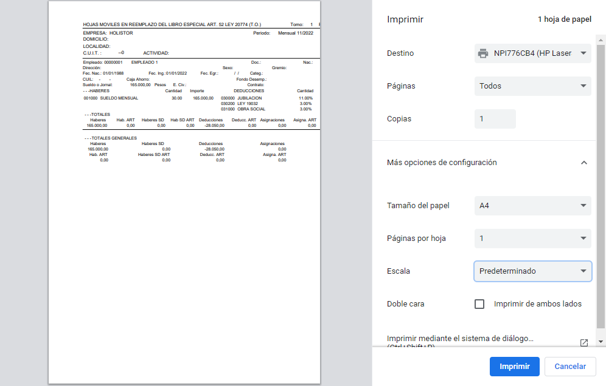
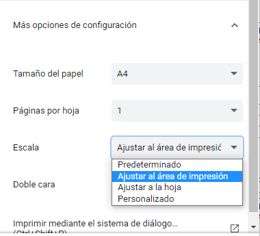
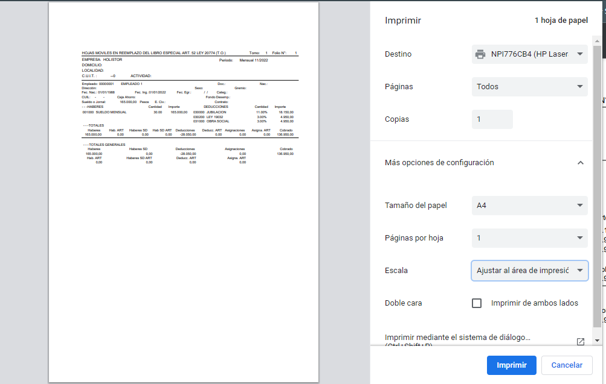

# 20240930190514

 1 
 
  
Estudios Contables  

 
 
 
 2 Estudios Contables  
Sueldos y Jornales  
Abril  2023 Ajustar márgenes al momento de la impresión . 
 
A continuación, se detallan los pasos  para configurar correctamente los  
márgenes al momento de imprimir reportes.  
 
Seleccionar el botón imprimir desde la vista previa del navegador  
 
 
 
Veremos que nos abrirá una pantalla con una vista previa de la impresión 
a modo de ejemplo:  
 
 
 
Importante : Debe tener como “Destino”  una impresora en papel, ya que 
si se guarda como PDF no respetará los márgenes correctamente.  
 
Para configurar los márgenes correctamente hay que ingresar en Más 
opciones de configuración > Escala  > Ajustar al área de impresión  
 

 
 
 
 3 Estudios Contables  
Sueldos y Jornales  
Abril  2023  
 
En la vista previa, podemos observar cómo se ajustan los márgenes . 
 
Ejemplo:  
 
 
 
Imprimir el reporte y verificar que todo salga correctamente.  
 

