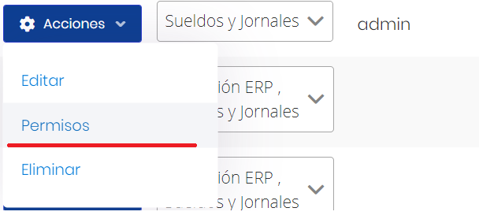
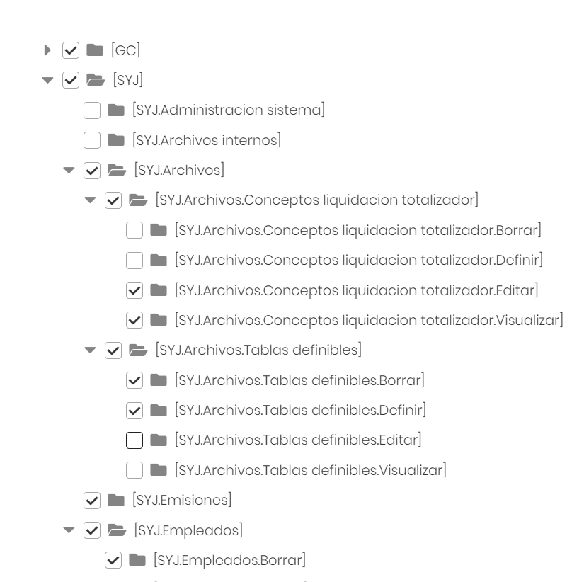
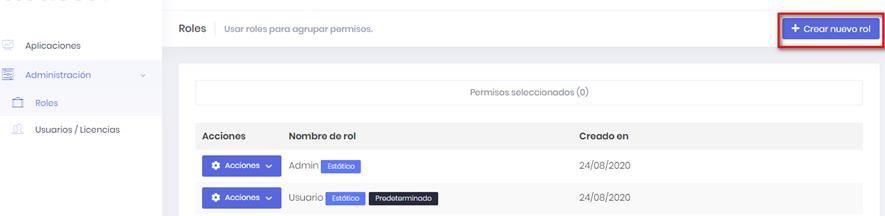
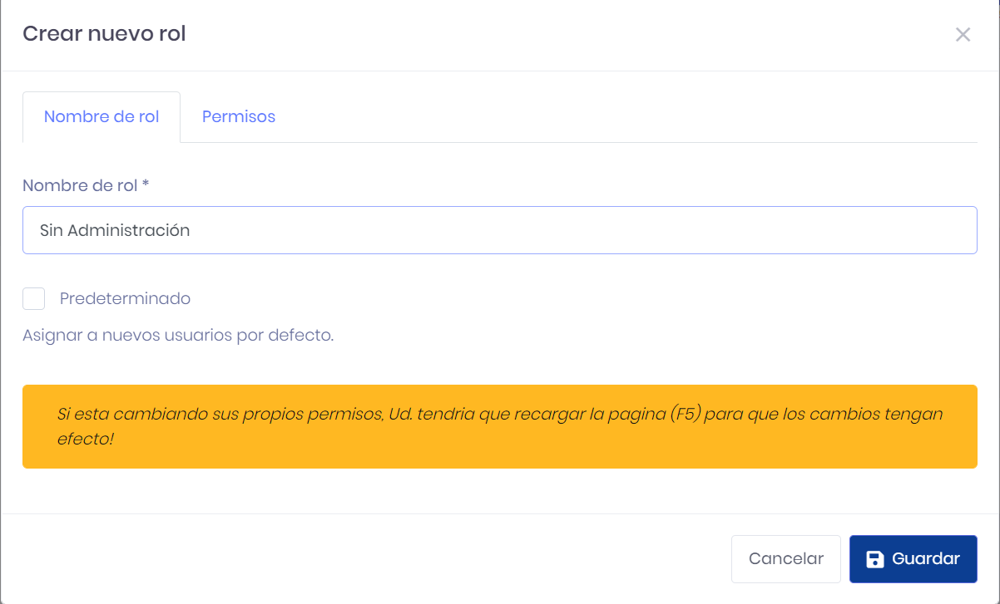
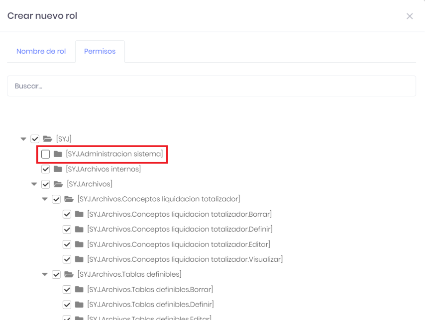
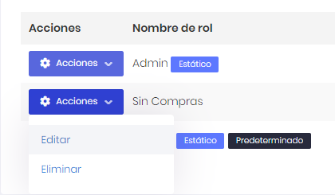
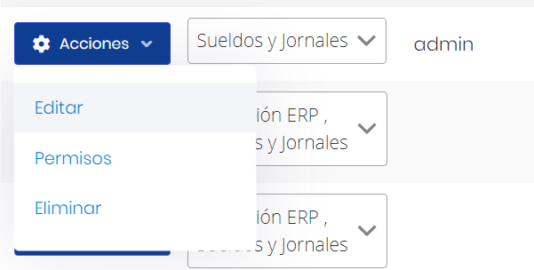
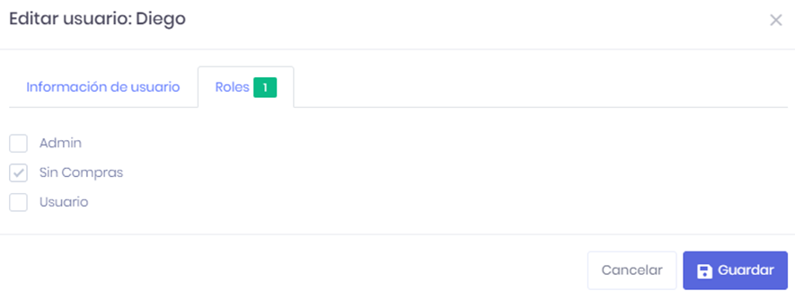
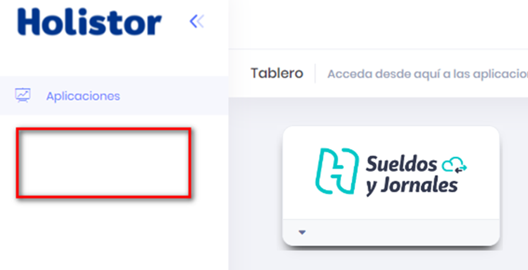

# 20240930190520

 1 
 
  
Estudios Contables  

 
 
 
 2 Estudios Contables  
Sueldos y Jornales  
Octubre  2022 Asignación de Permisos y creación de Roles . 
 
A continuación, se detallan los pasos a seguir para asignar permisos a los 
usuarios definidos en el sistema y crear nuevos roles.  
 
IMPORTANTE:  Para el óptimo funcionamiento  de Plataforma Holistor 
Sueldos y Jornales WEB , se recomienda utilizar el Navegador de Internet 
Google Chrome.  
 
Acceder a la Plataforma Holistor y dentro de su Espacio de Trabajo como 
"Usuario Administrador" ingresar a "Administración > Usuario/Licencias” . 
En el panel derecho seleccionar el usuario deseado y en el botón 
“Acciones”  y seleccionar “Permisos” . 
 
 
 
En la ventana que aparece se deben tildar/destildar las opciones 
correspondientes a ese usuario. Se pueden bloquear ciertos accesos 
puntuales o todo un módulo completo. Eje mplo:  

 
 
 
 3 Estudios Contables  
Sueldos y Jornales  
Octubre  2022  
 
Presionar en “Guardar”  para confirmar los cambios.  
 
Si se cuenta con varios usuarios, se pueden crear distintos grupos de 
permisos (Roles) según corresponda. Pueden crear las combinaciones de 
permisos que deseen, dando de alta distintos roles.  
Para  ello dentro de la Plataforma ir a "Administración > Roles” . 
Por defecto se presentan los roles que vienen definidos en el sistema, que 
son “Admin” (todos los permisos) y “Usuario” (permisos limitados).  
 
Para dar de alta un rol presionar en el botón “+ Cre ar nuevo rol” . 
 
 
 

 
 
 
 4 Estudios Contables  
Sueldos y Jornales  
Octubre  2022 Ingresar un nombre de rol y los permisos del mismo. En el siguiente ejemplo 
se da de alta un rol para usar todo el sistema, excepto  cambiar las opciones 
de Administración.  
 
 
 
IMPORTANTE:  Si se tilda la casilla Predeterminado, a los nuevos usuarios 
que se den de alta se les asignará ese rol.  
 
 
 

 
 
 
 5 Estudios Contables  
Sueldos y Jornales  
Octubre  2022 Presionar en “Guardar” para finalizar. Aparecerá el nuevo rol creado.  
 
Desde el botón “Acciones”  se puede editar en caso de que querer cambiar 
algún permiso, o eliminarlo también.  
 
 
 
Si volvemos a "Adm inistración > Usuario/Licencias”  y seleccionamos el 
mismo usuario del ejemplo anterior, desde el botón “Acciones”  
seleccionamos “Editar” , nos abrirá una ventana para cambiarle el rol, 
desde la pestaña “Roles” . 
 
 

 
 
 
 6 Estudios Contables  
Sueldos y Jornales  
Octubre  2022  
 
Allí sele ccionamos el nuevo rol (En el ejemplo, “Sin Compras”). Aunque no 
es lo más usual, se pueden tildar más de un rol para un mismo usuario. En 
ese caso se combinarán los permisos de los roles tildados.  
 
Por último, presionar en “Guardar” para confirmar los camb ios. 
 
Si ingresamos al sistema con ese usuario veremos los cambios realizados. 
En primer lugar, se deshabilitan las opciones de Administración.  
 
 
 
Ante cualquier inconveniente no dude en comunicarse con nosotros.  

