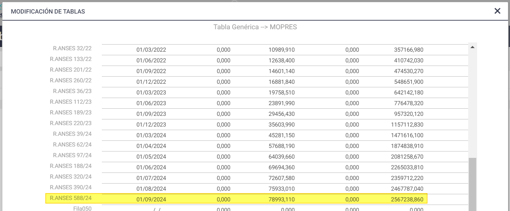

# 20240930190539

 1 
 
  
Estudios Contables  

 
 
 
 2 Estudios Contables  
Sueldos y Jornales  
Septiem bre 2024  Control de MOPRES  
 
A continuación, con motivo de la aplicación del Dto. 491/04 y 1448/08  te detallamos 
pautas a  tener en cuenta al momento de aplicar control de MOPREs en las liquidaciones, 
en el módulo Sueldos y Jornales  Web.  
 
¡Esperamos que te sea de utilidad!  
 
TOPES PROPORCIONALES : 
 
• Ingresos y Egresos del periodo : el sistema proporcionará automáticamente los 
MOPRES en función de los días del mes en el que se mantuvo la relación laboral.  
 
• Empleados remunerados mensualmente y por días : el sistema proporcionará 
automáticamente los MOPREs totales del mes en función de los días que se 
liquiden en los conceptos 001 000 SUELDO MENSUAL y/o 0012 00 DIAS 
TRABAJADOS.  
 
El cálculo del tope (máximo o mínimo) va a ser igual a:  
MOPRE / 30 x DTR (Días Trabajados)  
 
Atención : para que el sistema no proporcione automáticamente los valores 
mínimos y máximos de MOPREs mensuales cuando la cantidad de días informados 
sea menor al total del período, deberás ingresar en Empresa > Complementos , el 
complemento  PROMOD valor NO 
 
• Empleados Jornalizados : para empleados que utilicen el código 0015 00 HORAS 
NORMALES , 0017 00 HORAS TRABAJADAS  u otro equivalente, para proporcionar 
MOPREs en función de días, deberás ingresar el concepto 0015 00 HORAS 
NORMALES o 0017 00 HORAS TRABAJADAS en Novedades y colocar la cantidad de 
días que corresponda en la columna IMPORTE.  
 
El cálculo del tope (máximo o mínimo) va a ser igual a:  
MOPRE / 30 x TOT. DTR 
 
Cuando efectúes liquidaciones quincenales, para que se consideren las 
remuneraciones de todo el mes en las bases imponibles de aportes y 
contribuciones, al calcular la segunda quincena será necesario que la liquidación 
de la primera quincena se  encuentre actualizada, ya que el control lo realiza en la 
segunda quincena.  
 
 

 
 
 
 3 Estudios Contables  
Sueldos y Jornales  
Septiem bre 2024  CONTROL DE TOPES P OR SEPARADO : 
 
El sistema efectuará un control por separado de MOPREs para Remuneraciones  
Mensuales, Vacaciones, Sueldo Anual Complementario y Remuneraciones a cargo 
de ART.  
 
• Sueldo Anual Complementario :  
Conforme lo establece el Art. 6 de la RG (AFIP) 1750/04, el Art. 9 de la L. 24241 y 
el Art. 1 del Dto. 433/94, para el cálculo de los aportes y contribuciones 
integrantes de la CUSS, correspondientes a cada cuota semestral del SAC se 
aplicará un límite a l a base  imponible equivalente al 50% del tope vigente para las 
remuneraciones mensuales.  
En el caso de liquidaciones proporcionales del SAC, para la determinación de las 
bases  mínimas o máximas a considerar, se tendrán en cuenta los topes indicados 
proporcionados.  
 
El cálculo del tope (máximo o mínimo) va a ser igual a:  
 
MOPRE / 30 x  ACU. AGUINALDO_MESE S (que son los meses trabajados en el 
semestre).  
 
Si es el primer SAC del año, el valor de ACU. AGUINALDO_MESES  lo determina 
contando los meses desde enero (o la fecha de ingreso si es posterior a enero de 
ese año)  hasta junio o si existe fecha de egreso, hasta esa fecha.  
 
Si es el segundo SAC del año, el valor de ACU. AGUINALDO_MESES  lo determina  
contando los meses desde julio (o si hay fecha de ingreso posterior a julio tomará 
dicha fecha) hasta diciembre, si existe fecha de egreso, hasta ésta.  
 
• Vacaciones :  
Conforme lo establece el Art. 6 de la RG (AFIP) 1750/04, el Art. 9 de la L. 24241 y 
el Art. 1 del Dto. 433/94, la suma que se abone en concepto de vacaciones deberá 
ser computada en forma separada de los demás conceptos que constituyen 
remuneración,  para la determinación de las bases imponibles de aportes y 
contribuciones.  
 
En el caso de liquidaciones proporcionales, se aplicará el proporcional diario del 
tope  vigente mensual por la cantidad de días por los que corresponden las 
vacaciones.  
 
Atención : En caso de no desear el control de MOPRES por separado para sueldo y  
vacaciones, deberás ingresar en Empresa  > Complementos la variable:  CMOVAC 
valor  NO 

 
 
 
 4 Estudios Contables  
Sueldos y Jornales  
Septiem bre 2024  ACTUALIZACION DE TOPES:  
 
Los valores de los montos mínimos y máximos se envían en una tabla del sistema , 
esta tabla se actualiza en forma automática, mediante actualizaciones.  
 
Podrás visualizarla desde el menú Empresa > Tablas Definibles , seleccionando el 
nombre de tabla: MOPRES , ingresando en el botón [ Datos ]. 
 
 
 
No obstante, en algunos casos, se podrán modificar los valores predefinidos 
utilizando las siguientes variables ingresadas en Empresa  > Complementos  (si el 
cambio se aplica a todos los empleados) o en Empleados  >Legajo , botón 
Complementos  (si el cambio es para un empleado en particular) según 
corresponda:  
• Para modificar el tope mínimo para los Aportes (excepto Obra Social):  
AMPOMIN valor  XXXX.XX   (colocar importe mínimo)  
• Para modificar el tope mínimo para las contribuciones (excepto Obra Social y 
ART):  
AMPOMIN_CP valor  XXXX.XX   (colocar importe mínimo)  
• Para modificar el tope máximo para el cálculo de Aportes:  
AMPOMAX valor  XXXX.XX   (colocar importe máximo)  
• Para modificar el tope máximo para las Contribuciones Patronales (excepto Obra 
Social y ART):  
AMPOMAX_CP  valor  XXXX.XX   (colocar importe máximo)  
• Para modificar el tope mínimo para los Aportes y Contribuciones para Obra 
Social:  
AMPOMIN_OS valor  XXXX.XX   (colocar importe mínimo)   
 
ANULACION DE CONTROL DE MOPRES  
 
1. Si no se desea aplicar control de Bases imponibles MÍNIMA y MÁXIMA (art. 9 
Ley 24241) en el empleado, se deberá:  

 
 
 
 5 Estudios Contables  
Sueldos y Jornales  
Septiem bre 2024  • Cargar en Novedades el código 030000 JUBILACION, y colocar un 1 en la 
columna CANTIDAD (se anulará el control para Aportes) y  
• Cargar en Novedades el código 035000 CONTRIBUCIONES, y colocar un 1 en 
la columna CANTIDAD (se anulará el control para Contribuciones 
Patronales).  
 
2. Si no desearas aplicar control de Bases imponibles MÍNIMA y MÁXIMA (art. 9 
Ley 24241) en el empleado, en ninguna liquidación , deberás:  
• Cargar en Conceptos Fijos el código 0300 JUBILACIÓN , y colocar un 1 en la 
columna CANTIDAD (se anulará el control para Aportes) y  
• Cargar en Conceptos Fijos el código 0350 CONTRIBUCIONES , y colocar un 1 
en la columna CANTIDAD (se anulará el control para Contribuciones 
Patronales).  
 
Al anular dicho Control de Mopres, el sistema aplicará los porcentajes de deducciones 
sobre el total remunerativo, sin realizar ningún tipo de control.  
 
 

