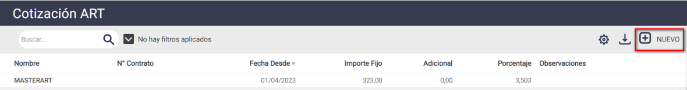
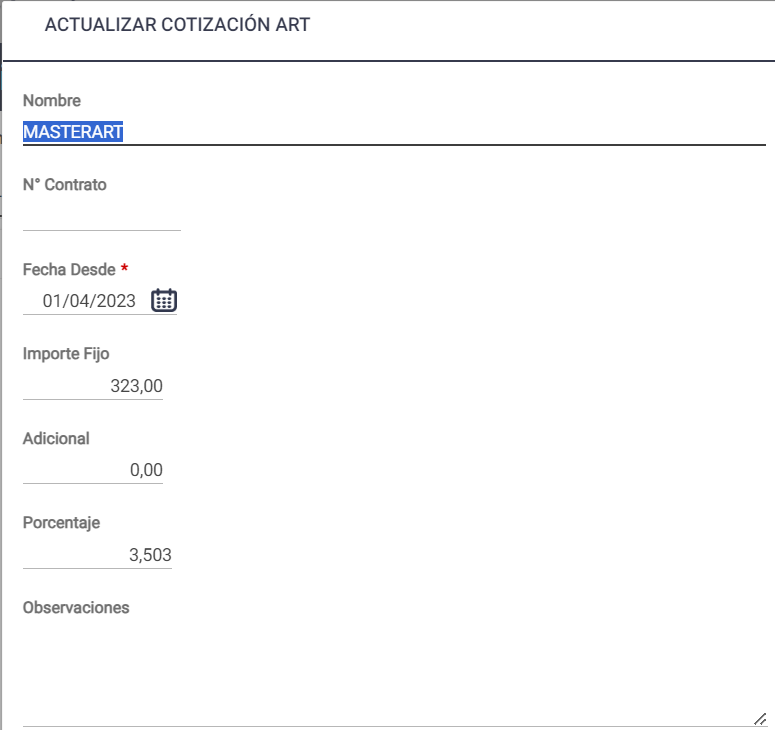
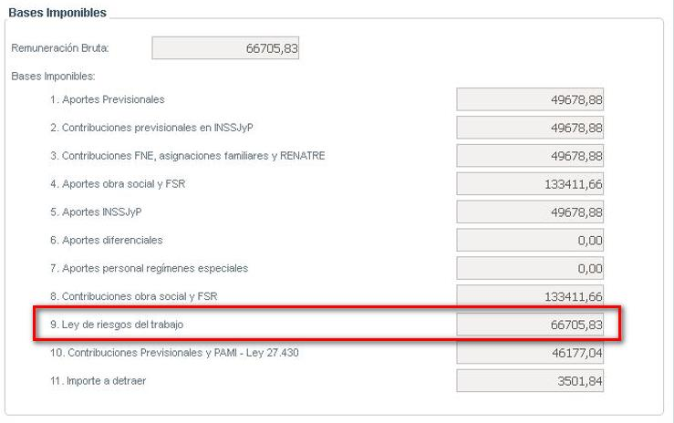

# 20240930190555

 1 
 
  
Estudios Contables  

 
 
 
 2 Estudios Contables  
Sueldos y Jornales  
Septiembre  2024  Cálculo de ART:  
 
A continuación, te detallamos los pasos a seguir para poder calcular los importes 
relacionados con ART, según el criterio que desee adoptar para determinar su base de 
cálculo.  
 
¡Esperamos que te sea de utilidad!  
 
Generalidades:  
 
Para que el sistema calcule de manera adecuada los importes relacionados con ART, 
deberás informar las cotizaciones y sus correspondientes fechas de vigencia.  
 
1. Carga de las cotizaciones : 
 
Desde el menú Empresa > Cotización ART , deberás presionar el botón [NUEVO] e 
incorporar los datos del contrato: Nombre, Número, Fecha desde, Importe fijo, etc. 
Luego presiona CONFIRMAR.  
 
 
 
 
En caso de producirse cambios en las cotizaciones, podrás completar un renglón 
posterior  al existente, seleccionando nuevamente el botón [NUEVO ] con los nuevos 
valores y demás datos, indicando la nueva FECHA DESDE.  
 

 
 
 
 3 Estudios Contables  
Sueldos y Jornales  
Septiembre  2024   
2. Conceptos Fijos : 
 
Para que el sistema realice el cálculo, también deberás ingresar el concepto 035500 ART  
en los Conceptos Fijos de los Empleados. Por defecto, el sistema calculará según los  
valores cargados previamente en Empresa > Cotización ART.  
 
NOTA:  este proceso lo podrás realizar desde Empleados > Modificaciones Masivas  > 
Conceptos Fijos  para más de un empleado a la vez.  
 
3. Modalidades de Cálculo : 
 
Para la determinación de la base de cálculo del porcentual de la Contribución de ART,  
existen dos modalidades de cálculo posibles:  
 
1) Considerando tanto las remuneraciones con y sin descuento que se abonen, sin 
aplicar  topes máximos (Según Art. 4 de la res SRT 983/2010 y Art. 10 Ley 26773). En este  
caso, el sistema no tendrá en cuenta los siguientes conceptos:  
 
• 0195 00 VACAC. NO GOZADAS AÑO ANTERIOR  
• 0196 00 VACAC.NO GOZADAS  
• 0197 00 AGUIN.S/VAC.NO GOZADAS  
• 0198 00 INTEGRACION MES DESPIDO  
• 0290 00 PREAVISO  
• 0291 00 S.A.C. S/ PREAVISO  
• 0292 00 INDEM.POR ANTIGUEDAD  
• Y todos aquellos conceptos que en TOTALIZADORES > solapa Totalización Importe  
tengan el totalizador R983  
 
Esta alternativa es la que el sistema aplica por defecto. Si ésta es la modalidad de cálculo  
que deseas adoptar, te sugerimos verificar que en Empresa > Complemento s no poseas 
la variable  R983 valor  NO 
 
2) Considerando solo conceptos remunerativos, y aplicando topes máximos de bases  
imponibles. Para utilizar esta alternativa de cálculo, deberás ingresar en el menú 
Empresa  > Complementos > Agregar disponibles  la variable R983 valor NO  
 
4. Emisiones : 
 
Desde el menú Emisiones > A.R.T > Aportes A.R.T  podrás emitir el papel de trabajo  que 
muestra el cálculo de Aportes de A.R.T.  
Dicho importe, también lo visualizarás  desde Emisiones > Declaración en Línea - Aportes 
y Contribuciones (DLAC) > Aportes y Contribuciones.  

 
 
 
 4 Estudios Contables  
Sueldos y Jornales  
Septiembre  2024   
5. Exportación : 
 
Al exportar a LIBRO DE SUELDO DIGITAL , el sistema llevará la base para el cálculo de 
ART, en la Remuneración 9 que podrá visualizar desde el botón n ómina  y el lápiz para 
editar el CUIL.   
 
 
 
 
 
 

