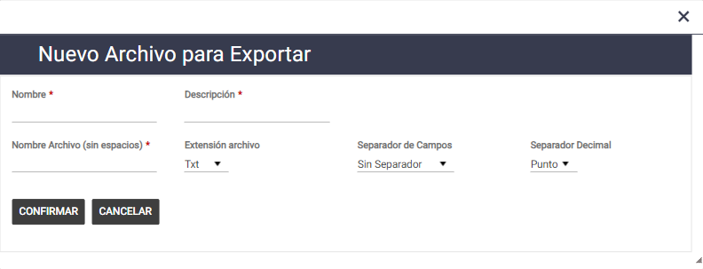
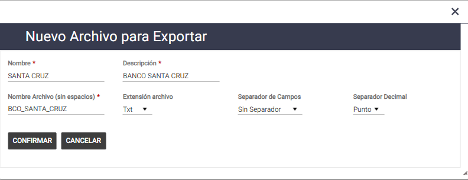
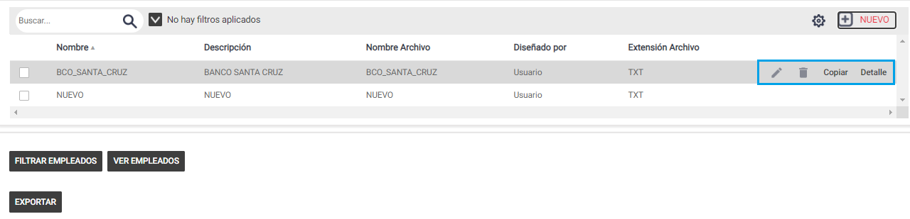
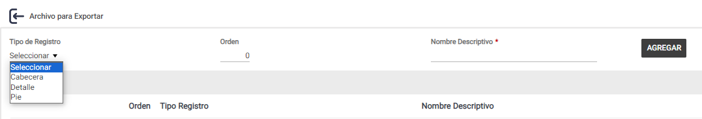
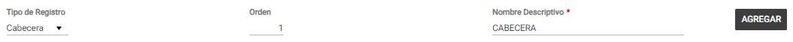
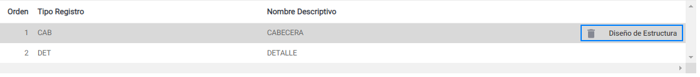
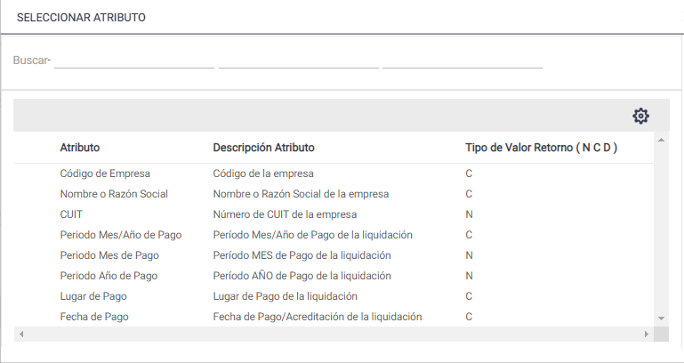
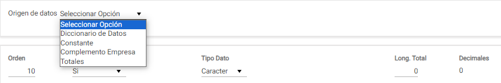
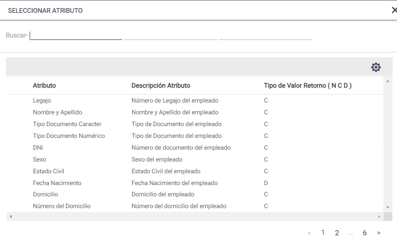
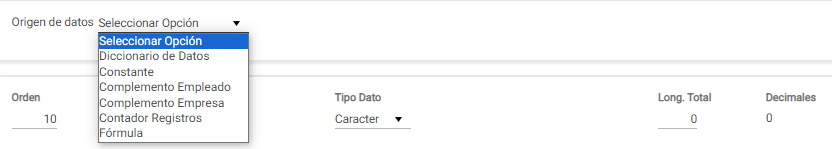

# 20240930190652

 1 
 
  
Estudios Contables  

 
 
 
 2 Estudios Contables  
Sueldos y Jornales  
Septiembre 202 4 Generar arc hivos  
 
A continuación, te detallamos los pasos a seguir para poder reali zar la generación  de 
archivos en el módulo  de Sueldos y Jornales Web .  
 
¡Esperamos que te sea de utilidad!  
 
Generalidades:  
 
El proceso Generar Archivos permite crear y generar un archivo con extensión txt, csv, 
excel o pdf según las necesidades de diseño específicas de cada usuario para luego ser 
importado en la aplicación correspondiente. Los mismos quedaran disponibles para 
todas las Empresa y Liquidaciones.  
 
Creación : 
 
Lo realiza desde el menú  Exportar > Genera r de arc hivos . Pasos a seguir:  
 ♦ [Nuevo] : desde esta opción se dará de alta un nuevo Archivo, para terminar pulsar el 
botón [Confirmar] o [Cancelar].  
► Nombre : nombre mediante el cual se hace referencia al archivo. Es único y no 
admite duplicados.  
► Descripción : colocar la descripción deseada por el usuario.  
► Nombre Archivo (sin espacios) : nombre que tendrá el archivo.  
► Extensión archivo : por defecto propone txt, pero se puede seleccionar csv, excel 
o pdf.  
► Separador de Campos : por defecto propone sin separador, pero se puede 
seleccionar coma (,), punto y coma (;), barra (|) o tabulador.  
► Separador Decimal : por defecto propone punto, pero se puede seleccionar 
coma.  

 
 
 
 3 Estudios Contables  
Sueldos y Jornales  
Septiembre 202 4  
Por ejemplo:  
 
♦ [Modificar] : desde esta opción se podrá modificar los datos del archivo.  
♦ [Borrar] : desde esta opción se podrá borrar el archivo.  
♦ [Copiar] : desde esta opción se podrá copiar el archivo para crear uno nuevo.  
♦ [Detalle] : desde esta opción se deberán definir los registros.  
 
► Tipo de Registro : los registros posibles son Cabecera, Detalle y Pie.  

 
 
 
 4 Estudios Contables  
Sueldos y Jornales  
Septiembre 202 4 ► Orden : colocar el orden que corresponda.  
► Nombre Descriptivo : colocar la descripción deseada por el usuario.  
Por último,  presionar Agregar.  
 
Por ejemplo:  
 
♦ [Borrar] : desde esta opción se podrá borrar el registro.  
♦ [Diseño de Estructura] : desde esta opción se deberá definir la estructura del registro.  
 
En los registros Cabecera  y Pie se podrán seleccionar los siguiente s datos:  
► Diccionario de Datos : permite seleccionar atributos de la empresa y de 
liquidaciones:  

 
 
 
 5 Estudios Contables  
Sueldos y Jornales  
Septiembre 202 4  
► Constante : para asignar un valor fijo, o para completar con ceros y/o espacios 
en blanco.  
► Complemento Empresa : para asignar un valor que varía según la empresa.  
► Totales : para realizar las operaciones sumar, contar o promedio.  
 
En el registro Detalle se podrán seleccionar los siguientes datos : 
► Diccionario de Datos : permite seleccionar atributos del empleado, de la 
empresa y de liquidaciones:  

 
 
 
 6 Estudios Contables  
Sueldos y Jornales  
Septiembre 202 4  
► Constante : para asignar un valor fijo, o para completar con ceros y/o espacios 
en blanco.  
► Complemento Empleado : para asignar un valor que varía según el empleado.  
► Complemento Empresa : para asignar un valor que varía según la empresa.  
► Contador Registros : para que haga el conteo de legajos en cada registro.  
► Fórmula : para realizar una operación básica suma, resta, multiplicación o 
división  
 
Importante:  si la extensión del archivo es PDF, el mismo saldrá en formato vertical 
cuando la sumatoria de la longitud de todos los campos no supere los 120 y en caso de 
superarlo saldrá en horizontal mostrando todos los datos siempre que no superen 
longitud de 170. Entre cada campo se deja un espacio con una longitud igual a 2.  
  

 
 
 
 7 Estudios Contables  
Sueldos y Jornales  
Septiembre 202 4 • [Filtrar Empleados ]: desde ese botón se pueden seleccionar los empleados que 
participarán de la emisión.  
o Filtros : se debe seleccionar cuál de estos comandos va a ejecutarse. Las opciones 
posibles  son: 
▪ Todos: la exportación se efectuará con todos los legajos existentes en la 
liquidación seleccionada.  
▪ Por Entorno: permite indicar desde qué legajo hasta cuál otro participará del 
archivo de exportación.  
También se puede filtrar por Sucursal, Área, Departamento, Sección, Gremio y 
Categoría. Están relacionados con los datos ingresados en el legajo del empleado.  
De no elegirse ningún filtro, la generación del archivo contendrá a todos los 
empleados del universo elegido.  
• [Ver empleados ]: desde este botón se pueden consultar los empleados que responden 
a los filtros indicados.  
• [Exportar ]: presionando este botón iniciará el proceso de generación en el formato que 
corresponda.  
 
 
 
 
 
 
 
 
 
 
 
 
 
 
 
 
 

