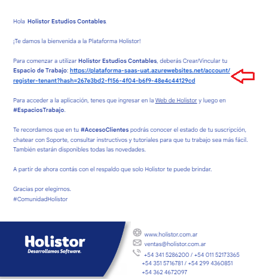
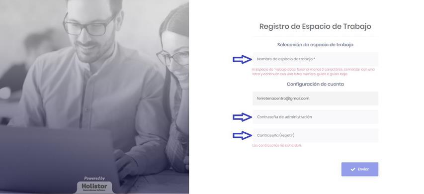
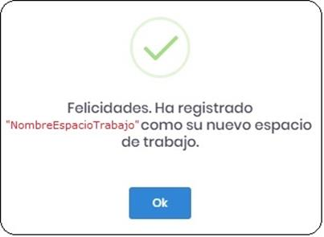
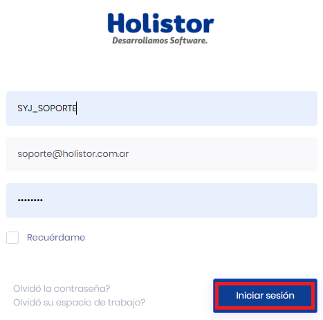
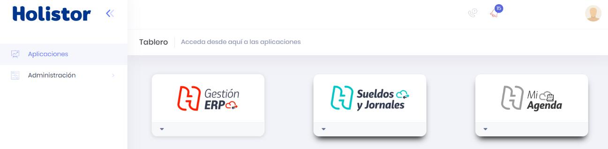
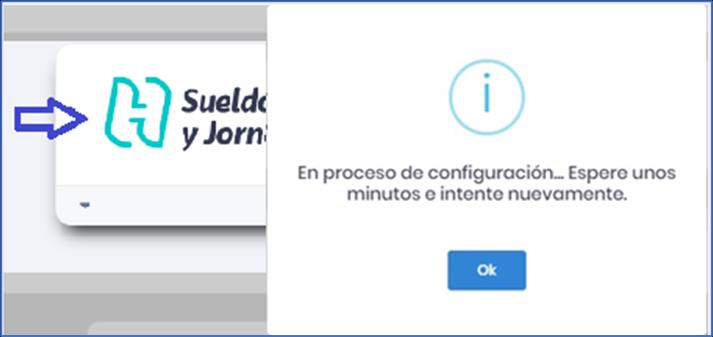
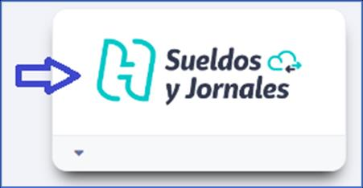
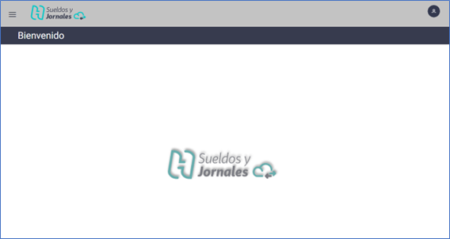

# 20240930190656

 1 
 
  
Estudios Contables  

 
 
 
 2 Estudios Contables  
Sueldos y Jornales  
Octubre  2022 Generar Espacio de Trabajo . 
A continuación, se detallan los pasos a seguir para generar el espacio de 
trabajo en la plataforma Holistor Sueldos y Jornales WEB  y comenzar a 
trabajar.  
IMPORTANTE:  Para el óptimo funcionamiento de la Plataforma Holistor 
Sueldo y Jornales WEB , se recomienda utilizar el Navegador de Internet 
Google Chrome.  
1. Definir el espacio de trabajo ingresando desde el enlace que recibió 
en el segundo correo "Bienvenida a la Plataforma Holistor" :   
 
 
2. Asignar el nombre del espacio de trabajo y la contraseña. Luego, 
presionamos el botón “Enviar” . 
 

 
 
 
 3 Estudios Contables  
Sueldos y Jornales  
Octubre  2022  
 
3. Si todo salió bien se presentará el siguiente cartel:  
 
 
 
4. Mediante la opción "Espacios de Trabajo"  presente en la Web 
Pública de Holistor ( www. Holistor.com. ar), ya estamos en 
condiciones de poder acceder a nuestro "Espacio de Trabajo" , 
seleccionando el mismo y escribiendo el Usuario (Email) y 
Contraseña:  
 
 
 
Los datos utilizados en la siguiente imagen son a modo de ejemplo:  
 

 
 
 
 4 Estudios Contables  
Sueldos y Jornales  
Octubre  2022  
 
5. Al acceder, se presenta el "Panel de Aplicaciones".  En el cual 
podemos ver, la aplicación de Sueldos y Jornales , y el espacio de 
trabajo con el usuario definido automáticamente mediante el 
correo utilizado para acceder, este mismo con el Rol de 
“Administra dor”:  
 
 
 
6. Ingresamos a la aplicación "Sueldos y Jornales"  y nos informará que 
se encuentra en proceso de configuración, ya que está creando la 
Base de Datos, esto demora algunos minutos:  
 
 

 
 
 
 5 Estudios Contables  
Sueldos y Jornales  
Octubre  2022  
7. Luego de algunos minutos, el usuario Administrador ya se 
encuentr a en condiciones de acceder a la aplicación “Sueldos y 
Jornales” . 
 
 
 
 
Ante cualquier inconveniente no dude en comunicarse con nosotros.  
 

