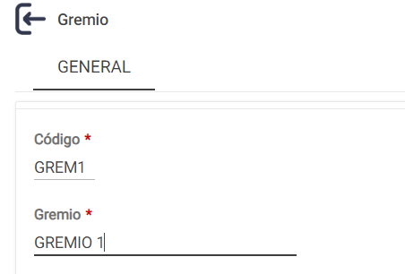
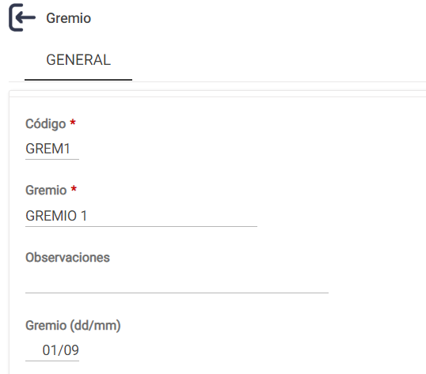
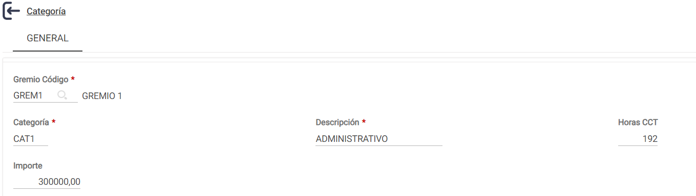

# 20240930190703

 1 
 
  
Estudios Contables  

 
 
 
 2 Estudios Contables  
Sueldos y Jornales  
Septiembre  2024  Gremios y Categorías  
 
A continuación, te detallamos los pasos a seguir para poder crear gremios y categorías 
en el módulo Sueldos y Jornales  Web.  
 
¡Esperamos que te sea de utilidad!  
 
1. Gremios.  
 
Desde el menú  Archivo > Laborales > Gremio , podrás definir  nuevos gremios, o bien 
consultar y/o modificar los existentes.  
 
Para dar de alta un Gremio inexistente, deberás realizar los siguientes pasos:  
 
1) Archivo > Laborales > Gremio > +Nuevo >  Colocar en el campo Código una nueva 
combinación de hasta cinco caracteres alfabéticos  y/o numéricos.  
 
2) En el campo Gremio  completar con la descripción, por ejemplo:  
 
 
 
3) Completá el campo Gremio (dd/mm) . Esto servirá para que, cuando ingreses en los 
Conceptos Fijos del empleado el concepto 012300 DIA GREMIO , se calcule 
automáticamente el mismo en el período que coincida con lo que coloques aquí.  
 

 
 
 
 3 Estudios Contables  
Sueldos y Jornales  
Septiembre  2024  4) Por último > Confirmar  
 
2.  Categorías.  
 
Para poder crear nuevas categorías, luego de haber creado el gremio, o bien sobre uno 
ya existente, deberás ingresar en el menú Archivo > Laborales > Categoría > +Nuevo  
 
 
 
 
1) Gremio Código : es necesario elegir a cuál gremio pertenece la categoría a 
consultar o a dar de alta. Escribiendo el código o presionando el botón “Buscar” se 
pueden consultar los códigos existentes en el sistema, posicionarse en el deseado y 
hacer clic sobre la descripción.  
 
2) En el campo Categoría  colocar un nuevo código de hasta cinco caracteres 
alfanumérico.  
 
3) En el campo Horas CCT  deberás informar la cantidad de horas normales 
mensuales dispuestas por convenio colectivo. En caso de no completar este campo, 
el sistema considerará, por defecto, 200 horas normales.  
 
4) En Importe  se informa el básico correspondiente a la categoría, (si el empleado 
es jornalizado, deberás completar el valor de la hora de trabajo, si fuera 
mensualizado, el sueldo mensual, etc.). Al completar este valor, cuando ingreses en 
los Conceptos Fijos del emp leado, los códigos 0010 00 SUELDO MENSUAL, 0012 00 
DÍAS TRABAJADOS, 0015 00 HORAS NORMALES o 0017 00 HORAS TRABAJADAS, el 
sistema tomará este  monto como básico en forma automática.  
 
Esto tiene como ventaja que, al cambiar el básico de una categoría de un gremio, la 
modificación podrás realizarla desde este menú, teniendo efecto sobre todos los 
empleados de todas las empresas que correspondan a la categoría en cuestión.  
 
5) Por último > Confirmar  

