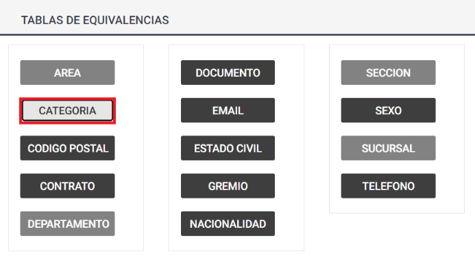

# 20240930190711

 1 
 
  
Estudios Contables  

 
 
 
 2 Estudios Contables  
Sueldos y Jornales  
Octubre  2022 Importar legajos desde  Modelo Excel proporcionado 
por Holistor . 
 
1. Ingresar en Empleados > Legajo > Importar legajos . 
 
 
 
2. En Descargar Plantillas  encontrarán 2 modelos “Legajos con 
Validación”  y “Sin validación”.   
 
Cabe aclarar que recomendamos utilizar la plantilla “Legajos con 
Validación”  cuando es la primera vez que vamos a trabajar con un sistema 
de sueldos.  
En caso de previamente tener otro sistema de Sueldos, donde ya 
contamos con la información de los legajos en otro Excel, podemos utilizar 
el modelo “Sin validación”.  La única diferencia es que no aparecerán las 
casillas explicad as en el punto 4.1 y 4.2.  
 
 
 
3. Descargar la plantilla deseada y abrir la misma.  
 
4. Cargar los datos solicitados en el Excel. El único campo obligatorio 
es el “Legajo” pero es conveniente llenar la mayor cantidad de 

 
 
 
 3 Estudios Contables  
Sueldos y Jornales  
Octubre  2022 datos para luego no tener que cargarlos manualmente en el 
sistema.  
 
A modo de ejemplo:  
 
 
 
4.1 - Para algunos campos, como por ejemplo el “tipo de 
documento”, tiene un menú desplegable que le permite 
seleccionar las distintas  opciones.  
 
 
 
4.2 - Si en alguno de ellos se desconoce a qué corresponde, en las 
diferentes hojas están las descripciones a cada uno de esos 
códigos.   
 
 
 
4.3 - Una vez llenados los datos,  se deberá guardar y cerrar el Excel.  
 
5. En el sistema de Sueldos y Jornales WEB, veremos la tabla de 
equivalencias . Dicha tabla solo  se tiene que utilizar en caso de que 
en el Excel se haya completado con una codificación diferente a la 
del sistema.  

 
 
 
 4 Estudios Contables  
Sueldos y Jornales  
Octubre  2022  
 
5.1 - Como ejemplo usaremos la categoría, pero el proceso es el 
mismo para todos los campos en la tabla de equivalencias. 
Supongamos que en Código Categoría cargamos “ADM A” , 
cuando el código Administrativo A en Holistor es “ADM -A”. 
 
 
 
5.2 - Presionamos sobre Categoría en SYJ WEB . 
 
 
 
5.3 - Cargamos el dato que nosotros le dimos a ese código en el 
Excel . 

 
 
 
 5 Estudios Contables  
Sueldos y Jornales  
Octubre  2022  
 
6. Hacer click sobre “Seleccionar Archivo Importación” . 
 
 
 
6.1 - Elegir el Excel con los legajos.  
 
Nos va a indicar la cantidad de filas leídas  
 
 
 
6.2 - Presionar sobre “Validar” para verificar que los empleados 
importados no tengan advertencias o errores.  
 
 
 
Si la validación es exitosa, mostrará este cartel  

 
 
 
 6 Estudios Contables  
Sueldos y Jornales  
Octubre  2022  
 
También nos mostrar á esta breve descripción de los legajos importados  
 
 
 
6.3 - A la izquierda de cada legajo, podemos ver si tiene errores o 
advertencias.  
 
En caso de cualquier aviso, se puede corregir desde esa misma pantalla.  
 
 
 
7. Presionar sobre “Guardar” . 
 
 

 
 
 
 7 Estudios Contables  
Sueldos y Jornales  
Octubre  2022  
8. Una vez guardada la tabla, presionar sobre “Importar” . 
 
 
 
Luego de que el sistema termine de cargar los datos, aparecerá esta 
notificación  
 
 
 
9. Presionar sobre “Salir” y nos mostrará la tabla de empleados 
importada.  
 
 
 

 
 
 
 8 Estudios Contables  
Sueldos y Jornales  
Octubre  2022  
 
Ante cualquier inconveniente no dude en contactarnos  
 

