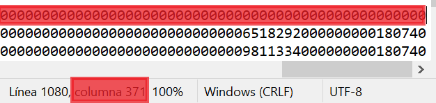

# 20240930190739

 1 
 
  
Estudios Contables  

 
 
 
 2 Estudios Contables  
Sueldos y Jornales  Web  
Octubre 2023  
 Rectificar en negativo en Libro de Sueldos Digital  
 
En el siguiente instructivo encontrará los pasos a seguir para poder 
rectificar en negativo en Libro de Sueldos Digital y dejar en blanco uno o 
más legajos. Luego deberá cargar la liquidación o liquidaciones definitivas 
de dichos legajos.  
 
 
1) Exportar el txt de la liquidación a rectificar (si los empleados  a 
rectificar intervin ieron  en más de una, sumarizar  todas aquellas en 
las que formaron parte ). 
Para ello dirigirse a Exportar > Libro de Sueldos Digital  y elegir la 
opción Generar > Liquidación y DJ  y presionar [EXPORTAR]  
 
ESPECIAL ATENCIÓN:  
Tener en cuenta que las liquidaciones tener los mismos valores  en 
Holistor que en AFIP . Puede comprobarlo desde la sección 
LIQUIDACIONES Y DDJJ en AFIP, revisando los totales señalados:  
 
 
 
Estos los compara con los totales por liquidación en Holistor desde 
Emisiones > Resumen > Resumen de Sueldos . Si hubiera diferencias, 
deberá conciliarlas antes de continuar con la rectificación.  
 
2) Descomprimir el archivo de exportación y a brir el txt de Liquidación 
en bloc de notas . En el menú Ver tildar Barra de estado, de esa 
manera en el margen inferior derecho  podrá observar el número de 
línea  y columna. (Consultar instructivo de Errores frecuentes de LSD 
para mayor información a este respecto)  

 
 
 
 3 Estudios Contables  
Sueldos y Jornales  Web  
Octubre 2023  
 3) Modificar dentro del txt el número de Liquidación para que sea 
posterior al original a rectificar.  
Para ello ver posiciones 23 a 27 del primer renglón  del txt . 
 
  
 
Se modifica a:  
 
 
 
 
4) En aquellos empleados a rectificar , en el registro 3 de los mismos 
(detalle  de los conceptos , renglones que comienzan con 03 ) cambiar 
las C por D y viceversa . Estas letras representan Crédito y Débito 
respectivamente, de esta manera modificándolas se invierte el signo 
de los conceptos para así anular los valores de la liquidación.  
Puede identificarlos por el CUIL indicado después del 03:  
 
 
 
5) En aquellos empleados a rectificar , en el registro 04, reemplazar por 
cero los valores de las remuneraciones . 
Se identifica el legajo con el CUIL indicado después del 04 . Luego se 
busca la columna 161 y se reemplaza por 0 los caracteres hasta el 
final. Puede cambiarse cada juego de números individualmente por 

 
 
 
 4 Estudios Contables  
Sueldos y Jornales  Web  
Octubre 2023  
 0 o bien borrar desde allí en adelante, colocando 0 hasta llegar al 
carácter 371:  
  
 
  
 
 
6) Subir a LSD con el número de liquidación que se indicó en el punto 2. 
Si hay empleados que no se deberán tomar en cuenta, se pueden 
eliminar una vez cargada la liquidación, antes de validar.  
 
Los legajos sobre los que se haya trabajado habrán quedado en 
blanco , de modo que se deberán crear luego liquidaciones separadas 
definitivas en las que sólo formen parte los empleados a rectificar.  
 
Tener en cuenta que el número de orden de esta o estas liquidaciones 
definitivas debe ser subsiguiente a las informadas en el Libro de 
Sueldos Digital , esto desde Liquidación > Carátula en el campo 
ORDEN.  
 
Para subir estas liquidaciones definitivas posteriores, tener en cuenta 
que al exportarlas, desde Exportar > Libro de Sueldos Digital , deberá 
elegir Liquidación y DJ  y presionar [ELEGIR LIQUIDACIONES].  
En la ventana que se abre observará un listado de todas las 
liquidaciones del período. Deberá tildar únicamente las liquidaciones 
definitivas, las anteriores  que fueron rectificadas con el 
procedimiento detallado deberán quedar destildadas . 
 
 

