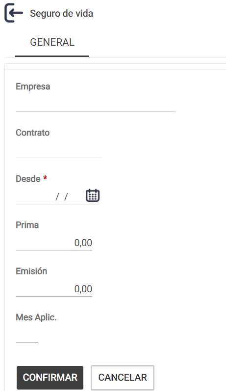
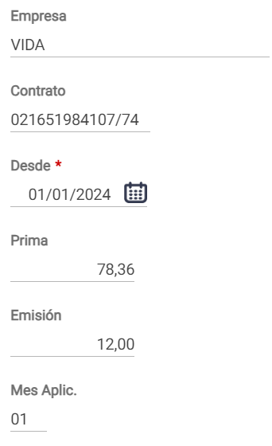
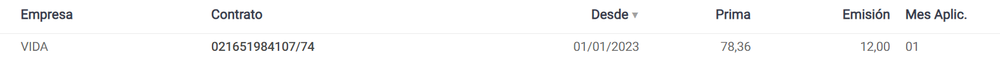
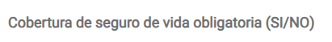
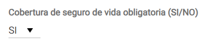
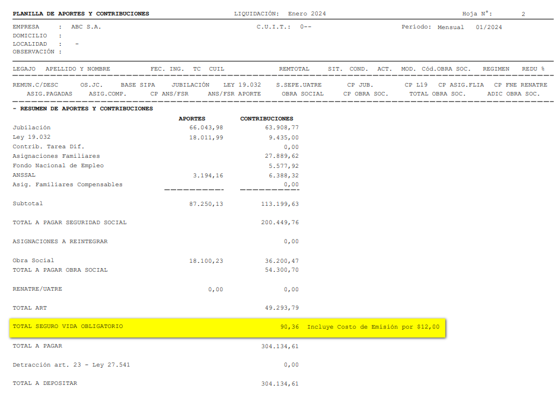
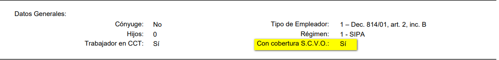

# 20240930190752

 1 
 
  
Estudios Contables  

 
 
 
 2 Estudios Contables  
Sueldos y Jornales  
Septiembre  2024  Seguro Colectivo de Vida Obligatorio (SCVO)  
 
A continuación,  te detallamos los pasos a seguir para poder efectuar, en el módulo 
Sueldos y Jornales  web , el cálculo de la póliza de Seguro de Vida Obligatorio establecido 
por Dec. 1567/74  
 
¡Esperamos que te sea de utilidad!  
 
 
1. Definición : 
 
Desde el menú Empresa > Seguro vida  > deberá seleccionar  NUEV O. Se le abrirá el 
siguiente cuadro.  
 
 
 
 
Dicho cuadro deberá ser completado con la información pertinente.  
 
Aclaración : el mes de aplicación sirve para indicar el mes en el que se paga el costo de 
EMISION del SEGURO COLECTIVO DE VIDA OBLIGATORIO.  
Una vez completa la tabla pone CONFIRMAR . 
 
Ejempl o: 

 
 
 
 3 Estudios Contables  
Sueldos y Jornales  
Septiembre  2024   
 
Una vez confirmado el paso anterior el sistema se lo mostrará de la siguiente manera:  
 
 
 
 
Deberá completar desde Empleado  > Legajo > Solapa DGI >  
 
 
 
Lo que defina en la Empresa, regirá por defecto para la totalidad de sus empleados. Si  
por algún motivo, a algún empleado no le correspondiera el cálculo del seguro de vida  
obligatorio, deberá ingresar en el menú Empleados > Legajos , solapa DGI , y en el  campo 
“Con cobertura de Seguro de Vida Obligatoria SI/NO ”, del empleado en  cuestión, 
completar con NO. Caso contrario, de SI corresponder , completará con un SI. 
 
Ejemplo:  
 
 
 
2. Visualización : 
 
Luego de efectuar los procesos habituales de Verificar y Calcular, podrá visualizar el  
monto de Seguro de Vida Obligatorio desde Emisiones >  Declaración en Línea - Aportes 
y Contribuciones (DLAC) > Aportes y Contribuciones.  

 
 
 
 4 Estudios Contables  
Sueldos y Jornales  
Septiembre  2024   
En nuestro ejemplo, en el mes de enero  visualizaremos, además de la prima, el costo  de 
emisión:  
 
 
3. Emisión:  
 
Desde Emisiones >  Declaración en Línea - Aportes y Contribuciones (DLAC) > 
Declaración en Línea  podremos visualizar el dato que luego se exportara.  
 
Ejemplo:  
 
 
 
 
 
 
 
 
 
 

