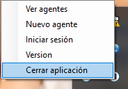

# view?usp\u003ddrivesdk

 1 
 
  
Estudios Contables  

 
 
 
 2 Estudios Contables  
Sueldos y Jornales  
Noviembre 2023 Actualización e importación de conceptos  
 
Las actualizaciones del módulo y de conceptos para el sistema Sueldos y Jornales Web 
es automática, no se realiza por los usuarios.  
 
Para el caso de la Optimización de Conceptos de Liquidación, se deben realizar los  
siguientes  pasos : 
 
Cuando haya una actualización,  ya sea por nueva versión del módulo  o por actualización 
de Sindicatos, al ingresar al espacio de trabajo podrá  ver una nueva notificación.  
 
 
 
Si abre la misma y selecciona Novedades de versiones , podrá ver los conceptos que 
fueron incorporados al sistema, a modo de ejemplo:  
 
 
 
Al ingresa al sistema deberá realizar el procedimiento de Actualizar conceptos. La realiza 
desde  ÚTILES  > CONCEPTOS DE LIQUIDACIÓN  > ACTUALIZACIÓN DE CONCEPTOS . 
 
Tendrá dos solapas: En la solapa GENERALES  podrá visualizar los conceptos generales 
del sistema, que sugerimos actualizar siempre.  

 
 
 
 3 Estudios Contables  
Sueldos y Jornales  
Noviembre 2023  
 
 
 
En la solapa SINDICALES  solo aparecerán los conceptos sindicales que tenga importados 
en el sistema, no todos lo conceptos de la actualización . Si son conceptos que utiliza, 
sugerimos actualizarlos, caso contrario, puede destildar los mismos.  
 
Si hay algún concepto enviado en la actualización, que no aparezca en la solapa 
Sindicales  pero necesite utilizarlo, deberá importarlo:  
 
Se realiza desde:  ÚTILES> CONCEPTOS DE LIQUIDACIÓN> IMPORTAR/EXPORTAR 
CONCEPTOS DE LIQUIDACIÓN>  tildar solapa GENERALES o SINDICALES  (según a qué 
rama pertenezca el concepto optimizado)  > en caso de ser un Concepto Sindical  > buscar 
con la LUPA  el gremio al cual se le incorporaron conceptos optimizados  > presionar el 
botón SELECCIONAR CONCEPTOS  > tildar el concepto nuevo  > en la columna Nuevo 
Código  (si el código que lleva el concepto a importar ya está ocupado), se le puede 
asignar uno nuevo que esté disponible, teniendo en cuenta el siguiente rango:  
 
• Del Nº 000002  al Nº 000899  y del Nº 001000  al Nº 029999  Remuneraciones con 
y sin descuentos.  
• Del Nº 030000  al Nº 034999  Retenciones.  
• Del Nº 035000  al Nº 049999  Contribuciones patronales.  
• Del Nº 050000  al Nº 059999  Asignaciones familiares.  
• Del Nº 060000  al Nº 089999  Conceptos a informar en el recibo sin importes 
liquidados, remuneraciones  sin descuentos no sujeto a retención y/o contribución y 
ART.  
Y por último se debe presionar IMPORTAR  para completar el proceso . 
 
De esta manera quedará incorporado al sistema el nuevo concepto actualizado y se 
podrá comenzar a trabajar con los mismos.  
 

