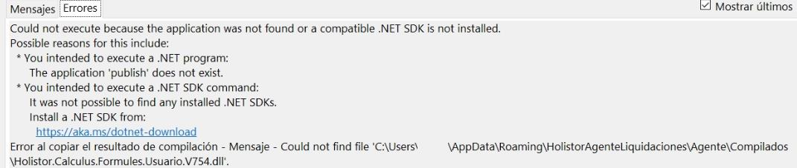

# view?usp\u003ddrivesdk

 1 
 
  
Estudios Contables  

 
 
 
 2 Estudios Contables  
Sueldos y Jornales  
Septiembre  2024  Firma de empleador en el recibo  
 
A continuación, te detallamos los pasos a seguir para poder cargar la f irma del 
empleador en el rec ibo de sueldos e n el mo dulo  de Sueldos y Jornales web.  
 
¡Esperamos que te sea de utilidad!  
 
Cargar/ borrar/modificar firma:  
 
Desde el menú  Empresa > Trabajar con emp resa > haciendo clic  sobre el CODIGO  de la 
misma , se dirige a la solapa FIRMA:  
 
 
 
Seleccionando la s opcio nes: 
 
♦ [Nuevo ]: desde esta opción se dará de alta la Firma del empleador que se podrá utilizar 
en los Recibos, para terminar pulsar el botón [Confirmar] o [Cancelar].  
El formato sugerido para la misma es PNG de 165 x 165.  
♦ [Modificar] : desde esta opción se podrá modificar.  
♦ [Eliminar] : desde esta opción se podrá dar de baja.  
Emisión : 
Una vez cargada la misma se  dirige a Emisiones  > Reci bos, deberá  tildar la opción  FIRMA  
> Comenzar  

 
 
 
 3 Estudios Contables  
Sueldos y Jornales  
Septiembre  2024   
 

