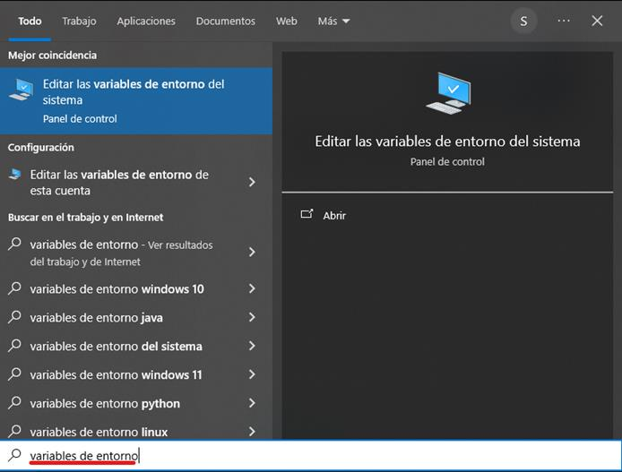
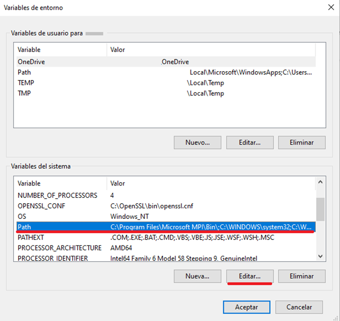
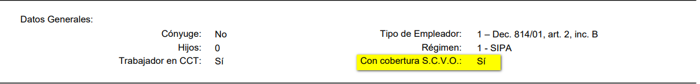
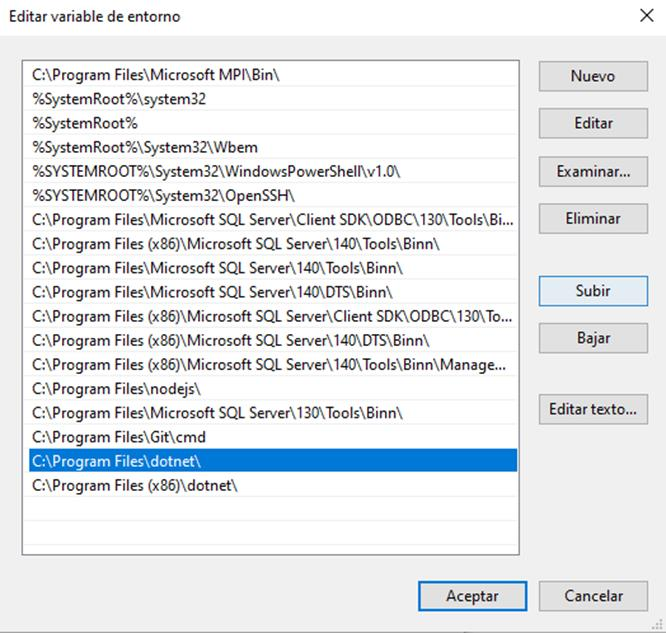

# view?usp\u003ddrivesdk

 1 
 
  
Estudios Contables  

 
 
 
 2 Estudios Contables  
Sueldos y Jornales  
Junio 2024  Cálculo SAC S/ Acuerdos No Remunerativos Junio 
2024   
 
A continuación, te recordamos las generalidades a tener en cuenta para la  
liquidación del Sueldo Anual Complementario sobre conceptos no 
remunerativos en el módulo Sueldos y Jornales . 
 
¡Esperamos que te sea de utilidad!  
 
CONCEPTO DE LIQUIDACIÓN PREVISTO : 
 
El concepto previsto por el sistema para liquidar el aguinaldo contemplando 
las bases no remunerativas, es el concepto 0283 00 SAC SOBRE AC.NO 
REMUNERATIVO . Este concepto podrás incluirlo en la liquidación de 
distintas formas:  
 
• Agregando el concepto a cada empleado que corresponda, por 
Novedades . 
• Desde la opción Liquidación > Modificaciones Masivas Novedades , 
para cargarlo simultáneamente a todos los empleados de la 
liquidación o a un grupo determinado.  
 
Para que se calcule el concepto 0283 00 SAC SOBRE AC.NO 
REMUNERATIVO , es necesario colocar la variable SACNOREM  con Valor SI 
en Empresa > Complementos  para todos los empleados, o en Empleado > 
Legajo > Complementos  para un empleado en particular.  
 
Podrá importar el concepto desde Útiles > Conceptos de liquidación > 
Importar/exportar conceptos de liquidación , solapa Importar  tilda 
Conceptos Sindicales > Sindicato >  A_USO GENERAL  > [Seleccionar 
conceptos]   
 

 
 
 
 3 Estudios Contables  
Sueldos y Jornales  
Junio 2024   
 
CÁLCULO AUTOMÁTICO : 
 
Ingresando desde Emisiones > Sueldos Anual Complementario > Detalle de 
Remuneraciones por semestre  se podrá corroborar la base considerada por 
el sistema.  
 
El sistema tomará del mayor valor del semestre  de la columna "Total 
General" , el dato de la columna "Acuerdos y Accesorios" , lo dividirá por 12 
y lo multiplicará por los meses trabajados.  
 
CÁLCULO MANUAL : 
 
Si no estuviera de acuerdo con el importe determinado por el sistema, o 
éste no tuviera suficientes datos actualizados en las tablas como para 
efectuar el cálculo automático, se podrá ingresar el concepto 0283 00 SAC 
SOBRE AC.NO REMUNERATIVO  en Liquidación > Novedades , indicando 
directamente el importe que desees abonar.  
 
EJEMPLO DE CÁLCULO  
 
Al emitir el Listado de Detalle de Remuneraciones por Semestre, ingresando 
en Emisiones > Sueldos Anual Complementario > Detalle de 
Remuneraciones por semestre  podemos visualizar desde la columna “Total 
General” , podemos visualizar que la mejor remuneración del semestre fue 
marzo: $ 932.846,85 (758.912,85 + 173.934)  

 
 
 
 4 Estudios Contables  
Sueldos y Jornales  
Junio 2024   
 
 
En el Recibo : 
 
 
 
Para el cálculo del concepto 0283 00 SAC SOBRE AC.NO REMUNERATIVO , 
toma de la mejor remuneración del semestre de la columna “Total 
General” , el valor de la columna “Acuerdo y Accesorios” , lo divide por 12 y 
lo multiplica por los meses trabajados.  
 
173.934 / 12 * 6 = $ 86.967  
 
Para el cálculo del 0298 00 AGUINALDO , toma de la mejor remuneración 
del  
semestre de la columna “Total General” , el valor de la columna “Total” , lo  
divide por 12 y lo multiplica por los meses trabajados.  
 
758.912,85 / 12 * 6 = $ 379.456,43  
 
Desde el menú Emisiones > Sueldo Anual Complementario > Cálculo S.A.C , 
podrás visualizar los datos que se utilizaron para el cálculo del aguinaldo: 
mejor remuneración, mes de la mejor remuneración, meses computados, 
importe de SAC.  

 
 
 
 5 Estudios Contables  
Sueldos y Jornales  
Junio 2024   
 
Codificación AFIP:  
 
Los conceptos 0283 00 SAC SOBRE AC.NO REMUNERATIVO , sugerimos 
codificarlo con 560001 - SAC - PPC y CCT Especiales  o 550000 – Importes 
no rem especiales.  
 

