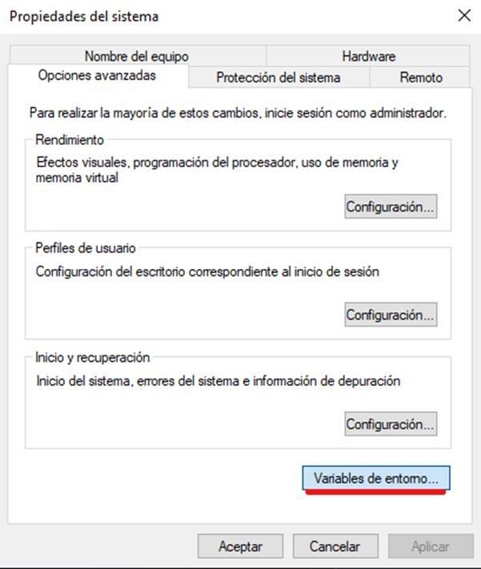

# view?usp\u003ddrivesdk

 1 
 
  
Estudios Contables  

 
 
 
 2 Estudios Contables  
Sueldos y Jornales  
Diciembre 2023  AJUS TE DE  SAC Diciembre 202 3 – Comercio  
 
A continuación, te recordamos las generalidades a tener en cuenta para la  
liquidación de  ajuste del Sueldo Anual Complementario del segundo semestre 
Diciembre/2023 para empleados de Comercio.  
 
¡Esperamos que te sea de utilidad!  
 
CONCEPTO S DE LIQUIDACIÓN PREVISTOS : 
 
Si al liquidar el SAC no se contaba con la información de diciembre y ésta 
resulta ser la mejor remuneración del semestre, podrá realizarse el ajuste 
utilizando los si guientes conceptos:  
 
0297 00 DIFERENCIA DE AGUINALDO  que realizará  el ajuste sobre la parte 
remunerativa , y sobre la pa rte no remunerativa  tenemos previstos dos 
conceptos  
0299 01 DIF.SAC NO REMUN.COMERCIO C/OS  para afiliados a comercio 
c/osecac.  
0295 01 DIF.SAC NO REMUN.COMERCIO S/OS  para afiliados  a comercio  
s/osecac.  
 
La importación  del concepto 0297 DIFERENCIA DE AGUINALDO  puede 
realizarla desde Útiles  > Conceptos d e liquidación  > Importar/Ex portar 
conceptos de liquidación  > Solapa Importar > Seleccio nando Conceptos 
Sindic ales > A _USO GENERAL:  
 

 
 
 
 3 Estudios Contables  
Sueldos y Jornales  
Diciembre 2023   
 
La importación  del concepto 0299 01 DIF.SAC NO REMUN.COMERCIO C/OS  
desde Útiles  > Conceptos d e liquidación  > Importar/Ex portar conceptos de 
liquidación  > Solapa Importar > Seleccio nando Conceptos Sindic ales > 
COMERCIO:  
 
 

 
 
 
 4 Estudios Contables  
Sueldos y Jornales  
Diciembre 2023  La importación  del concepto 0295 01 DIF.SAC NO REMUN.COMERCIO S/OS  
desde Útiles  > Conceptos d e liquidación  > Importar/Ex portar conceptos de 
liquidación  > Solapa Importar > Seleccio nando Conceptos Sindic ales > 
COMERCIO  SIN OSECAC:  
 
 
 
 
FUNCIONAMIEN TO DE LOS CONCEPTOS : 
 
Estos concepto s se puede n liquidar junto con el sueldo de diciembre o en 
una liquidación separada (que deberá tener período diciembre) si el sueldo 
de ese mes ya fue calculado y actualizado.  
 
Se debe ingresar desde Liquidación  > Novedades , sin indicar nada. 
Calculará la diferencia que exista con la liquidación original efectuada con 
los conceptos de aguinaldo . El importe se liquidará únicamente si fuese 
positivo (a favor del empleado). También se puede indicar directamente el 
valor a pagar en la columna Importe . 
 
IMPORTANTE:  Para que se realice el ajuste del aguinaldo es importante que 
se hayan actualizado los totalizadores de la liquidación de SAC.  

 
 
 
 5 Estudios Contables  
Sueldos y Jornales  
Diciembre 2023  Al calcular el ajuste deberá  seleccionar la opción:  “Si, es una liquidación 
complementaria”  
 
 
 

