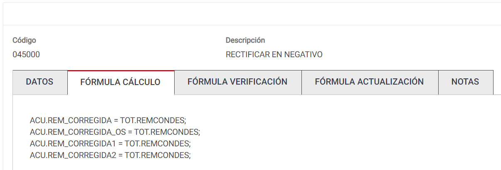
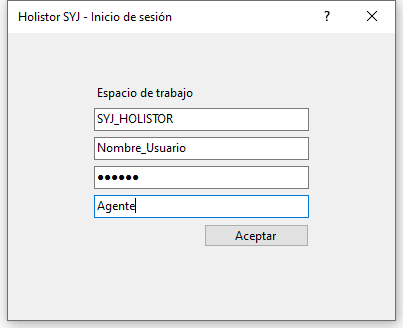
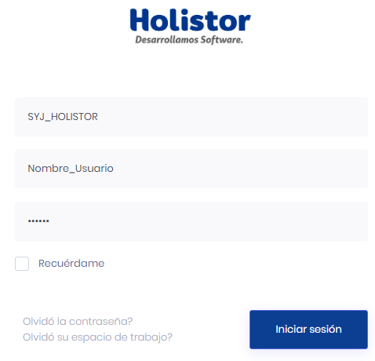

# view?usp\u003ddrivesdk

 1 
 
  
Estudios Contables  

 
 
 
 2 Estudios Contables  
Sueldos y Jornales  
Junio 2024  Cálculo SAC S/ Acuerdos No Remunerativos Junio 
2024  – Comercio  
 
A continuación, te recordamos las generalidades a tener en cuenta para la  
liquidación del Sueldo Anual Complementario  sobre acuerdos no 
remunerativos  del primer  semestre Junio 2024  para gremio  de Comercio.  
 
¡Esperamos que te sea de utilidad!  
 
CONCEPTO S DE LIQUIDACIÓN PREVISTOS : 
 
Los conceptos a utilizar son: 0285 01 - SAC SOBRE AC COMERCIO C/OS  si 
son afiliados a OSECAC y el 0284 00 - SAC SOBRE AC COMERCIO S/OS  si no 
son afiliados a OSECAC.  
 
Se podrán importar desde Útiles > Conceptos de liquidación >  
Importar/exportar conceptos de liquidación , solapa Importar  tilda 
Conceptos Sindicales > Sindicato > 4 COMERCIO > [Seleccionar conceptos]  
para los afiliados a OSECAC  y el concepto es el 0285 01 - SAC SOBRE AC 
COMERCIO C/OS  
 
 
 
Para los NO afiliados a OSECAC el concepto lo encontrara en Útiles > 
Conceptos de liquidación > Importar/exportar conceptos de liquidación , 
solapa Importar  tilda Conceptos Sindicales > Sindicato > 5 COMERCIO SIN 
OSECAC > [Seleccionar conceptos]  es el 0284 00 - SAC SOBRE AC COMERCIO 
S/OS  

 
 
 
 3 Estudios Contables  
Sueldos y Jornales  
Junio 2024   
 
 
Los conceptos se agregan desde Liquidación > Novedades  sin informar 
nada.  
 
También se puede realizar desde Liquidación > Modificaciones Masivas 
Novedades , para cargarlo simultáneamente a todos los empleados de la 
liquidación o a un grupo determinado.  
 
En Empresa > Complementos , es necesario colocar las  variables 
SACCOM_202010 y SACNOREM , para que se liquiden los conceptos 0284 
00SAC SOBRE AC COMERCIO S/OS y 0285 01 SAC SOBRE AC COMERCIO 
C/OS . 
 
CÁLCULO AUTOMÁTICO : 
 
Ingresando desde Emisiones > Sueldos Anual Complementario > Detalle de 
Remuneraciones por semestre  se podrá corroborar la base considerada por 
el sistema.  
 
El sistema tomará del mayor valor del semestre  sumando los importes de 
las columnas “Total”  y “Acuerdos y accesorios” ; el dato de la columna 
"Acuerdos y Accesorios" , lo dividirá por 12 y lo multiplicará por los meses 
trabajados.  
 
 
 
 

 
 
 
 4 Estudios Contables  
Sueldos y Jornales  
Junio 2024  CÁLCULO MANUAL : 
 
Si no estuvieras de acuerdo con el importe determinado por el sistema, o 
éste no tuviera suficientes datos actualizados en las tablas como para 
efectuar el cálculo automático, se podrá ingresar el concepto 028400 SAC 
SOBRE AC COMERCIO S/OS  y/o el 028501 SAC SOBRE AC COMERCIO 
C/OS  en Liquidación > Novedades , indicando directamente el importe que  
desees abonar.  
 
CÁLCULO EN RECIBO SEPARADO : 
 
Para liquidar el SAC en un recibo separado, en tipo de liquidación debe 
elegir Aguinaldo . 
 
 
 
Además, deberá utilizar Códigos de Condiciones  que bloqueen el cálculo 
de los Conceptos Fijos, para que sólo salga el aguinaldo en el recibo. La 
exclusión de conceptos mediante Códigos de Condición podrá efectuarla 
para todos los empleados que participan de la liquidación o sólo para 
algunos. Puede descargar el archivo PDF de código de condiciones 
haciendo clic aquí .  

 
 
 
 5 Estudios Contables  
Sueldos y Jornales  
Junio 2024   
Si el concepto que no se debe calcular es, por ejemplo, el código 0010 00 
SUELDO MENSUAL , dicho concepto tiene en Archivo > Conceptos de 
Liquidación > Cond. Carátula : -S. En la carátula de la liquidación (en el 
campo Códigos Condiciones) deberá colocar la letra S (sin signo)  
 
 
 
 
 

 
 
 
 6 Estudios Contables  
Sueldos y Jornales  
Junio 2024  En el recibo de sueldo aparecerá, en el lugar correspondiente al Período 
Abonado, la palabra “Aguinaldo” . 
 
EJEMPLO DE CÁLCULO  
 
Al emitir el Listado de Detalle de Remuneraciones por Semestre, 
ingresando en Emisiones > Sueldos Anual Complementario > Detalle de 
Remuneraciones por semestre , podemos visualizar que el mejor mes del 
semestre es Mayo 2024 : $ 790.874,60  (501.109,20 + 289.765,20) 
 
 
 
Para determinar el mes con mejor sueldo del semestre, el sistema suma 
los importes de las columnas “Total”  y “Acuerdos y accesorios” . 
 
 
En el Recibo : 
 
 
 
Para el cálculo del concepto 0285 01 SAC SOBRE AC COMERCIO C/OS , 
toma de la mejor remuneración del semestre, el valor de la columna 
“Acuerdo y Accesorios” , lo divide por 12 y lo multiplica por los meses 
trabajados.  
 
289.765,20  / 12 * 6 = $ 144.882,60   

 
 
 
 7 Estudios Contables  
Sueldos y Jornales  
Junio 2024   
Para el cálculo del 0298 00 AGUINALDO , toma de la mejor remuneración 
del semestre, el valor de la columna “Total” , lo divide por 12 y lo 
multiplica por los meses trabajados.  
 
501.109,20 / 12 * 6 = $ 2 50.554,60  
 
Desde el menú Emisiones > Sueldo Anual Complementario > Cálculo 
S.A.C , podrás visualizar los datos que se utilizaron para el cálculo del 
aguinaldo: mejor remuneración, mes de la mejor remuneración, meses 
computados, importe de SAC.  
 
 
 
 
 
Codificación AFIP:  
 
Los conceptos 0284 00 SAC SOBRE AC COMERCIO S/OS  y/o el 0285 01 SAC 
SOBRE AC COMERCIO C/OS , sugerimos codificarlo con 560001 - SAC - PPC 
y CCT Especiales  o 550000 – Importes no rem especiales.  
 
 
 

