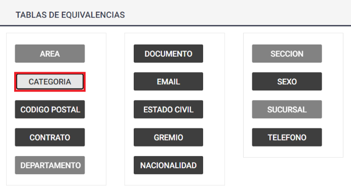

# view?usp\u003ddrivesdk

 1 
 
  
Estudios Contables  

 
 
 
 2 Estudios Contables  
Sueldos y Jornales  
Octubre  2022 CREAR USUARIOS, ASIGNAR ROLES Y LICENCIAS . 
 
A continuación, se detallan los pasos a seguir para crear nuevos usuarios, 
asignar roles y licencias.  
IMPORTANTE:  Para el óptimo funcionamiento, se  recomienda utilizar el 
Navegador de Internet Google Chrome.  
Acceder a la Plataforma Holistor y dentro de su Espacio de Trabajo como 
"Usuario Administrador" ingresar a "Administración >  
Usuarios/Aplicaciones > Crear Nuevo Usuario":  
 
Una vez dentro en la p estaña "Roles", es posible seleccionar el rol que 
tendrá este usuario entre:  
- Admin:  tiene acceso al "Panel de Aplicaciones" y tiene permisos para 
administrar Usuario, Licencias y Roles.  
- Usuario:  tiene acceso al "Panel de Aplicaciones".  
La contraseña qu e se le asigne podrá ser cambiada en el primer inicio de 
sesión del usuario.  
Los datos utilizados en las siguientes imágenes son a modo de ejempl o: 

 
 
 
 3 Estudios Contables  
Sueldos y Jornales  
Octubre  2022  
 
 
Con nuestro usuario creado y el rol asignado, ahora tenemos que 
otorgarle la licencia para poder uti lizar la aplicación, en este caso 
podemos ver en el panel central que tenemos 100 licencias en total y 0 
asignadas.  
 

 
 
 
 4 Estudios Contables  
Sueldos y Jornales  
Octubre  2022 En la columna Aplicaciones Asignadas y presionamos el botón 
“Seleccione” del usuario al que le queremos otorgar la licencia.  
 
Se va a desplegar un menú en el cual podemos tildar la aplicación a la cual 
le queremos otorgar la licencia a este usuario y presionamos el botón 
aplicar cambios.  
 
La página va a recargar y luego de unos segundos si todo salió bien, abajo 
a la derecha nos informa  que se guardó con éxito.  
 
En el panel central podemos verificar que tenemos una licencia asignada.  

 
 
 
 5 Estudios Contables  
Sueldos y Jornales  
Octubre  2022  
La cantidad de usuarios que se pueden crear es ilimitada, pero solo 
podemos asignar la cantidad de licencias que tengamos adquiridas.  
Ejemplo:  podemos t ener 20 usuarios creados, pero en este caso, solo 
podemos asignar licencias a 10 de ellos a la vez, ya que poseemos el 
paquete de 10 licencias.  
En cualquier momento podemos desasignar licencia a un usuario para 
habilitar a otro.  
Ante cualquier inconveniente no dude en contactarnos.  
 

